# <a name="quickstart-create-an-aspnet-web-app"></a>Краткое руководство по созданию веб-приложения ASP.NET 

## <a name="introduction"></a>Введение

В этом кратком руководстве описано, как создать и развернуть веб-приложение ASP.NET в службе приложений Azure с помощью Visual Studio 2017. Пример приложения подключается к кэшу Redis для Azure для хранения и извлечения данных. Завершив работу с кратким руководством, вы получите рабочее веб-приложение, размещенное в Azure, которое выполняет чтение и запись в кэш Redis для Azure.

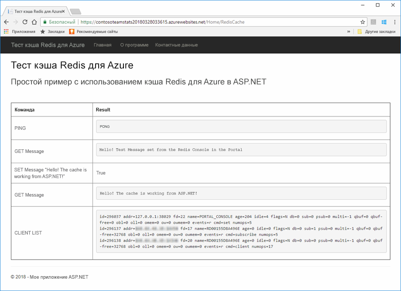

[!INCLUDE [quickstarts-free-trial-note](../../includes/quickstarts-free-trial-note.md)]

## <a name="prerequisites"></a>предварительным требованиям

Для работы с этим руководством необходимо установить [Visual Studio 2017](https://www.visualstudio.com/downloads/) с указанной ниже средой:
* ASP.NET и веб-разработка.
* разработка Azure;

## <a name="create-the-visual-studio-project"></a>Создание проекта Visual Studio

1. Откройте Visual Studio и выберите **Файл** >**Создать** > **Проект**.

2. В диалоговом окне **Создать проект** сделайте следующее:

    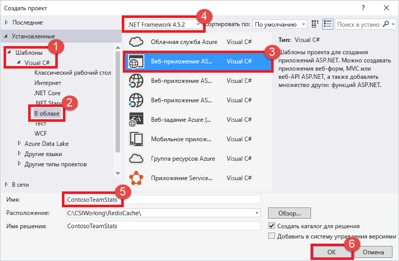

    a. В списке **Шаблоны** разверните узел **Visual C#**.

    Б. Выберите **Облако**.

    c. Выберите **Веб-приложение ASP.NET**.

    d. Убедитесь, что выбрана платформа **.NET Framework 4.5.2** или ее более новая версия.

    д. В поле **Имя** укажите имя проекта. В этом примере используется имя **ContosoTeamStats**.

    f. Нажмите кнопку **ОК**.
   
3. Выберите тип проекта **MVC**.

4. Убедитесь, что для параметра **Проверка подлинности** указано значение **Без проверки подлинности**. В зависимости от установленной версии Visual Studio значение **Проверка подлинности** по умолчанию может быть другим. Чтобы изменить его, щелкните **Изменить способ проверки подлинности** и выберите **Без проверки подлинности**.

5. Нажмите кнопку **ОК**, чтобы создать проект.

## <a name="create-a-cache"></a>Создание кэша

Создайте кэш для приложения.

[!INCLUDE [redis-cache-create](../../includes/redis-cache-create.md)]

[!INCLUDE [redis-cache-access-keys](../../includes/redis-cache-access-keys.md)]

#### <a name="to-edit-the-cachesecretsconfig-file"></a>Изменение файла *CacheSecrets.config*

3. Создайте на компьютере файл с именем *CacheSecrets.config*. Поместите его в расположение, где он не будет записываться после изменения с исходным кодом примера приложения. В этот кратком руководстве файл *CacheSecrets.config* расположен в папке *C:\AppSecrets\CacheSecrets.config*.

4. Измените файл *CacheSecrets.config*. Затем добавьте следующее содержимое:

    ```xml
    <appSettings>
        <add key="CacheConnection" value="<cache-name>.redis.cache.windows.net,abortConnect=false,ssl=true,password=<access-key>"/>
    </appSettings>
    ```

5. Замените `<cache-name>` на имя узла кэша.

6. Замените `<access-key>` первичным ключом для кэша.

    > [!TIP]
    > При повторном создании первичного ключа доступа вторичный ключ доступа можно использовать во время смены ключей как дополнительный ключ.
>
7. Сохраните файл.

## <a name="update-the-mvc-application"></a>Обновление приложения MVC

В этом разделе вы обновите приложение для поддержки нового представления, которое отображает простой тест кэша Redis для Azure.

* [Добавление в файл web.config параметра приложения для использования кэша](#Update-the-webconfig-file-with-an-app-setting-for-the-cache)
* [Настройка приложения для использования клиента StackExchange.Redis](#configure-the-application-to-use-stackexchangeredis)
* [Обновление HomeController и макета](#update-the-homecontroller-and-layout)
* [Добавление нового представления RedisCache](#add-a-new-rediscache-view)

### <a name="update-the-webconfig-file-with-an-app-setting-for-the-cache"></a>Добавление в файл web.config параметра приложения для использования кэша

При локальном запуске приложения сведения в файле *CacheSecrets.config* используются для подключения к экземпляру кэша Redis для Azure. Позже вы развернете это приложение в Azure. Сейчас вы настроите параметр приложения в Azure, который приложение использует вместо этого файла для получения сведений о соединении кэша. 

Так как файл *CacheSecrets.config* не развертывается в Azure с помощью приложения, он используется только при тестировании приложения локально. Храните эти сведения в надежном месте для предотвращения вредоносного доступа к данным кэша.

#### <a name="to-update-the-webconfig-file"></a>Обновление файла *web.config*
1. В **обозревателе решений** откройте файл *web.config*, щелкнув его дважды.

    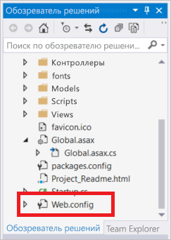

2. В файле *web.config* найдите элемент `<appSetting>`. Теперь добавьте следующий атрибут `file`: Если использовалось другое имя файла или расположение, замените эти значения на представленные в примере.

* До: `<appSettings>`
* После: ` <appSettings file="C:\AppSecrets\CacheSecrets.config">`

Среда выполнения ASP.NET объединяет содержимое внешнего файла с разметкой в элементе `<appSettings>`. Если указанный файл не удается найти, среда выполнения игнорирует атрибут файла. Секреты (строка подключения к вашему кэшу) не включаются в исходный код приложения. При развертывании веб-приложения в Azure файл *CacheSecrests.config* не развертывается.

### <a name="to-configure-the-application-to-use-stackexchangeredis"></a>Настройка приложения для использования StackExchange.Redis

1. Чтобы настроить приложение для использования пакета NuGet [StackExchange.Redis](https://github.com/StackExchange/StackExchange.Redis) для Visual Studio, выберите **Инструменты > Диспетчер пакетов NuGet > Консоль диспетчера пакетов**.

2. Выполните следующую команду в окне `Package Manager Console`:

    ```powershell
    Install-Package StackExchange.Redis
    ```

3. Пакет NuGet загружает и добавляет необходимые ссылки на сборки в клиентском приложении для доступа к кэшу Azure Redis из клиента кэша StackExchange.Redis. Если вы предпочитаете использовать версию клиентской библиотеки `StackExchange.Redis` со строгими именами, установите пакет `StackExchange.Redis.StrongName`.

### <a name="to-update-the-homecontroller-and-layout"></a>Обновление HomeController и макета

1. В **обозревателе решений** разверните папку **Контроллеры**, а затем откройте файл *HomeController.cs*.

2. Добавьте следующие два оператора `using` в верхней части файла для поддержки параметров клиента кэша и приложения.

    ```csharp
    using System.Configuration;
    using StackExchange.Redis;
    ```

3. Добавьте следующий метод в класс `HomeController` для поддержки нового действия `RedisCache`, выполняющего некоторые команды для нового кэша.

    ```csharp
        public ActionResult RedisCache()
        {
            ViewBag.Message = "A simple example with Azure Redis Cache on ASP.NET.";

            var lazyConnection = new Lazy<ConnectionMultiplexer>(() =>
            {
                string cacheConnection = ConfigurationManager.AppSettings["CacheConnection"].ToString();
                return ConnectionMultiplexer.Connect(cacheConnection);
            });

            // Connection refers to a property that returns a ConnectionMultiplexer
            // as shown in the previous example.
            IDatabase cache = lazyConnection.Value.GetDatabase();

            // Perform cache operations using the cache object...

            // Simple PING command
            ViewBag.command1 = "PING";
            ViewBag.command1Result = cache.Execute(ViewBag.command1).ToString();

            // Simple get and put of integral data types into the cache
            ViewBag.command2 = "GET Message";
            ViewBag.command2Result = cache.StringGet("Message").ToString();

            ViewBag.command3 = "SET Message \"Hello! The cache is working from ASP.NET!\"";
            ViewBag.command3Result = cache.StringSet("Message", "Hello! The cache is working from ASP.NET!").ToString();

            // Demostrate "SET Message" executed as expected...
            ViewBag.command4 = "GET Message";
            ViewBag.command4Result = cache.StringGet("Message").ToString();

            // Get the client list, useful to see if connection list is growing...
            ViewBag.command5 = "CLIENT LIST";
            ViewBag.command5Result = cache.Execute("CLIENT", "LIST").ToString().Replace(" id=", "\rid=");

            lazyConnection.Value.Dispose();

            return View();
        }
    ```

4. В **обозревателе решений** разверните папку **Представления** > **Общие**. Затем откройте файл *_Layout.cshtml*.

    Замените

        ```csharp
        @Html.ActionLink("Application name", "Index", "Home", new { area = "" }, new { @class = "navbar-brand" })
        ```

    на:

        ```csharp
        @Html.ActionLink("Azure Redis Cache Test", "RedisCache", "Home", new { area = "" }, new { @class = "navbar-brand" })
        ```

### <a name="to-add-a-new-rediscache-view"></a>Добавление нового представления RedisCache

1. В **обозревателе решений** разверните папку **Views** и щелкните правой кнопкой мыши папку **Home**. Выберите **Добавить** > **Представление...**.

2. В диалоговом окне **Добавить представление** введите **RedisCache** для имени представления. Затем щелкните **Добавить**.

3. Замените код в файле *RedisCache.cshtml* следующим кодом:

    ```csharp
    @{
        ViewBag.Title = "Azure Redis Cache Test";
    }

    <h2>@ViewBag.Title.</h2>
    <h3>@ViewBag.Message</h3>
    <br /><br />
    <table border="1" cellpadding="10">
        <tr>
            <th>Command</th>
            <th>Result</th>
        </tr>
        <tr>
            <td>@ViewBag.command1</td>
            <td><pre>@ViewBag.command1Result</pre></td>
        </tr>
        <tr>
            <td>@ViewBag.command2</td>
            <td><pre>@ViewBag.command2Result</pre></td>
        </tr>
        <tr>
            <td>@ViewBag.command3</td>
            <td><pre>@ViewBag.command3Result</pre></td>
        </tr>
        <tr>
            <td>@ViewBag.command4</td>
            <td><pre>@ViewBag.command4Result</pre></td>
        </tr>
        <tr>
            <td>@ViewBag.command5</td>
            <td><pre>@ViewBag.command5Result</pre></td>
        </tr>
    </table>
    ```

## <a name="run-the-app-locally"></a>Локальный запуск приложения

По умолчанию проект размещает приложение локально в [IIS Express](https://docs.microsoft.com/iis/extensions/introduction-to-iis-express/iis-express-overview) для тестирования и отладки.

### <a name="to-run-the-app-locally"></a>Запуск приложения на локальном компьютере
1. В Visual Studio выберите **Отладка** > **Начать отладку**, чтобы создать и запустить приложение локально для тестирования и отладки.

2. В браузере на панели навигации выберите **Azure Redis Cache Test** (Проверка кэша Redis для Azure).

3. В приведенном ниже примере видно, что ключ `Message` ранее содержал кэшированное значение, установленное через консоль кэша Redis для Azure на портале. Приложение обновило кэшированное значение. Кроме того, оно выполнило команды `PING` и `CLIENT LIST`.

    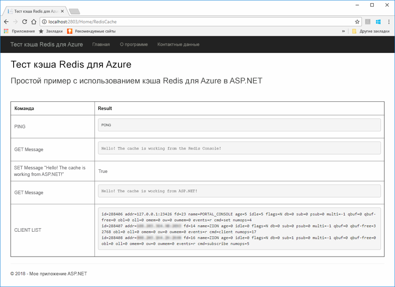

## <a name="publish-and-run-in-azure"></a>Публикация и выполнение в Azure

После успешного локального тестирования приложения вы сможете развернуть приложение в Azure и запустить его в облаке.

### <a name="to-publish-the-app-to-azure"></a>Публикация приложения в Azure

1. В Visual Studio щелкните узел проекта правой кнопкой мыши в обозревателе решений. Затем щелкните **Опубликовать**.

    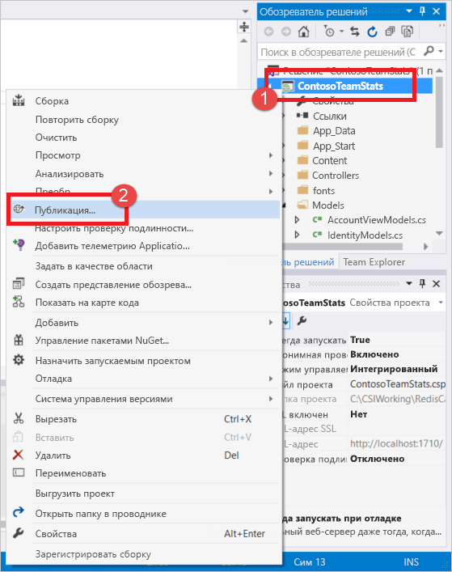

2. Выберите **Служба приложений Microsoft Azure**, **Создать**, а затем щелкните **Опубликовать**.

    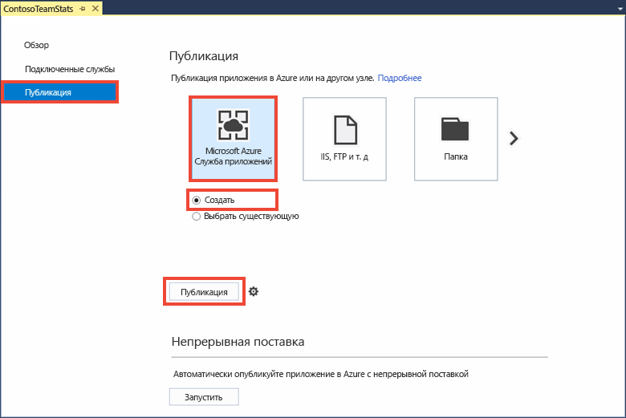

3. В диалоговом окне **Создать службу приложений** внесите следующие изменения:

    | Параметр | Рекомендуемое значение | ОПИСАНИЕ |
    | ------- | :---------------: | ----------- |
    | **Имя приложения** | Используйте значение по умолчанию. | При развертывании приложения в Azure его имя соответствует имени узла для приложения. В имя можно добавить суффикс метки времени, если необходимо сделать его уникальным. |
    | **Подписка** | Выберите подписку Azure. | В этой подписке взимается плата за связанные операции размещения. Если у вас несколько подписок Azure, убедитесь, что выбрана необходимая подписка.|
    | **Группа ресурсов** | Используйте группу ресурсов, в которой создан кэш (например *TestResourceGroup*). | Группа ресурсов позволяет управлять всеми ресурсами как группой. Позже, если вы захотите удалить приложение, можно просто удалить всю группу. |
    | **План обслуживания приложения** | Выберите **Создать** и создайте план службы приложений с именем *TestingPlan*. <br />Используйте то же **расположение**, что и при создании кэша. <br />В качестве размера выберите **Бесплатный**. | План службы приложений определяет набор вычислительных ресурсов, на которых выполняется веб-приложение. |

    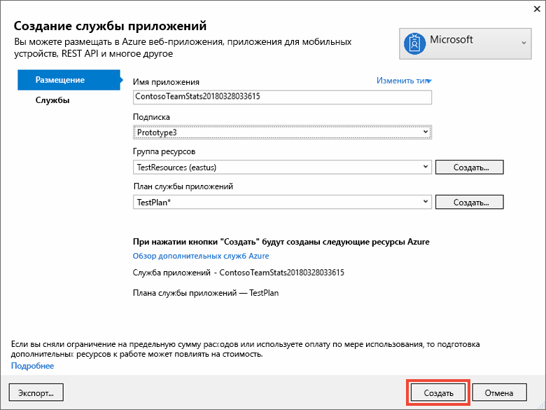

4. После настройки параметров службы приложений щелкните **Создать**.

5. Просмотрите состояние публикации в окне Visual Studio **Вывод**. После публикации приложения регистрируется его URL-адрес:

    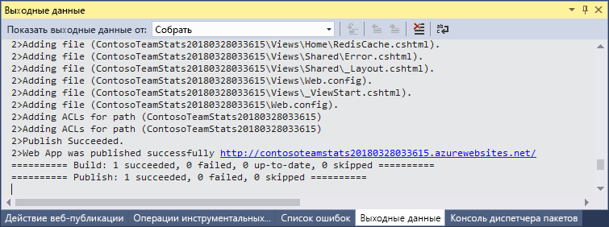

### <a name="add-the-app-setting-for-the-cache"></a>Добавление параметра приложения для кэша

После публикации нового приложения добавьте новый параметр приложения. Этот параметр используется для хранения сведений о подключении к кэшу. 

#### <a name="to-add-the-app-setting"></a>Добавление параметров приложения 

1. В строке поиска в верхней части портала Azure введите имя приложения, чтобы найти созданное приложение.

    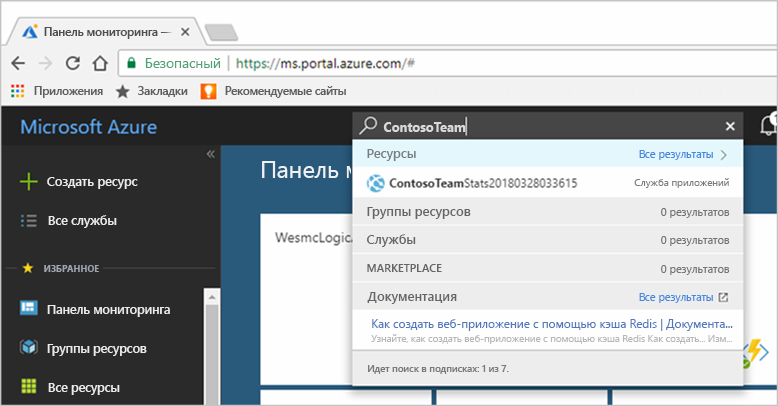

2. Добавьте параметр нового приложения с именем **CacheConnection**, которое приложение будет использовать для подключения к кэшу. Используйте значение, заданное для `CacheConnection` в файле *CacheSecrets.config*. Значение содержит имя узла и ключ доступа кэша.

    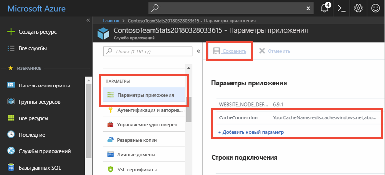

### <a name="run-the-app-in-azure"></a>Запуск приложения в Azure

В браузере перейдите по URL-адресу приложения. URL-адрес отображается в результатах выполнения операции публикации в окне выходных данных в Visual Studio. Его также можно найти на портале Azure на странице обзора созданного приложения.

На панели навигации щелкните **Azure Redis Cache Test** (Проверка кэша Redis для Azure), чтобы проверить доступ к кэшу.


## <a name="clean-up-resources"></a>Очистка ресурсов

При переходе к следующему руководству в нем можно использовать ресурсы, созданные в рамках этого руководства.

В противном случае, если вы закончите работу с примером приложения из краткого руководства, вы можете удалить ресурсы Azure, созданные в рамках этого руководства, чтобы избежать ненужных расходов. 

> [!IMPORTANT]
> Удаление группы ресурсов — процесс необратимый. Группа ресурсов и все содержащиеся в ней ресурсы удаляются без возможности восстановления. Будьте внимательны, чтобы случайно не удалить не ту группу ресурсов или не те ресурсы. Если ресурсы для размещения этого примера созданы в имеющейся группе ресурсов, содержащей ресурсы, которые следует сохранить, можно удалить каждый ресурс отдельно в соответствующих колонках вместо удаления группы ресурсов.

### <a name="to-delete-a-resource-group"></a>Удаление группы ресурсов

1. Войдите на [портал Azure](https://portal.azure.com) и щелкните **Группы ресурсов**.

2. Введите имя группы ресурсов в поле **Фильтровать по имени...** В инструкциях в этой статье использовалась группа ресурсов с именем *TestResources*. В своей группе ресурсов в списке результатов щелкните **...**, а затем выберите **Удалить группу ресурсов**.

    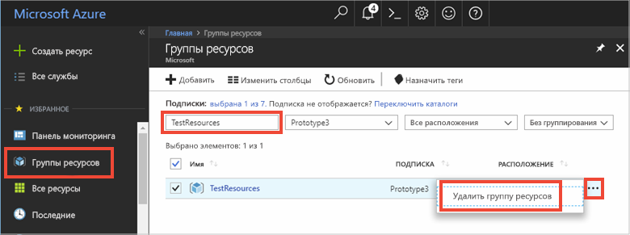

Подтвердите операцию удаления группы ресурсов. Введите имя группы ресурсов, которую необходимо удалить, и щелкните **Удалить**.

Через некоторое время группа ресурсов и все ее ресурсы будут удалены.

## <a name="next-steps"></a>Дополнительная информация

В следующем руководстве вы будете использовать кэш Redis для Azure в более реалистичном сценарии для улучшения производительности приложения. Вы обновите это приложение, чтобы кэшировать результаты списка лидеров с помощью шаблона "Кэш на стороне" с ASP.NET и базой данных.

> [!div class="nextstepaction"]
> [Руководство по созданию списка лидеров с применением шаблона "Кэш на стороне" в ASP.NET](cache-web-app-cache-aside-leaderboard.md)
