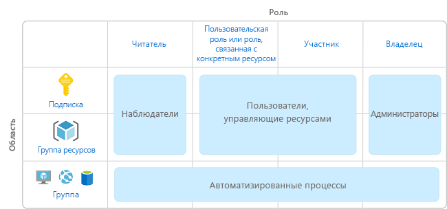
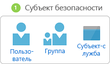
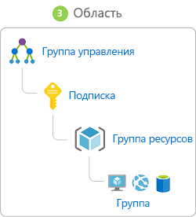
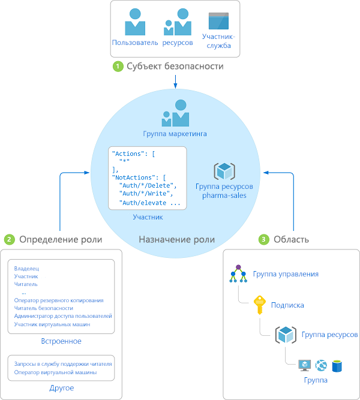

# Что такое управление доступом на основе ролей (RBAC)?

Управление доступом к облачным ресурсам является критически важной функцией в любой организации, использующей облако. Управление доступом на основе ролей (RBAC) позволяет управлять доступом пользователей к ресурсам Azure, включая настройку разрешений на выполнение операций с этими ресурсами и определением областей доступа.

RBAC — это система авторизации на основе [Azure Resource Manager](../azure-resource-manager/resource-group-overview.md), которая обеспечивает точное управление доступом к ресурсам в Azure.

## Что можно сделать с помощью RBAC?

Вот некоторые примеры действий, которые можно выполнять с помощью RBAC:

- предоставление одному пользователю разрешения на управление виртуальными машинами в подписке, а другому — на управление виртуальными сетями;
- предоставление группе DBA разрешения на управление базами данных SQL в подписке;
- предоставление пользователю разрешения на управление всеми ресурсами в группе ресурсов, включая виртуальные машины, веб-сайты и подсети;
- представление приложению доступа ко всем ресурсам в группе ресурсов.

## Рекомендации по использованию ролей RBAC

С помощью RBAC вы можете распределить обязанности внутри команды и предоставить пользователям доступ на уровне, который им необходим для выполнения поставленных задач. Вместо того чтобы предоставить всем неограниченные разрешения для подписки Azure или ресурсов, можно разрешить только определенные действия в конкретной области.

Когда вы разрабатываете стратегию управления доступом, предоставьте пользователям минимальные разрешения, чтобы они могли выполнять свои задачи. На следующей схеме представлен рекомендуемый шаблон для использования ролей RBAC.

## Принцип работы RBAC

Для управления доступом к ресурсам с помощью RBAC создаются назначения ролей. Это важнейшее понятие. Именно таким образом предоставляются разрешения. Назначение ролей состоит из трех элементов: субъект безопасности, определение роли и область действия.

### Субъект безопасности

*Субъект безопасности* — это объект, представляющий пользователя, группу или субъект-службу, которые запрашивают доступ к ресурсам Azure.

- Пользователь — человек, имеющий профиль в Azure Active Directory. Роли можно также назначать пользователям в других клиентах. Сведения о пользователях в других организациях см. в статье [Что такое служба совместной работы Azure AD B2B](/azure/active-directory/active-directory-b2b-what-is-azure-ad-b2b).
- Группа — набор пользователей, созданный в Azure Active Directory. При назначении роли группе ее получают все пользователи в этой группе. 
- Субъект-служба — это идентификатор безопасности, который используется приложениями или службами для доступа к определенным ресурсам Azure. Это что-то вроде *удостоверения пользователя* (имя пользователя и пароль или сертификат) для приложения.

### Определение роли

*Определение роли* представляет собой коллекцию разрешений. Иногда оно называется просто *ролью*. В определении роли перечисляются операции, которые можно выполнить, например чтение, запись и удаление. Роль может быть общей, например "Владелец", или более конкретной, например "Модуль чтения виртуальной машины".

В Azure есть несколько [встроенных ролей](built-in-roles.md). Ниже перечислены четыре основные встроенные роли. Первые три роли охватывают все типы ресурсов.

- [Владелец](built-in-roles.md#owner) — имеет полный доступ ко всем ресурсам, включая право делегировать доступ другим пользователям.
- [Участник](built-in-roles.md#contributor) — может создавать все типы ресурсов Azure и управлять ими, но не может предоставлять доступ другим пользователям.
- [Читатель](built-in-roles.md#reader) — может просматривать существующие ресурсы Azure.
- [Администратор доступа пользователей](built-in-roles.md#user-access-administrator) — может управлять доступом пользователей к ресурсам Azure.

Остальные встроенные роли разрешают управление определенными ресурсами Azure. Например, роль [Участник виртуальных машин](built-in-roles.md#virtual-machine-contributor) позволяет пользователю создавать виртуальные машины и управлять ими. Если встроенные роли не соответствуют потребностям вашей организации, вы можете создать собственные [настраиваемые роли](custom-roles.md).

В Azure появились операции с данными, которые позволяют предоставлять доступ к данным внутри объекта (в настоящее время эта функция находится на стадии предварительной версии). Например, если у пользователя есть доступ на чтение данных в учетной записи хранения, это позволяет ему считывать большие двоичные объекты или сообщения в этой учетной записи. Дополнительные сведения см. в статье [Определения ролей](role-definitions.md).

### Область

*Область* — это граница, в пределах которой предоставляется доступ. При назначении роли можно точнее ограничить разрешенные действия, определив их область. Это удобно, если вы хотите привлечь какого-либо пользователя к [работе над веб-сайтом](built-in-roles.md#website-contributor), но только для одной группы ресурсов.

В Azure область действия можно задать на нескольких уровнях: на уровне подписки, группы ресурсов или ресурса. Структура областей строится на отношениях "родитель-потомок": у каждого дочернего элемента есть только один родительский.

Доступ, предоставленный вами в родительской области, наследуется в дочерних областях. Например:

- Если вы назначаете роль [Читатель](built-in-roles.md#reader) группе в области подписки, участники этой группы могут просматривать все группы ресурсов и ресурсы в подписке.
- Если вы назначаете роль [Участник](built-in-roles.md#contributor) приложению в области группы ресурсов, оно может управлять ресурсами всех типов в этой группе ресурсов, но не в других группах ресурсов в подписке.

В Azure также есть область выше уровнем, чем область подписок. Она называется [группы управления](../azure-resource-manager/management-groups-overview.md). В настоящее время эта функция находится на стадии предварительной версии. Группы управления позволяют управлять несколькими подписками. При задании области для RBAC можно указать группу ресурсов либо указать подписку, группу ресурсов или иерархию ресурсов.

### Назначение роли

*Назначение ролей* — это процесс привязки определения роли к пользователю, группе или субъекту-службе в определенной области в целях предоставления доступа. Доступ предоставляется путем создания назначения ролей, а отзывается путем его удаления.

На приведенной ниже схеме показан пример назначения ролей. В этом примере группе "Маркетинг" назначена роль [Участник](built-in-roles.md#contributor) для группы ресурсов "Продажи медицинских препаратов". Это означает, что пользователи из группы "Маркетинг" могут создавать ресурсы Azure в группе ресурсов "Продажи медицинских препаратов" или управлять любыми такими ресурсами. Пользователи в группе "Маркетинг" не имеют доступа к ресурсам за пределами группы ресурсов "Продажи медицинских препаратов", если они не имеют других назначений ролей.

Создавать назначения ролей можно с помощью портала Azure, Azure CLI, Azure PowerShell, пакетов SDK Azure или интерфейсов REST API. В каждой подписке вы можете назначить до 2000 ролей. Для создания и удаления назначений ролей требуется разрешение `Microsoft.Authorization/roleAssignments/*`. Оно предоставляется с помощью ролей [владельца](built-in-roles.md#owner) или [администратора доступа пользователей](built-in-roles.md#user-access-administrator).

## Дополнительная информация

- [Quickstart: Grant access for a user using RBAC and the Azure portal](quickstart-assign-role-user-portal.md) (Краткое руководство по предоставлению доступа пользователю с помощью RBAC и портала Azure)
- [Управление доступом с помощью RBAC и портала Azure](role-assignments-portal.md)
- [Сведения о различных ролях в Azure](rbac-and-directory-admin-roles.md)
