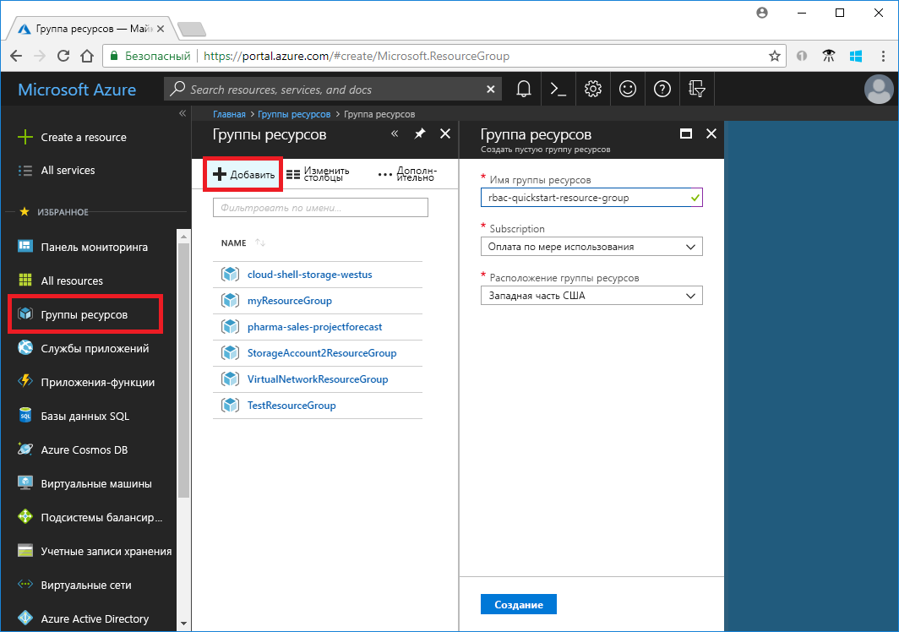
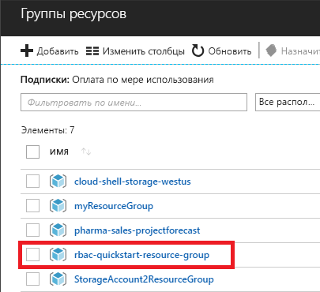
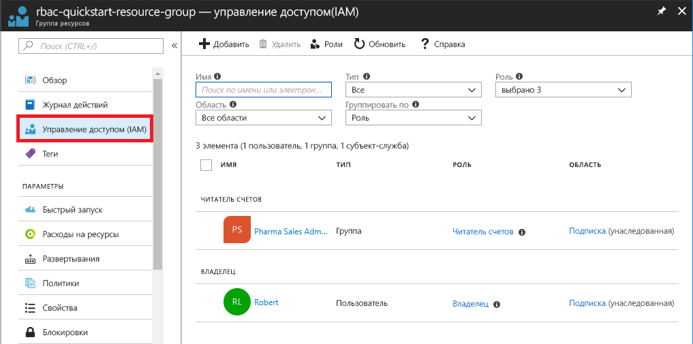
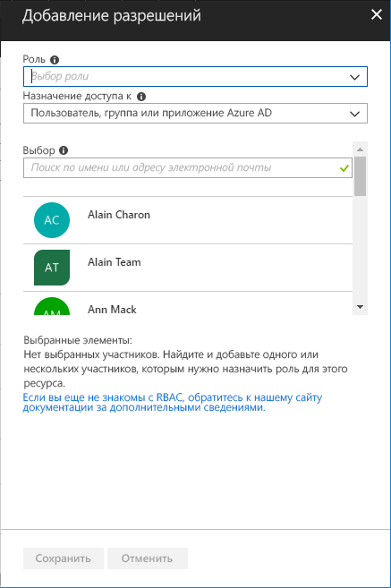
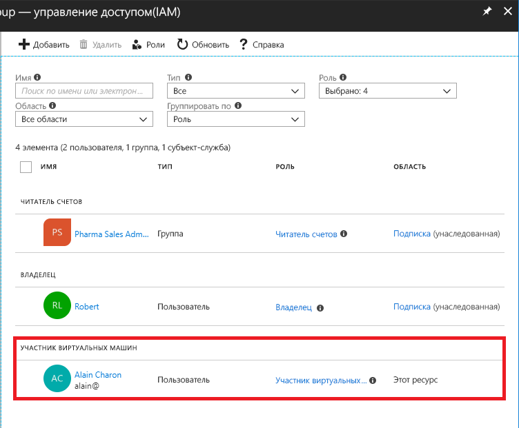
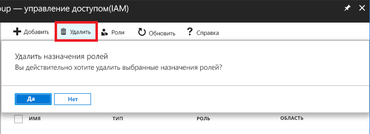
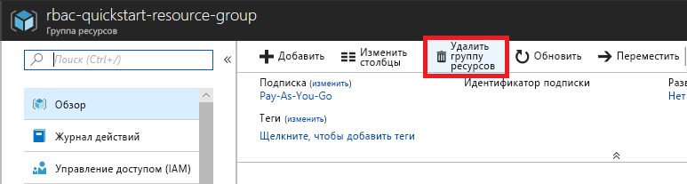

# Краткое руководство. Предоставление доступа пользователю с помощью RBAC и портала Azure

Управление доступом на основе ролей (RBAC) — это способ управления доступом к ресурсам в Azure. В этом кратком руководстве пользователь получает доступ к созданию и управлению виртуальными машинами в группе ресурсов.

Если у вас еще нет подписки Azure, [создайте бесплатную учетную запись Azure](https://azure.microsoft.com/free/?WT.mc_id=A261C142F), прежде чем начинать работу.

## Вход в Azure

Войдите на портал Azure по адресу http://portal.azure.com.

## Создание группы ресурсов

1. В списке переходов выберите **Группы ресурсов**.

1. Чтобы открыть колонку **Группа ресурсов**, нажмите **Добавить**.

   

1. Как **имя группы ресурсов** введите **rbac-quickstart-resource-group**.

1. Выберите подписку и расположение группы ресурсов.

1. Выберите **Создать**, чтобы создать группу ресурсов.

1. Выберите **Обновить**, чтобы обновить список групп ресурсов.

   Новая группа ресурсов появится в списке групп ресурсов.

   

## Предоставление доступа

При использовании RBAC, чтобы предоставить доступ, нужно создать назначение ролей.

1. В списке **Группы ресурсов** выберите новую группу ресурсов **rbac-quickstart-resource-group**.

1. Выберите **Управление доступом (IAM)**, чтобы просмотреть текущий список назначения ролей.

   

1. Выберите **Добавить**, чтобы открыть панель **Добавление разрешений**.

   Если у вас нет разрешений на назначение ролей, параметр **Добавить** не будет отображаться.

   

1. В раскрывающемся списке **Роль** выберите **Участник виртуальных машин**.

1. В списке **Выбор** выберите себя или другого пользователя.

1. Нажмите кнопку **Сохранить**, чтобы создать назначение роли.

   Через несколько секунд пользователю назначается роль "Участник виртуальной машины" в пределах группы ресурсов rbac-quickstart-resource-group.

   

## Запрет доступа

В RBAC, чтобы удалить доступ, нужно удалить назначение роли.

1. В списке назначения ролей добавьте флажок рядом с пользователем с ролью "Участник виртуальной машины".

1. Нажмите кнопку **Удалить**.

   

1. В появившемся сообщении об удалении назначения роли нажмите кнопку **Да**.

## Очистка

1. В списке переходов выберите **Группы ресурсов**.

1. Чтобы открыть группу ресурсов, выберите **rbac-quickstart-resource-group**.

1. Чтобы удалить группу ресурсов, выберите **Удалить группу ресурсов**.

   

1. В колонке **Вы действительно хотите удалить** введите имя группы ресурсов: **rbac-quickstart-resource-group**.

1. Чтобы удалить группу ресурсов, выберите **Удалить**.

## Дополнительная информация

> [!div class="nextstepaction"]
> [Руководство по предоставлению доступа пользователям с помощью RBAC и Azure PowerShell](tutorial-role-assignments-user-powershell.md)

