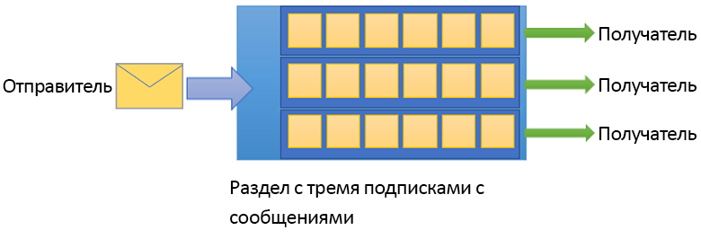

# Что такое служебная шина Azure?

Служебная шина Microsoft Azure — это полностью управляемый брокер интеграции сообщений корпоративного уровня. Чаще всего служебная шина используется для разделения приложений и (или) служб друг, представляя им надежную и безопасную платформу для асинхронного обмена данными и сведениями о состоянии. Данные передаются между приложениями и (или) службами с помощью *сообщений*. Сообщение имеет двоичный формат и может содержать простой текст, XML или JSON. 

Вот несколько распространенных сценариев для обмена сообщениями:

* Обмен сообщениями — передача бизнес-данных, например данных о продажах, заказах и перемещении запасов, а также журналов.
* Разделение приложений — повышение надежности и масштабируемости приложений и служб (без необходимости одновременно подключать к сети клиент и службу).
* Разделы и подписки — поддержка связей *один ко многим* между издателями и подписчиками.
* Сеансы обмена сообщениями — реализация рабочих процессов, которые требуют упорядочения сообщений или отсроченной доставки.

## Пространства имен

Пространство имен — это контейнер, определяющий область действия для всех компонентов обмена сообщениями. В одном пространстве имен могут содержаться несколько очередей и разделов. Часто пространства имен выполняют роль контейнеров приложений.

## Очереди

Сообщений отправляются и получаются через *очереди*. Очереди позволяют хранить сообщения, пока принимающее приложение сможет получить и обработать их.

Сообщения в очередях упорядочиваются и получают отметку времени поступления. Принятые сообщения безопасно хранятся в хранилище с избыточностью. Сообщения доставляются в режиме *запроса*, то есть процессом доставки управляет приложение.

## Разделы

Вы также можете использовать *разделы* для отправки и получения сообщений. Очереди часто используются для взаимодействия в режиме "точка — точка", но разделы позволяют реализовать сценарии публикации и подписки.

Для раздела может существовать несколько независимых подписок. Подписка на раздел может получать копию любого сообщения, отправленного в этот раздел. Подписки — это именованные сущности, которые могут создаваться на неограниченный срок, но для них также можно настроить ограничение срока действия или автоматическое удаление.

В некоторых сценариях нужно, чтобы в отдельную подписку попадали не все сообщения, отправленные в раздел. В таких случаях вы можете применить [правила и фильтры](topic-filters.md), чтобы определить условия активации необязательных [действий](topic-filters.md#actions), отфильтровать сообщения и (или) задать либо изменить свойства сообщений.

## Дополнительные функции

Служебная шина также поддерживает дополнительные возможности для более сложных схем обмена сообщениями. В разделах ниже описываются основные возможности.

### Сеансы обмена сообщениями

Чтобы реализовать надежный механизм FIFO в служебной шине, используйте сеансы. [Сеансы сообщений](message-sessions.md) обеспечивают согласованную и упорядоченную обработку несвязанных последовательностей связанных сообщений. 

### Автоматическая переадресация

Функция [автоматической переадресации](service-bus-auto-forwarding.md) позволяет привязать очередь или подписку к другой очереди или разделу, которые являются частью одного и того же пространства имен. Если включена автоматическая переадресация, служебная шина автоматически удаляет сообщения, помещенные в первую очередь или подписку (источник), и помещает их во вторую очередь или раздел (место назначения).

### Перемещение в очередь недоставленных сообщений

Служебная шина поддерживает [перемещение в очередь недоставленных сообщений](service-bus-dead-letter-queues.md) для хранения сообщений, которые невозможно обработать или доставить какому-либо адресату. Вы можете удалить сообщения из очереди недоставленных сообщений и проверить их.

### Доставка по расписанию

Сообщения можно отправлять в очередь или раздел [для отложенной обработки](message-sequencing.md#scheduled-messages) (например, чтобы запланировать задание для обработки системой в определенное время).

### Откладывание сообщений

Когда клиент очереди или подписки получает сообщение, которое предназначено этому клиенту но не может быть сразу обработано из-за каких-либо ограничений в приложении, этот клиент может [отложить получение такого сообщения](message-deferral.md) на более позднее время. Сообщение остается в очереди или подписке, но игнорируется.

### Пакетная обработка

[Пакетная обработка на стороне клиента](service-bus-performance-improvements.md#client-side-batching) позволяет клиенту очереди или раздела отложить отправку сообщения на определенный период времени. Если в течение этого времени клиент будет отправлять дополнительные сообщения, они будут переданы в одном пакете. 

### Транзакции

[Транзакция](service-bus-transactions.md) объединяет две или несколько операций в область выполнения. Служебная шина поддерживает операции группирования относительно одной сущности обмена сообщениями (очереди, раздела, подписки) в области транзакции.

### Фильтрация и действия

Подписчики могут самостоятельно определять, какие сообщения они хотят получать из раздела. Эти сообщения определяются в одном или нескольких [именованных правилах подписки](topic-filters.md). При каждом совпадении с условиями правила подписка создает копию сообщения, каждая из которых может содержать разные заметки в соответствии с разными правилами.

### Автоматическое удаление при простое

[Автоматическое удаление при простое](/dotnet/api/microsoft.servicebus.messaging.queuedescription.autodeleteonidle) позволяет настроить интервал бездействия, по истечении которого очередь автоматически удаляется. Минимальная длительность составляет 5 минут.

### Обнаружение дубликатов

В случае ошибок, которые не позволяют клиенту точно установить состояние операции отправки, можно выполнить [поиск повторяющихся сообщений](duplicate-detection.md). Отправитель может повторно отправить то же самое сообщение, а очередь или раздел автоматически отклонит возможные дубликаты.

### SAS, RBAC и MSI

Служебная шина поддерживает такие протоколы безопасности, как [подписанный URL-адрес](service-bus-sas.md) (SAS), [управление доступом на основе ролей](service-bus-role-based-access-control.md) (RBAC) и [управляемое удостоверение службы](service-bus-managed-service-identity.md) (MSI).

### Геоизбыточное аварийное восстановление

Если происходит авария на уровне региона или центра обработки данных Azure, [геоизбыточное аварийное восстановление](service-bus-geo-dr.md) позволяет продолжать обработку данных, переключившись на другой регион и (или) центр обработки данных.

### Безопасность

Служебная шина поддерживает стандартные протоколы [AMQP 1.0](service-bus-amqp-overview.md) и [HTTP/REST](/rest/api/servicebus/).

## Клиентские библиотеки

Служебная шина поддерживает клиентские библиотеки для [.NET](https://github.com/Azure/azure-service-bus-dotnet/tree/master), [Java](https://github.com/Azure/azure-service-bus-java/tree/master) и [JMS](https://github.com/Azure/azure-service-bus/tree/master/samples/Java/qpid-jms-client).

## Интеграция

Служебная шина полностью интегрируется со следующими службами Azure:

- [Сетка событий](https://azure.microsoft.com/services/event-grid/) 
- [Logic Apps](https://azure.microsoft.com/services/logic-apps/) 
- [Функции](https://azure.microsoft.com/services/functions/) 
- [Dynamics 365](https://dynamics.microsoft.com)
- [Stream Analytics](https://azure.microsoft.com/services/stream-analytics/)
 
## Дополнительная информация

Сведения о начале работы с обменом сообщениями через служебную шину см. в следующих статьях:

* [Сравнение служб обмена сообщениями Azure](../event-grid/compare-messaging-services.md?toc=%2fazure%2fservice-bus-messaging%2ftoc.json&bc=%2fazure%2fservice-bus-messaging%2fbreadcrumb%2ftoc.json).
* Сведения о Служебной шине Azure [категории "Стандартный" и "Премиум"](https://azure.microsoft.com/pricing/details/service-bus/) и цены на нее.
* [Performance and Latency of Azure Service Bus Premium tier](https://blogs.msdn.microsoft.com/servicebus/2016/07/18/premium-messaging-how-fast-is-it/) (Производительность и задержки для Служебной шины Azure категории "Премиум").
* Также вы можете изучить краткие руководства для [.NET](service-bus-quickstart-powershell.md), [Java](service-bus-quickstart-powershell.md) или [JMS](service-bus-quickstart-powershell.md).
