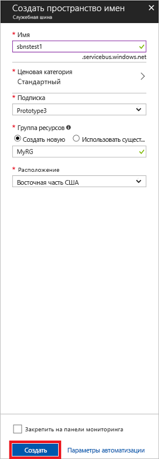

# <a name="quickstart-send-and-receive-messages-using-the-azure-portal-and-net"></a>Краткое руководство по отправке и получению сообщений Служебной шины Azure с помощью портала Azure и .NET

Служебная шина Microsoft Azure представляет собой брокер интеграции сообщений корпоративного уровня, который гарантирует защищенную и абсолютно надежную доставку сообщений. Типичный сценарий применения служебной шины подразумевает функциональное разделение двух или более приложений, служб либо процессов, которым нужно обмениваться данными или сведениями о состоянии. В таких сценариях часто требуется назначать несколько пакетных заданий для других приложений и служб или запускать обработку заказов. Например, розничная компания может отправлять данные из точек продаж во вспомогательный офис или региональный центр дистрибуции для пополнения запасов и сбора сведений о товарах. В этом сценарии клиентское приложение отправляет сообщения в очередь служебной шины и получает сообщения из нее.  


В этом кратком руководстве объясняется, как отправлять и получать сообщения через очередь служебной шины, создав с помощью [портала Azure][Azure portal] пространство имен для обмена сообщениями и очередь в этом пространстве имен, а также как получить учетные данные для авторизации в этом пространстве имен. Далее в этой процедуре демонстрируется отправка и получение сообщений через созданную очередь с применением [библиотеки .NET Standard](https://www.nuget.org/packages/Microsoft.Azure.ServiceBus).

Если у вас еще нет подписки Azure, вы можете создать [бесплатную учетную запись][], прежде чем начинать работу.

## <a name="prerequisites"></a>предварительным требованиям

Для работы с этим руководством вам потребуются:

- [Visual Studio 2017 с обновлением 3 (версия 15.3, 26730.01)](http://www.visualstudio.com/vs) или более новая версия.
- [Пакет SDK для .NET Core](https://www.microsoft.com/net/download/windows) версии 2.0 или более новой.

## <a name="log-on-to-the-azure-portal"></a>Вход на портал Azure

Сначала откройте [портал Azure][Azure portal] и выполните вход, используя подписку Azure. Здесь вам в первую очередь нужно создать пространство имен служебной шины с типом **обмен сообщениями**.

## <a name="create-a-service-bus-namespace"></a>Создание пространства имен служебной шины

Пространство имен служебной шины для обмена сообщениями предоставляет уникальный контейнер, ограничивающий область действия. Вы можете обращаться к этому контейнеру по [полному доменному имени][] и создавать в нем очереди, разделы и подписки. В следующем примере создается пространство имен служебной шины для обмена сообщениями в новой или существующей [группе ресурсов](/azure/azure-resource-manager/resource-group-portal):

1. На портале в области навигации слева щелкните **+ Создать ресурс**, **Интеграция Enterprise** и **Служебная шина**.
2. В диалоговом окне **Создание пространства имен** укажите имя пространства имен. Система немедленно проверяет, доступно ли оно.
3. Убедившись, что пространство имен доступно, выберите ценовую категорию: "Стандартный" или "Премиум".
4. Выберите **подписку** Azure, в рамках которой будет создано пространство имен.
5. Выберите существующую **группу ресурсов** , в которую будет включено это пространство имен, или создайте новую.      
6. Укажите **расположение**— страну или регион для размещения пространства имен.
7. Нажмите кнопку **Создать**. Теперь система создает пространство имен и включает его. Возможно, вам придется подождать несколько минут, пока система выделит ресурсы для вашей учетной записи.



### <a name="obtain-the-management-credentials"></a>Получение учетных данных управления

При создании нового пространства имен автоматически создается начальное правило подписанного URL-адреса (SAS) и связанная с ним пара первичного и вторичного ключей, каждый из которых предоставляет полный контроль над всеми аспектами пространства имен. Чтобы скопировать начальное правило, выполните следующие действия. 

1.  Щелкните **Все ресурсы**, а затем щелкните созданное имя пространства имен.
2. В окне пространства имен щелкните **Политики общего доступа**.
3. В окне **Политики общего доступа** щелкните **RootManageSharedAccessKey**.
4. В окне **Policy: RootManageSharedAccessKey** (Политика: RootManageSharedAccessKey) нажмите кнопку **Копировать** рядом с полем **Первичная строка подключения**, чтобы скопировать строку подключения в буфер обмена для последующего использования. Вставьте на время эти значения в Блокноте или любом другом месте. 

    ![Строка подключения][connection-string]
5. Повторите предыдущий шаг, скопировав и вставив значение **первичного ключа** во временное расположение для последующего использования.

## <a name="create-a-queue"></a>Создание очереди

Чтобы создать очередь служебной шины, укажите пространство имен, в котором вы хотите ее создать. В следующем примере показано, как создать очередь на портале:

1. В левой области навигации портала щелкните **Служебная шина**. Если элемент **Служебная шина** не отображается, щелкните **Больше служб**.
2. Щелкните пространство имен, в котором вы хотите создать очередь.
3. В окне пространства имен выберите раздел **Очереди**, а затем в окне **Очереди** нажмите кнопку **+ Очередь**.
4. Введите **имя очереди**, остальные значения по умолчанию не изменяйте.
5. Нажмите кнопку **Создать** в нижней части окна.
6. Запишите имя созданной очереди.

## <a name="send-and-receive-messages"></a>Отправка и получение сообщений

Подготовив пространство имен и очередь и получив необходимые учетные данные, вы можете приступать к отправке и получению сообщений. Этот код можно изучить в [папке с примером на GitHub](https://github.com/Azure/azure-service-bus/tree/master/samples/Java/quickstarts-and-tutorials/quickstart-jms).

Чтобы выполнить этот код, сделайте следующее:

1. Выполните следующую команду, которая клонирует [репозиторий GitHub для служебной шины](https://github.com/Azure/azure-service-bus/):

   ```shell
   git clone https://github.com/Azure/azure-service-bus.git
   ```

3. Перейдите к папке `azure-service-bus\samples\DotNet\GettingStarted\BasicSendReceiveQuickStart\BasicSendReceiveQuickStart` с примерами.

4. Скопируйте строку подключения и имя очереди, которые вы получили в разделе [Получение учетных данных управления](#obtain-the-management-credentials).

5.  В командной строке введите следующую команду:

   ```shell
   dotnet build
   ```

6.  Перейдите в папку `bin\Debug\netcoreapp2.0`.

7.  Введите приведенную ниже команду, чтобы запустить программу. Не забудьте ввести вместо `myConnectionString` значение, которое вы получили ранее, а вместо `myQueueName` — имя созданной очереди:

   ```shell
   dotnet BasicSendReceiveQuickStart.dll -ConnectionString "myConnectionString" -QueueName "myQueueName"
   ``` 

8. Проследите, как в очередь отправляются 10 сообщений, а затем поступают из нее:

   

## <a name="clean-up-resources"></a>Очистка ресурсов

С помощью портала можно удалить группу ресурсов, пространство имен и очередь.

## <a name="understand-the-sample-code"></a>Разбор примера кода

Этот раздел содержит дополнительные сведения о работе этого примера кода. 

### <a name="get-connection-string-and-queue"></a>Получение строки подключения и очереди

Строка подключения и имя очереди передаются в метод `Main()` в качестве аргументов командной строки. `Main()` объявляет две строковые переменные для хранения этих значений:

```csharp
static void Main(string[] args)
{
    string ServiceBusConnectionString = "";
    string QueueName = "";

    for (int i = 0; i < args.Length; i++)
    {
        var p = new Program();
        if (args[i] == "-ConnectionString")
        {
            Console.WriteLine($"ConnectionString: {args[i+1]}");
            ServiceBusConnectionString = args[i + 1]; 
        }
        else if(args[i] == "-QueueName")
        {
            Console.WriteLine($"QueueName: {args[i+1]}");
            QueueName = args[i + 1];
        }                
    }

    if (ServiceBusConnectionString != "" && QueueName != "")
        MainAsync(ServiceBusConnectionString, QueueName).GetAwaiter().GetResult();
    else
    {
        Console.WriteLine("Specify -Connectionstring and -QueueName to execute the example.");
        Console.ReadKey();
    }                            
}
```
 
Затем метод `Main()` запускает асинхронный цикл обработки сообщений `MainAsync()`.

### <a name="message-loop"></a>Цикл обработки сообщений

Метод MainAsync() создает клиент очереди, используя аргументы командной строки, затем вызывает обработчик получения сообщений с именем `RegisterOnMessageHandlerAndReceiveMessages()` и отправляет набор сообщений:

```csharp
static async Task MainAsync(string ServiceBusConnectionString, string QueueName)
{
    const int numberOfMessages = 10;
    queueClient = new QueueClient(ServiceBusConnectionString, QueueName);

    Console.WriteLine("======================================================");
    Console.WriteLine("Press any key to exit after receiving all the messages.");
    Console.WriteLine("======================================================");

    // Register QueueClient's MessageHandler and receive messages in a loop
    RegisterOnMessageHandlerAndReceiveMessages();

    // Send Messages
    await SendMessagesAsync(numberOfMessages);

    Console.ReadKey();

    await queueClient.CloseAsync();
}
```

Метод `RegisterOnMessageHandlerAndReceiveMessages()` просто настраивает несколько параметров для обработчика событий и вызывает метод `RegisterMessageHandler()` клиента, который начинает прием сообщений:

```csharp
static void RegisterOnMessageHandlerAndReceiveMessages()
{
    // Configure the MessageHandler Options in terms of exception handling, number of concurrent messages to deliver etc.
    var messageHandlerOptions = new MessageHandlerOptions(ExceptionReceivedHandler)
    {
        // Maximum number of Concurrent calls to the callback `ProcessMessagesAsync`, set to 1 for simplicity.
        // Set it according to how many messages the application wants to process in parallel.
        MaxConcurrentCalls = 1,

        // Indicates whether MessagePump should automatically complete the messages after returning from User Callback.
        // False below indicates the Complete will be handled by the User Callback as in `ProcessMessagesAsync` below.
        AutoComplete = false
    };

    // Register the function that will process messages
    queueClient.RegisterMessageHandler(ProcessMessagesAsync, messageHandlerOptions);
} 
```

### <a name="send-messages"></a>Отправка сообщений

Операции создания и отправки сообщений выполняются в методе `SendMessagesAsync()`:

```csharp
static async Task SendMessagesAsync(int numberOfMessagesToSend)
{
    try
    {
        for (var i = 0; i < numberOfMessagesToSend; i++)
        {
            // Create a new message to send to the queue
            string messageBody = $"Message {i}";
            var message = new Message(Encoding.UTF8.GetBytes(messageBody));

            // Write the body of the message to the console
            Console.WriteLine($"Sending message: {messageBody}");

            // Send the message to the queue
            await queueClient.SendAsync(message);
        }
    }
    catch (Exception exception)
    {
        Console.WriteLine($"{DateTime.Now} :: Exception: {exception.Message}");
    }
}
```

### <a name="process-messages"></a>Обработка сообщений

Метод `ProcessMessagesAsync()` обнаруживает новые сообщения, обрабатывает их и завершает их прием:

```csharp
static async Task ProcessMessagesAsync(Message message, CancellationToken token)
{
    // Process the message
    Console.WriteLine($"Received message: SequenceNumber:{message.SystemProperties.SequenceNumber} Body:{Encoding.UTF8.GetString(message.Body)}");

    // Complete the message so that it is not received again.
    await queueClient.CompleteAsync(message.SystemProperties.LockToken);
}
```

## <a name="next-steps"></a>Дополнительная информация

С помощью этой статьи вы создали пространство имен служебной шины и другие ресурсы, необходимые для отправки и получения сообщений через очередь. Чтобы лучше изучить код, выполняющий отправку и получение сообщений, см. следующее руководство по служебной шине:

> [!div class="nextstepaction"]
> [Обновление информации о запасах с помощью портала Azure](./service-bus-tutorial-topics-subscriptions-portal.md)


[бесплатную учетную запись]: https://azure.microsoft.com/free/?ref=microsoft.com&utm_source=microsoft.com&utm_medium=docs&utm_campaign=visualstudio
[полному доменному имени]: https://wikipedia.org/wiki/Fully_qualified_domain_name
[Azure portal]: https://portal.azure.com/

[connection-string]: ./media/service-bus-quickstart-portal/connection-string.png
[service-bus-flow]: ./media/service-bus-quickstart-portal/service-bus-flow.png
