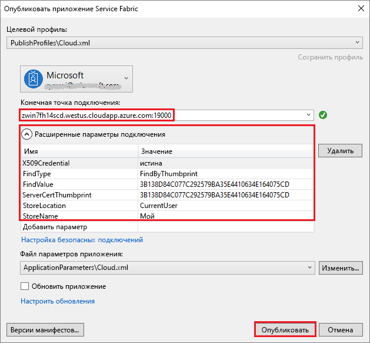

# <a name="tutorial-deploy-a-service-fabric-application-to-a-cluster-in-azure"></a>Руководство по развертыванию приложения Service Fabric в кластере в Azure

Это руководство из цикла. В нем показано, как развернуть приложение Azure Service Fabric в новый кластер в Azure.

Из этого руководства вы узнаете, как выполнить следующие задачи:
> [!div class="checklist"]
> * Создание кластера сообщества.
> * Развертывание приложения на удаленный кластер с помощью Visual Studio.

Из этой серии руководств вы узнаете, как выполнить следующие задачи:
> [!div class="checklist"]
> * [Создание приложения .NET Service Fabric](service-fabric-tutorial-create-dotnet-app.md).
> * Развертывание приложения в удаленном кластере.
> * [Добавление конечной точки HTTPS к интерфейсной службе ASP.NET Core](service-fabric-tutorial-dotnet-app-enable-https-endpoint.md)
> * [Настройка непрерывной интеграции и непрерывного развертывания с помощью Visual Studio Team Services](service-fabric-tutorial-deploy-app-with-cicd-vsts.md).
> * [Настройка мониторинга и диагностики приложения](service-fabric-tutorial-monitoring-aspnet.md)

## <a name="prerequisites"></a>Предварительные требования

Перед началом работы с этим руководством выполните следующие действия:

* Если у вас еще нет подписки Azure, создайте [бесплатную учетную запись Azure](https://azure.microsoft.com/free/?WT.mc_id=A261C142F).
* [Установите Visual Studio 2017](https://www.visualstudio.com/), а также рабочие нагрузки **разработка Azure** и **ASP.NET и веб-разработка**.
* [Установите пакет SDK для Service Fabric](service-fabric-get-started.md).

## <a name="download-the-voting-sample-application"></a>Скачивание примера приложения для голосования

Если вы не создавали пример приложения для голосования [в первой части этой серии руководств](service-fabric-tutorial-create-dotnet-app.md), вы можете скачать его. В окне терминала выполните следующую команду, чтобы клонировать репозиторий с примером приложения на локальный компьютер.

```git
git clone https://github.com/Azure-Samples/service-fabric-dotnet-quickstart
```

## <a name="publish-to-a-service-fabric-cluster"></a>Выполните публикацию в кластер Service Fabric

Теперь, когда приложение готово, можно развернуть его в кластер напрямую из Visual Studio. [Кластер Service Fabric](https://docs.microsoft.com/en-gb/azure/service-fabric/service-fabric-deploy-anywhere) — это подключенный к сети набор виртуальных машин или физических компьютеров, в котором вы развертываете микрослужбы и управляете ими.

В этом руководстве предложено два варианта развертывания приложения для голосования в кластер Service Fabric, с помощью Visual Studio.

* Выполните публикацию в пробной версии кластера (сообщества).
* Выполните публикацию в имеющийся кластер в своей подписке.  Кластеры Service Fabric можно создавать с помощью [портала Azure](https://portal.azure.com), скриптов [PowerShell](./scripts/service-fabric-powershell-create-secure-cluster-cert.md) или [Azure CLI](./scripts/cli-create-cluster.md) либо [шаблона Azure Resource Manager](service-fabric-tutorial-create-vnet-and-windows-cluster.md).

> [!NOTE]
> Многие службы используют обратный прокси-сервер для взаимодействия между собой. У кластеров, созданных из Visual Studio, и сторонних кластеров есть обратный прокси-сервер, включенный по умолчанию.  При использовании имеющегося кластера [в нем необходимо включить обратный прокси-сервер](service-fabric-reverseproxy-setup.md#).


### <a name="find-the-votingweb-service-endpoint-for-your-azure-subscription"></a>Найдите конечную точку службы VotingWeb для своей подписки Azure

Если необходимо опубликовать приложение для голосования в подписке Azure, найдите конечную точку интерфейсной веб-службы. Если используется кластер сообщества, порт 8080, использующийся пример приложения для голосования открывается автоматически, поэтому его не нужно настраивать в подсистеме балансировки нагрузки кластера сообщества.

Интерфейсная веб-служба ожидает передачи данных через определенный порт.  Если приложение развертывается в кластере в Azure, то приложение и кластер запускаются под контролем Azure Load Balancer.  Чтобы входящий трафик поступал в веб-службу, необходимо открыть порт приложения в Azure Load Balancer с помощью правила для этого кластера.  Порт (например, 8080) указан в файле *VotingWeb/PackageRoot/ServiceManifest.xml* в элементе **Endpoint**:

```xml
<Endpoint Protocol="http" Name="ServiceEndpoint" Type="Input" Port="8080" />
```

Чтобы создать подписку в Azure, откройте этот порт используя правила подсистемы балансировки нагрузки в Azure с помощью [сценария PowerShell](./scripts/service-fabric-powershell-open-port-in-load-balancer.md) или подсистемы балансировки нагрузки для этого кластера на [портале Azure](https://portal.azure.com).

### <a name="join-a-party-cluster"></a>Присоединение кластера сообщества

> [!NOTE]
> Если необходимо опубликовать приложение в своем кластере в рамках подписки Azure, перейдите к его развертыванию с помощью Visual Studio в соответствии с инструкциями в следующем разделе.

Кластеры сообщества — это бесплатные кластеры Service Fabric, которые доступны в течение ограниченного времени. Эти кластеры размещены в Azure и поддерживаются командой Service Fabric. Любой пользователь может развертывать приложения на этих кластерах и знакомиться с платформой. Кластер использует один самозаверяющий сертификат для обмена данными между узлами и обеспечения безопасности при взаимодействии между клиентом и узлом.

Войдите в систему и [присоедините кластер Windows](http://aka.ms/tryservicefabric). Скачайте сертификат PFX на компьютер, щелкнув ссылку **PFX**. Щелкните ссылку **How to connect to a secure Party cluster?** (Как подключиться к безопасному кластеру сообщества) и скопируйте пароль сертификата. Сертификат, пароль сертификата и значение **конечной точки подключения** будут использоваться в дальнейшем.


> [!Note]
> В течение одного часа доступно ограниченное число кластеров сообщества. Если при попытке регистрации в кластере сообщества поступает сообщение об ошибке, подождите немного и повторите попытку. Или следуйте инструкциям из раздела о [развертывании приложения .NET](https://docs.microsoft.com/azure/service-fabric/service-fabric-tutorial-deploy-app-to-party-cluster#deploy-the-sample-application), чтобы создать кластер Service Fabric в подписке Azure и развернуть в нем приложение. Если у вас еще нет подписки Azure, создайте [бесплатную учетную запись](https://azure.microsoft.com/free/?WT.mc_id=A261C142F).
>

На компьютере Windows установите PFX в хранилище сертификатов: *CurrentUser\My*.

```powershell
PS C:\mycertificates> Import-PfxCertificate -FilePath .\party-cluster-873689604-client-cert.pfx -CertStoreLocation Cert:\CurrentUser\My -Password (ConvertTo-SecureString 873689604 -AsPlainText -Force)


   PSParentPath: Microsoft.PowerShell.Security\Certificate::CurrentUser\My

Thumbprint                                Subject
----------                                -------
3B138D84C077C292579BA35E4410634E164075CD  CN=zwin7fh14scd.westus.cloudapp.azure.com
```

Помните об отпечатке для следующего шага.

> [!Note]
> По умолчанию служба веб-интерфейса ожидает передачи данных через порт 8080 для входящего трафика. Порт 8080 открыт в кластере сообщества.  Если нужно изменить порт приложения, замените его одним из портов, открытых в кластере сообщества.
>

### <a name="publish-the-application-using-visual-studio"></a>Публикация приложения с использованием Visual Studio

Теперь, когда приложение готово, можно развернуть его в кластер напрямую из Visual Studio.

1. Щелкните правой кнопкой мыши **Voting** в обозревателе решений и выберите **Опубликовать**. Появится диалоговое окно "Опубликовать".

2. Скопируйте **конечную точку подключения** со страницы кластера сообщества или из подписки Azure в поле **Конечная точка подключения**. Например, `zwin7fh14scd.westus.cloudapp.azure.com:19000`. Щелкните **Расширенные параметры подключения**. Значения *FindValue* и *ServerCertThumbprint* должны соответствовать отпечатку сертификата, который установлен на предыдущем шаге для кластера сообщества или сертификата, который соответствует подписке Azure.

    

    Имя каждого приложения в кластере должно быть уникальным.  Кластеры сообщества — это открытая общедоступная среда. Но они могут конфликтовать с существующим приложением.  В случае конфликта имен переименуйте проект Visual Studio и повторите развертывание.

3. Щелкните **Опубликовать**.

4. Откройте браузер и введите адрес кластера и порт ":8080" (или другой порт, если он настроен), чтобы получить доступ к приложению для голосования в кластере. Например: `http://zwin7fh14scd.westus.cloudapp.azure.com:8080`. Вы увидите приложения, выполняющиеся в кластере Azure. На веб-странице для голосования попробуйте добавить и удалить параметры голосования, а также проголосовать за один или несколько из этих параметров.

    


## <a name="next-steps"></a>Дополнительная информация

Из этого руководства вы узнали, как выполнить следующие задачи:

> [!div class="checklist"]
> * Создание кластера сообщества.
> * Развертывание приложения на удаленный кластер с помощью Visual Studio.

Перейдите к следующему руководству:
> [!div class="nextstepaction"]
> [Включение HTTPS](service-fabric-tutorial-dotnet-app-enable-https-endpoint.md)
