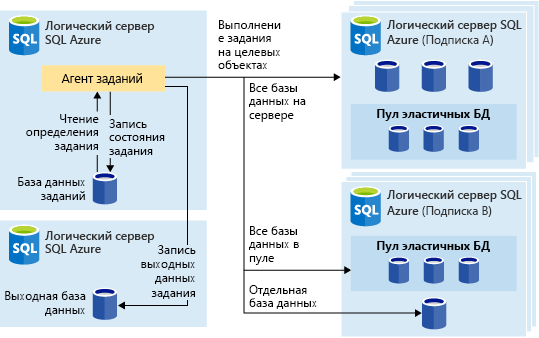
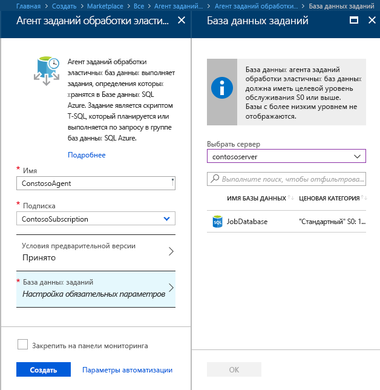
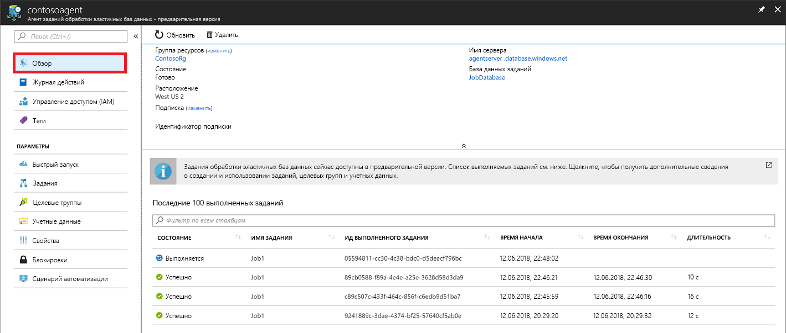
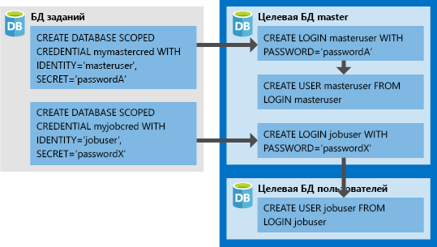

# <a name="manage-groups-of-databases-with-elastic-database-jobs"></a>Управление группами баз данных с помощью заданий эластичных баз данных

**Задания эластичных баз данных** позволяют одновременно запускать один или несколько скриптов T-SQL в большом количестве баз данных по расписанию или по требованию.

**Запускайте задания в любой комбинации баз данных**: одной или нескольких отдельных базах данных, всех базах данных на сервере, всех базах данных в эластичном пуле или в shardmap с дополнительной гибкостью, позволяющей включить или исключить любую конкретную базу данных. **Задания могут выполняться на нескольких серверах, в нескольких пулах и даже в базах данных в разных подписках.** Серверы и пулы динамически перечисляются во время выполнения, поэтому задания выполняются во всех базах данных, имеющихся в целевой группе на момент выполнения.

На следующем изображении показан агент задания, выполняющий задания в разных типах целевых групп:




## <a name="why-use-elastic-jobs"></a>Почему рекомендуется использовать эластичные задания?

### <a name="manage-many-databases"></a>Управление множеством баз данных

- Планирование запуска задач администрирования каждый рабочий день, в нерабочие часы и т. д.
- Развертывание изменений схемы, учетных данных, сбора данных о производительности или телеметрии клиента. Обновление эталонных данных (например, сведений о продукте, которые являются общими для всех баз данных).
- Перестроение индексов для повышения скорости обработки запросов. Настройка заданий для выполнения в коллекции баз данных на постоянной основе, например в часы наименьшей нагрузки.
- Собирайте результаты запросов из набора баз данных в центральную таблицу на постоянной основе. Запросы производительности могут выполняться непрерывно и вызывать дополнительные задачи.

### <a name="collect-data-for-reporting"></a>Сбор данных для отчетов

- Сбор данных из семейства баз данных SQL Azure в одну целевую таблицу.
- Выполняйте запросы обработки данных с повышенным временем выполнения для большого набора баз данных, например коллекции телеметрии клиентов. Результаты собираются в одну целевую таблицу для дальнейшего анализа.

### <a name="reduce-overhead"></a>Уменьшение нагрузки

- Как правило, чтобы выполнять инструкции Transact-SQL или другие административные задачи, к каждой базе данных необходимо подключаться отдельно. тогда как задание автоматически входит в каждую базу данных в целевой группе. Вы также определяете, поддерживаете и сохраняете сценарии Transact-SQL, которые могут выполняться в группе баз данных SQL Azure.

### <a name="accounting"></a>Учет

- Задания записывают состояние выполнения для каждой базы данных. При сбое действие автоматически выполняется повторно.

### <a name="flexibility"></a>Гибкость

- Определение пользовательских групп для баз данных SQL Azure и определение расписаний для запуска задания.


## <a name="elastic-job-components"></a>Компоненты заданий обработки эластичных баз данных

|Компонент  | Описание (дополнительные сведения приведены после таблицы) |
|---------|---------|
|[**Агент заданий обработки эластичных баз данных**](#elastic-job-agent) |  Ресурс Azure, созданный для выполнения заданий и управления ими.   |
|[**База данных заданий**](#job-database)    |    База данных SQL Azure, которую агент заданий использует для хранения данных, связанных с заданиями, определений заданий и т. д.      |
|[**Целевая группа**](#target-group)      |  Набор серверов, пулов, баз данных и карт сегментов, в которых требуется выполнить задания.       |
|[**Задание**](#job)  |  Задание — это единица работы, состоящая из одного или нескольких [шагов](#job-step). Шаги задания указывают скрипт T-SQL для запуска, а также другие сведения, необходимые для выполнения скрипта.  |


### <a name="elastic-job-agent"></a>Агент заданий обработки эластичных баз данных

Агент заданий обработки эластичных баз данных является ресурсом Azure для создания, запуска заданий и управления ими. Агент заданий обработки эластичных баз данных — это ресурс Azure, который вы создаете на портале ([PowerShell](elastic-jobs-powershell.md) и REST также поддерживаются). 

Для создания **агента заданий обработки эластичных баз данных** требуется наличие базы данных SQL. Агент настраивает эту существующую базу данных в качестве [*базы данных заданий*](#job-database).

Агент заданий обработки эластичных баз данных является бесплатным. Счета за использование базы данных заданий выставляются ​​так же, как и за использование любой базы данных SQL.

### <a name="job-database"></a>База данных заданий

*База данных заданий* используется для определения заданий, а также отслеживания состояния и истории их выполнения. *База данных заданий* также используется для хранения метаданных агента, журналов, результатов, определений заданий, а также содержит множество полезных хранимых процедур и других объектов базы данных для создания, запуска заданий и управления ими с использованием T-SQL.

В текущей предварительной версии для создания агента заданий обработки эластичных баз данных требуется существующая база данных Azure SQL (S0 или выше).

*База данных заданий* не обязательно должна быть новой, но должна быть чистой, пустой и иметь уровень обслуживания S0 или выше. Рекомендуемый уровень обслуживания для *базы данных заданий* — это S1 или выше, но на самом деле он зависит от уровня производительности, требуемого для заданий: количества шагов в задании и частоты выполнения заданий. Например, база данных S0 может быть достаточной для того, чтобы агент заданий выполнял несколько заданий в час, но запуск заданий каждую минуту может быть недостаточно эффективным, и лучше использовать более высокий уровень обслуживания.


#### <a name="job-database-permissions"></a>Разрешения базы данных заданий

Во время создания агента заданий в *базе данных заданий* создаются схема, таблицы и роль *jobs_reader*. Роль создается со следующим разрешением и предназначена для предоставления администраторам более тонкого контроля доступа для мониторинга заданий:


|Имя роли  |Разрешения схемы jobs  |Разрешения схемы jobs_internal  |
|---------|---------|---------|
|**jobs_reader**     |    SELECT     |    None     |

> [!IMPORTANT]
> Рассмотрите возможные последствия с точки зрения безопасности перед тем, как предоставить доступ к *базе данных заданий* в качестве администратора базы данных. Злоумышленник с разрешениями на создание или редактирование заданий может создать или редактировать задание, которое использует сохраненные учетные данные для подключения к базе данных под контролем злоумышленника, что позволяет ему определять пароль учетных данных.


### <a name="target-group"></a>Целевая группа

*Целевая группа* определяет набор баз данных, в которых будет выполняться шаг задания. Целевая группа может содержать любое количество следующих комбинаций:

- **Azure SQL Server** — если указан сервер, все базы данных, существующие на сервере во время выполнения задания, являются частью группы. Учетные данные главной базы данных должны быть предоставлены таким образом, чтобы группа могла быть перечислена и обновлена ​​до выполнения задания.
- **Эластичный пул** — если указан эластичный пул, все базы данных, находящиеся в нем во время выполнения задания, являются частью группы. Как и для сервера, учетные данные базы данных master должны быть предоставлены таким образом, чтобы группа могла быть обновлена ​​до выполнения задания.
- **Единственная база данных** — укажите одну или несколько отдельных баз данных, которые будут частью группы.
- **Shardmap** — базы данных shardmap.

> [!TIP]
> В момент выполнения задания *динамическое перечисление* повторно оценивает набор баз данных в целевых группах, включающих серверы или пулы. Динамическое перечисление гарантирует, что **задание выполняется во всех базах данных, существующих на сервере, или в пуле во время выполнения задания**. Повторная оценка списка баз данных во время выполнения особенно полезна для сценариев, в которых часто происходит изменение членства пула или сервера.


Пулы и отдельные базы данных могут быть указаны как включенные или исключенные из группы. Это позволяет создать целевую группу с любой комбинацией баз данных. Например, вы можете добавить сервер в целевую группу, но исключить конкретные базы данных в эластичном пуле (или исключить весь пул).

Целевая группа может содержать базы данных в нескольких подписках в разных регионах. Обратите внимание, что выполнение в разных регионах имеет более высокую задержку, чем выполнение в той же области.


### <a name="job"></a>Задание

*Задание* — это единица работы, которая выполняется по расписанию или одноразово. Задание состоит из одного или нескольких *шагов*.

#### <a name="job-step"></a>Шаг задания

Каждый шаг задания определяет сценарий T-SQL для выполнения, одну или несколько целевых групп для запуска сценария T-SQL и учетные данные, которые агент заданий должен подключить к целевой базе данных. На каждом шаге задания настраиваются время ожидания и повторные политики, а также могут указываться выходные параметры.

#### <a name="job-output"></a>Выходные данные задания

Результаты выполнения шагов задания в каждой целевой базе данных подробно записываются, а выходные данные скрипта можно записать в указанную таблицу. Вы можете указать базу данных для сохранения любых данных, возвращаемых из задания.

#### <a name="job-history"></a>Журнал заданий

История выполнения задания хранится в *базе данных заданий*. Задание очистки системы очищает историю выполнения, которой больше 45 дней. Чтобы удалить историю, которой менее 45 дней, вызовите хранимую процедуру **​​sp_purge_history** в *базе данных заданий*.

## <a name="workflow-to-create-configure-and-manage-jobs"></a>Рабочий процесс для создания, настройки заданий и управления ими

### <a name="create-and-configure-the-agent"></a>Создание и настройка агента

1. Создайте или определите пустую базу данных SQL с уровнем обслуживания S0 или выше. Она будет использоваться в качестве *базы данных заданий* при создании агента заданий обработки эластичных баз данных.
2. Создайте агент заданий обработки эластичных баз данных на [портале](https://portal.azure.com/#create/Microsoft.SQLElasticJobAgent) или с помощью [PowerShell](elastic-jobs-powershell.md#create-the-elastic-job-agent).

   

### <a name="create-run-and-manage-jobs"></a>Создание, запуск заданий и управление ими

1. Создайте учетные данные для выполнения задания в *базе данных заданий*, используя [PowerShell](elastic-jobs-powershell.md#create-job-credentials-so-that-jobs-can-execute-scripts-on-its-targets) или [T-SQL](elastic-jobs-tsql.md#create-a-credential-for-job-execution).
2. Определите целевую группу (базы данных, в которых вы хотите запустить задание) с помощью [PowerShell](elastic-jobs-powershell.md#define-the-target-databases-you-want-to-run-the-job-against) или [T-SQL](elastic-jobs-tsql.md#create-a-target-group-servers).
3. Создайте учетные данные агента заданий в каждой базе данных, где будет запущено задание [(добавьте пользователя (или роль) в каждую базу данных в группе)](https://docs.microsoft.com/azure/sql-database/sql-database-control-access). Пример см. в [руководстве по PowerShell](elastic-jobs-powershell.md#create-job-credentials-so-that-jobs-can-execute-scripts-on-its-targets).
4. Создайте задание с помощью [PowerShell](elastic-jobs-powershell.md#create-a-job) или [T-SQL](elastic-jobs-tsql.md#deploy-new-schema-to-many-databases).
5. Добавьте шаги задания с помощью [PowerShell](elastic-jobs-powershell.md#create-a-job-step) или [T-SQL](elastic-jobs-tsql.md#deploy-new-schema-to-many-databases).
6. Запустите задание с помощью [PowerShell](elastic-jobs-powershell.md#run-the-job) или [T-SQL](elastic-jobs-tsql.md#begin-ad-hoc-execution-of-a-job).
7. Отслеживайте состояние выполнения задания на портале с использованием [PowerShell](elastic-jobs-powershell.md#monitor-status-of-job-executions) или [T-SQL](elastic-jobs-tsql.md#monitor-job-execution-status).

   

## <a name="credentials-for-running-jobs"></a>Учетные данные для выполнения заданий

Задания используют [учетные данные для базы данных](/sql/t-sql/statements/create-database-scoped-credential-transact-sql), чтобы подключаться к базам данных, указанным целевой группой при выполнении. Если целевая группа содержит серверы или пулы, эти учетные данные с привязкой к базе данных используются для подключения к базе данных master для перечисления доступных баз данных.

Настройка правильных учетных данных для запуска задания может быть немного запутанной, поэтому учитывайте следующие моменты:

- Учетные данные для базы данных должны быть созданы в *базе данных заданий*.
- **Все целевые базы данных должны иметь имя для входа с [достаточными полномочиями](https://docs.microsoft.com/sql/relational-databases/security/permissions-database-engine) для успешного завершения задания** (jobuser на диаграмме ниже).
- Ожидается, что учетные данные будут повторно использоваться в разных заданиях, а пароли учетных данных будут зашифрованы и защищены от пользователей, имеющих доступ только для чтения объектов заданий.

Рассмотрев следующее изображение, вы сможете ознакомиться с правильными учетными данными и настроить их. **Не забудьте создать пользователя в каждой базе данных (все *целевые базы данных пользователя*), где задание должно быть запущено**.



## <a name="security-best-practices"></a>Рекомендации по обеспечению безопасности

Несколько рекомендаций по оптимальной работе с заданиями обработки эластичных баз данных

- Предоставляйте доступ к API-интерфейсам только доверенным лицам.
- Учетные данные должны иметь только те права, которые необходимы для выполнения шагов задания. Дополнительные сведения см. в статье [Authorization and Permissions in SQL Server](https://docs.microsoft.com/dotnet/framework/data/adonet/sql/authorization-and-permissions-in-sql-server) (Авторизация и разрешения в SQL Server).
- При использовании члена целевой группы сервера и/или пула настоятельно рекомендуется создать отдельную учетную запись с правами в базе данных master для просмотра или перечисления баз данных, используемых для расширения списков серверов и/или пулов базы данных до выполнения задания.


## <a name="agent-performance-capacity-and-limitations"></a>Производительность, емкость и ограничения агента

В заданиях обработки эластичных баз данных используются минимальные вычислительные ресурсы при ожидании завершения длительных заданий.

В зависимости от размера целевой группы баз данных и требуемого времени выполнения задания (количество одновременных рабочих ролей) агенту требуется разные объемы вычислений и производительности *базы данных заданий* (чем больше целевых объектов и заданий, тем выше требуемый объем вычислений).

Эта предварительная версия ограничена 100 одновременными заданиями.

### <a name="prevent-jobs-from-reducing-target-database-performance"></a>Предотвращение сокращения производительности заданий целевой базы данных

Чтобы ресурсы не перегружались при работе с базами данных в эластичном пуле SQL, задания можно настроить для ограничения количества баз данных, в которых может одновременно работать задание.

##  <a name="differences-between-elastic-jobs-and-sql-server-agent"></a>Различия между заданиями обработки эластичных баз данных и агентом SQL Server

Стоит отметить пару различий между агентом SQL Server (доступным как локально, так и как часть управляемого экземпляра SQL Database), а также агентом заданий обработки эластичных баз данных Azure SQL (теперь доступен для базы данных SQL и хранилища данных SQL).


|  |Задания обработки эластичных баз данных  |Агент SQL Server |
|---------|---------|---------|
|Область     |  Любое количество баз данных Azure SQL и/или хранилищ данных в том же облаке Azure, где расположен агент заданий. Целевые базы данных могут находиться на разных логических серверах, в разных подписках или регионах. <br><br>Целевые группы могут состоять из отдельных баз данных или хранилищ данных или всех баз данных на сервере, в пуле или shardmap (динамически перечисляемых во время выполнения задания). | Любая отдельная база данных в том же экземпляре SQL Server, что и агент SQL. |
|Поддерживаемые API-интерфейсы и средства     |  Портал, PowerShell, T-SQL, Azure Resource Manager      |   T-SQL, SQL Server Management Studio (SSMS)     |


## <a name="best-practices-for-creating-jobs"></a>Рекомендации по созданию заданий

### <a name="idempotent-scripts"></a>Идемпотентные сценарии
Скрипты задания T-SQL должны быть [идемпотентными](https://en.wikipedia.org/wiki/Idempotence). **Идемпотентный** означает, что, если сценарий выполнился успешно и запустился снова, его результат останется неизменным. Сценарий может завершиться ошибкой из-за временных проблем в сети. В этом случае задание будет автоматически пытаться выполнить сценарий указанное количество раз, после чего попытки будут прекращены. Идемпотентный сценарий дает неизменный результат даже после двух успешных запусков (или более).

Прежде чем создавать объект, рекомендуется сначала проверить, не существует ли он уже.


```sql
IF NOT EXIST (some_object)
    -- Create the object
    -- If it exists, drop the object before recreating it.
```

Аналогичным образом сценарий должен успешно завершаться, выполняя логическую проверку на существование различных условий и их обработку.


## <a name="next-steps"></a>Дополнительная информация

- [Создание заданий обработки эластичных баз данных и управление ими с помощью PowerShell](elastic-jobs-powershell.md)
- [Use Transact-SQL (T-SQL) to create and manage Elastic Database Jobs](elastic-jobs-tsql.md) (Создание заданий обработки эластичных БД и управление ими с использованием Transact-SQL (T-SQL))