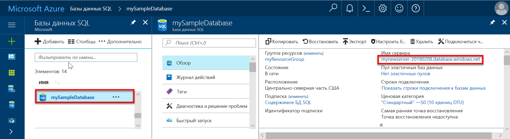

# Создание правила брандмауэра на уровне сервера для базы данных SQL с помощью портала Azure

В этом кратком руководстве описано создание правила брандмауэра на уровне сервера для базы данных SQL Azure, чтобы получить возможность подключаться к ней с локального ресурса.

## Предварительные требования

В этом кратком руководстве в качестве начальной точки используются ресурсы, созданные в руководстве [Создание базы данных SQL Azure на портале Azure](sql-database-get-started-portal.md)

## Войдите на портал Azure.

Войдите на [портале Azure](https://portal.azure.com/).

## создадим правило брандмауэра на уровне сервера;

Служба "База данных SQL" создает брандмауэр на уровне сервера, который не позволяет приложениям и средствам подключаться к серверу или любой базе данных на сервере, если не создано правило, открывающее брандмауэр. Для подключения с IP-адреса за пределами Azure создайте правило брандмауэра для конкретного IP-адреса или диапазона адресов. Выполните следующие действия, чтобы создать [правило брандмауэра уровня сервера базы данных SQL](sql-database-firewall-configure.md) для IP-адреса вашего клиента и разрешить внешнее подключение через брандмауэр базы данных SQL только с вашего IP-адреса.

> [!NOTE]
> База данных SQL обменивается данными через порт 1433. Если вы пытаетесь подключиться из корпоративной сети, исходящий трафик через порт 1433 может быть запрещен сетевым брандмауэром. В таком случае вы не сможете подключиться к серверу базы данных SQL Azure, пока ваш ИТ-отдел не откроет порт 1433.
>

1. По завершении развертывания щелкните раздел **Базы данных SQL** в меню слева и выберите **mySampleDatabase** на странице **баз данных SQL**. После этого откроется страница обзора базы данных, где будет указано полное имя сервера (например, **mynewserver-20170824.database.windows.net**) и предоставлены параметры для дальнейшей настройки.

2. Скопируйте полное имя сервера. Оно понадобится вам при работе с последующими руководствами для подключения к серверу и связанным базам данных.

   

3. Щелкните **Настройка брандмауэра для сервера** на панели инструментов, как показано на предыдущем рисунке. Откроется страница **параметров брандмауэра** для сервера базы данных SQL.

   

4. На панели инструментов щелкните **Добавить IP-адрес клиента**, чтобы добавить текущий IP-адрес в новое правило брандмауэра. С использованием правила брандмауэра можно открыть порт 1433 для одного IP-адреса или диапазона IP-адресов.

5. Выберите команду **Сохранить**. Для текущего IP-адреса будет создано правило брандмауэра уровня сервера, с помощью которого можно открыть порт 1433 логического сервера.

6. Нажмите кнопку **ОК**, а затем закройте страницу **Параметры брандмауэра**.

Теперь можно подключиться с этого IP-адреса к серверу базы данных SQL и его базам данных с помощью SQL Server Management Studio или другого средства по своему усмотрению, используя учетную запись администратора сервера, созданную ранее.

> [!IMPORTANT]
> По умолчанию доступ через брандмауэр базы данных SQL включен для всех служб Azure. На этой странице щелкните **Откл.**, чтобы отключить доступ для всех служб Azure.
>

## Очистка ресурсов

Сохраните эти ресурсы, если вы планируете перейти к [дальнейшим действиям](#next-steps) и узнать о различных методах подключения к базе данных и отправки запросов к ней. Если вы все-таки решите удалить ресурсы, созданные в этом кратком руководстве, выполните следующие действия.

1. В меню слева на портале Azure щелкните **Группы ресурсов**, а затем выберите **myResourceGroup**.
2. На странице группы ресурсов щелкните **Удалить**, в текстовом поле введите **myResourceGroup** и щелкните **Удалить**.

## Дополнительная информация

- Теперь, когда у вас есть база данных, вы можете [подключиться и создать запрос](sql-database-connect-query.md), используя одно из привычных средств или языков, в том числе
  - [подключиться и создать запрос с помощью SQL Server Management Studio](sql-database-connect-query-ssms.md);
  - [подключиться и создать запрос с помощью Azure Data Studio](https://docs.microsoft.com/sql/azure-data-studio/quickstart-sql-database?toc=/azure/sql-database/toc.json).
- Научитесь разрабатывать базы данных, создавать таблицы и вставлять данные при помощи одного из следующих руководств:
 - [Разработка первой базы данных SQL Azure с использованием SSMS](sql-database-design-first-database.md)
 - [Проектирование базы данных SQL Azure и подключение к ней с помощью C# и ADO.NET](sql-database-design-first-database-csharp.md)
