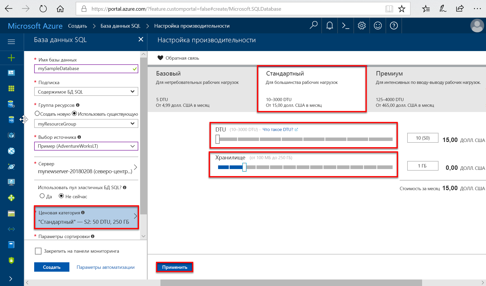
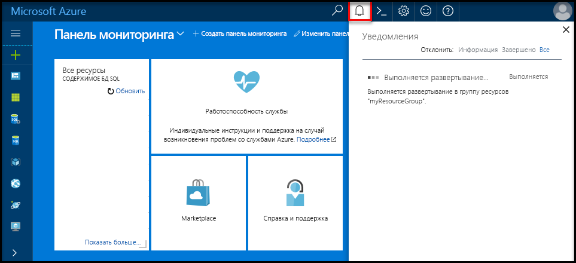
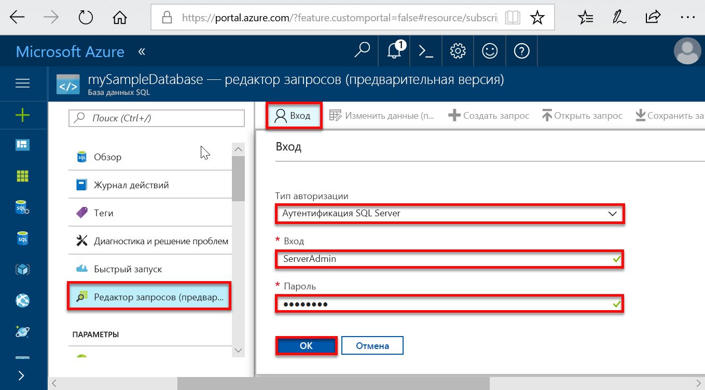
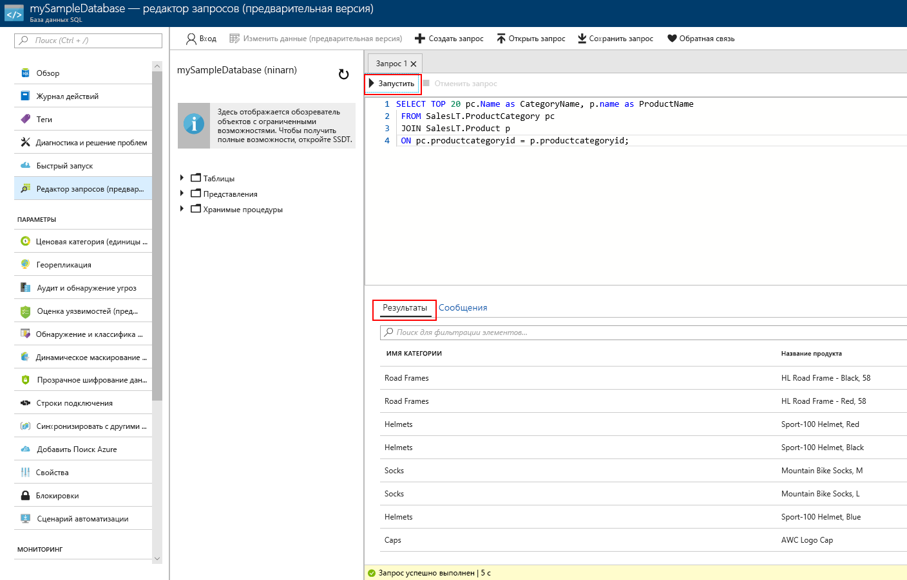

# <a name="create-an-azure-sql-database-in-the-azure-portal"></a>Создание базы данных SQL Azure на портале Azure

В этом кратком руководстве описано, как создать базу данных SQL на портале Azure с помощью [покупательской модели на основе DTU](sql-database-service-tiers-dtu.md). База данных SQL Azure — это база данных как услуга, которая позволяет запускать и масштабировать высокодоступные базы данных SQL Server в облаке. В этом кратком руководстве описано, как создать базу данных SQL и отправлять запросы к ней с помощью портала Azure.

Если у вас еще нет подписки Azure, создайте [бесплатную](https://azure.microsoft.com/free/) учетную запись Azure, прежде чем начинать работу.

  >[!NOTE]
  >База данных SQL предоставляет модель приобретения на основе DTU. Также доступна [модель приобретения на основе числа виртуальных ядер](sql-database-service-tiers-vcore.md).

## <a name="log-in-to-the-azure-portal"></a>Войдите на портал Azure.

Войдите на [портале Azure](https://portal.azure.com/).

## <a name="create-a-sql-database"></a>Создание базы данных SQL

База данных Azure SQL создается с определенным набором [вычислительных ресурсов и ресурсов хранения](sql-database-service-tiers-dtu.md). База данных создается в пределах [группы ресурсов Azure](../azure-resource-manager/resource-group-overview.md) и [логического сервера базы данных SQL Azure](sql-database-features.md).

Выполните следующие действия, чтобы создать базу данных SQL, содержащую образец данных Adventure Works LT.

1. Щелкните **Создать ресурс** в верхнем левом углу окна портала Azure.

2. Выберите **Базы данных** на странице **Создание** и щелкните **Создать** в разделе **База данных SQL** на странице **Создание**.

   

3. Заполните форму базы данных SQL, указав следующую информацию, как показано на предыдущем рисунке.   

   | Параметр       | Рекомендуемое значение | ОПИСАНИЕ |
   | ------------ | ------------------ | ------------------------------------------------- |
   | **Database name** (Имя базы данных) | mySampleDatabase | Допустимые имена баз данных см. в статье об [идентификаторах базы данных](https://docs.microsoft.com/sql/relational-databases/databases/database-identifiers). |
   | **Подписка** | Ваша подписка  | Дополнительные сведения о подписках см. [здесь](https://account.windowsazure.com/Subscriptions). |
   | **Группа ресурсов**  | myResourceGroup | Допустимые имена групп ресурсов см. в статье о [правилах и ограничениях именования](https://docs.microsoft.com/azure/architecture/best-practices/naming-conventions). |
   | **Выбрать источник** | Пример (AdventureWorksLT) | Загружает схему и данные AdventureWorksLT в новую базу данных |

   > [!IMPORTANT]
   > Необходимо выбрать пример базы данных в этой форме, так как она используется в оставшейся части этого руководства.
   >

4. В разделе **Сервер** щелкните **Настроить необходимые параметры** и заполните форму SQL Server (логический сервер), указав следующую информацию, как показано на указанном ниже изображении.   

   | Параметр       | Рекомендуемое значение | ОПИСАНИЕ |
   | ------------ | ------------------ | ------------------------------------------------- |
   | **Server name** (Имя сервера) | Любое глобально уникальное имя | Допустимые имена серверов см. в статье о [правилах и ограничениях именования](https://docs.microsoft.com/azure/architecture/best-practices/naming-conventions). |
   | **Имя для входа администратора сервера** | Любое допустимое имя | Допустимые имена входа см. в статье об [идентификаторах базы данных](https://docs.microsoft.com/sql/relational-databases/databases/database-identifiers). |
   | **Пароль** | Любой допустимый пароль | Длина пароля должна составлять минимум 8 символов. Пароль должен содержать символы трех категорий из перечисленных: прописные буквы, строчные буквы, цифры и символы, не являющиеся буквами или цифрами. |
   | **Подписка** | Ваша подписка | Дополнительные сведения о подписках см. [здесь](https://account.windowsazure.com/Subscriptions). |
   | **Группа ресурсов** | myResourceGroup | Допустимые имена групп ресурсов см. в статье о [правилах и ограничениях именования](https://docs.microsoft.com/azure/architecture/best-practices/naming-conventions). |
   | **Местоположение.** | Любое допустимое расположение | Дополнительные сведения о регионах Azure см. [здесь](https://azure.microsoft.com/regions/). |

   > [!IMPORTANT]
   > Указанные здесь учетные данные и пароль администратора сервера понадобятся позже в этом руководстве, чтобы войти на сервер и в его базу данных. Запомните или запишите эту информацию для последующего использования.
   >  

   

5. Заполнив форму, щелкните **Выбрать**.

6. Щелкните **Ценовая категория**, чтобы указать уровень службы, число DTU и объем хранилища. Изучите доступные ресурсы для каждого уровня служб (число DTU и объем хранилища).

   > [!IMPORTANT]
   > Хранилище категории "Премиум" объемом свыше 1 ТБ сейчас доступно во всех регионах, кроме следующих: северная часть Соединенного Королевства, центрально-западная часть США, южная часть Соединенного Королевства 2, Восточный Китай, центральный регион US DoD, Центральная Германия, восточный регион US DoD, юго-западный регион US Gov, юго-центральный регион US Gov, Северо-Восточная Германия, Северный Китай, восточный регион US Gov. В других регионах максимальный объем хранилища уровня "Премиум" равен 1 ТБ. См. [текущие ограничения для баз данных P11–P15]( sql-database-dtu-resource-limits-single-databases.md#single-database-limitations-of-p11-and-p15-when-the-maximum-size-greater-than-1-tb).  

7. Для работы с этим кратким руководством укажите уровень служб **Стандартный**, а затем с помощью ползунка выберите **10 DTU (S0)** и **1** ГБ хранилища.

   

8. Примите условия использования предварительной версии, чтобы использовать **дополнительное хранилище**.

   > [!IMPORTANT]
   > Хранилище категории "Премиум" объемом свыше 1 ТБ сейчас доступно во всех регионах, кроме следующих: центрально-западная часть США, Восточный Китай, центральный регион US DoD, штат Айова US Gov, Центральная Германия, восточный регион US DoD, юго-западный регион US Gov, Северо-Восточная Германия, Северный Китай. В других регионах максимальный объем хранилища уровня "Премиум" равен 1 ТБ. См. [текущие ограничения для баз данных P11–P15]( sql-database-dtu-resource-limits-single-databases.md#single-database-limitations-of-p11-and-p15-when-the-maximum-size-greater-than-1-tb).  

9. Выбрав уровень сервера, число DTU и объем хранилища, нажмите кнопку **Применить**.  

10. Заполнив форму базы данных SQL, нажмите кнопку **Создать**, чтобы подготовить базу данных. Подготовка занимает несколько минут.

11. На панели инструментов щелкните **Уведомления**, чтобы отслеживать процесс развертывания.

     

## <a name="query-the-sql-database"></a>Отправка запросов к базе данных SQL

После создания примера базы данных в Azure можно воспользоваться встроенным средством запроса на портале Azure, чтобы убедится, что вы сможете подключиться к базе данных и выполнить запрос данных.

1. На странице Базы данных SQL в меню слева выберите **Редактор запросов** (предварительная версия) и щелкните **Войти**.

   

2. Выберите аутентификацию SQL Server, укажите необходимые учетные данные и нажмите кнопку **ОК**, чтобы выполнить вход.

3. После того как вы пройдете проверку подлинности как **администратор сервера**, в области редактора запросов введите следующий запрос.

   ```sql
   SELECT TOP 20 pc.Name as CategoryName, p.name as ProductName
   FROM SalesLT.ProductCategory pc
   JOIN SalesLT.Product p
   ON pc.productcategoryid = p.productcategoryid;
   ```

4. Щелкните **Выполнить** и просмотрите результаты запроса в области **Результаты**.

   

5. Закройте страницу **редактора запросов**, нажмите кнопку **ОК**, чтобы отменить несохраненные изменения.

## <a name="clean-up-resources"></a>Очистка ресурсов

Сохраните эти ресурсы, если вы планируете перейти к [дальнейшим действиям](#next-steps) и узнать о различных методах подключения к базе данных и отправки запросов к ней. Если вы все-таки решите удалить ресурсы, созданные в этом кратком руководстве, выполните следующие действия.


1. В меню слева на портале Azure щелкните **Группы ресурсов**, а затем выберите **myResourceGroup**.
2. На странице группы ресурсов щелкните **Удалить**, в текстовом поле введите **myResourceGroup** и щелкните **Удалить**.

## <a name="next-steps"></a>Дополнительная информация

- Теперь, когда вы у вас есть база данных, нужно создать правило брандмауэра на уровне сервера, чтобы подключаться к базе данных из локальных средств. Дополнительные сведения см. в статье о [создании правила брандмауэра на уровне сервера](sql-database-get-started-portal-firewall.md).
- Создав это правило, вы сможете [подключиться и отправить запрос](sql-database-connect-query.md), используя одно из привычных средств или языков, в том числе:
  - [подключиться и создать запрос с помощью SQL Server Management Studio](sql-database-connect-query-ssms.md);
  - [подключиться и создать запрос с помощью Azure Data Studio](https://docs.microsoft.com/sql/azure-data-studio/quickstart-sql-database?toc=/azure/sql-database/toc.json).
- Чтобы создать базу данных с помощью Azure CLI, ознакомьтесь с [примерами сценариев Azure CLI](sql-database-cli-samples.md).
- Чтобы создать базу данных с помощью Azure PowerShell, ознакомьтесь с [примерами сценариев Azure PowerShell](sql-database-powershell-samples.md)