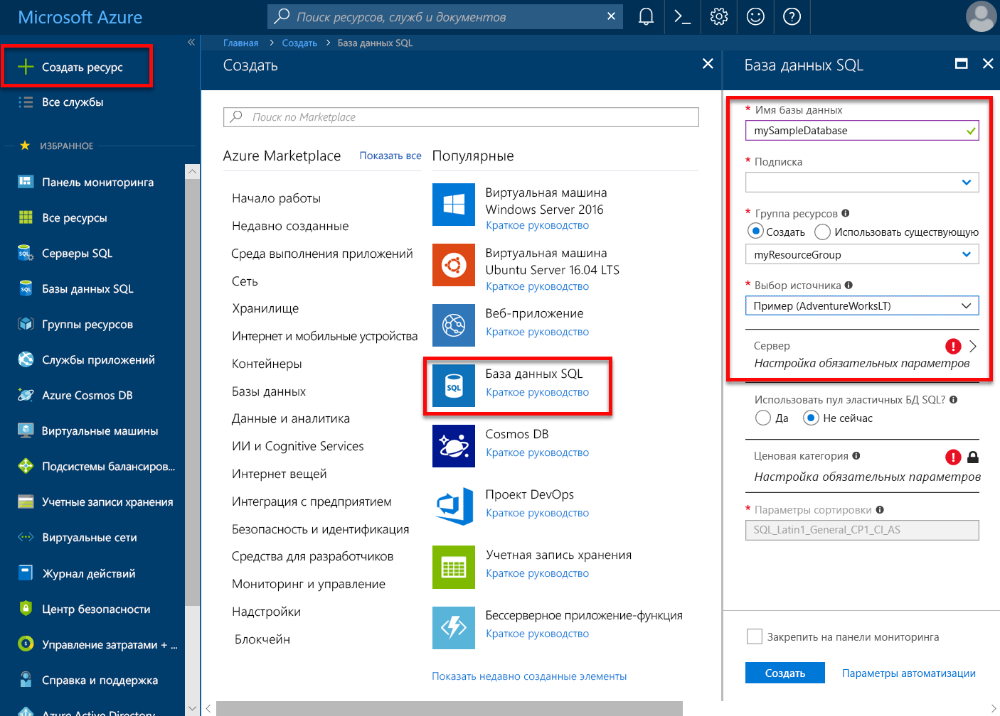
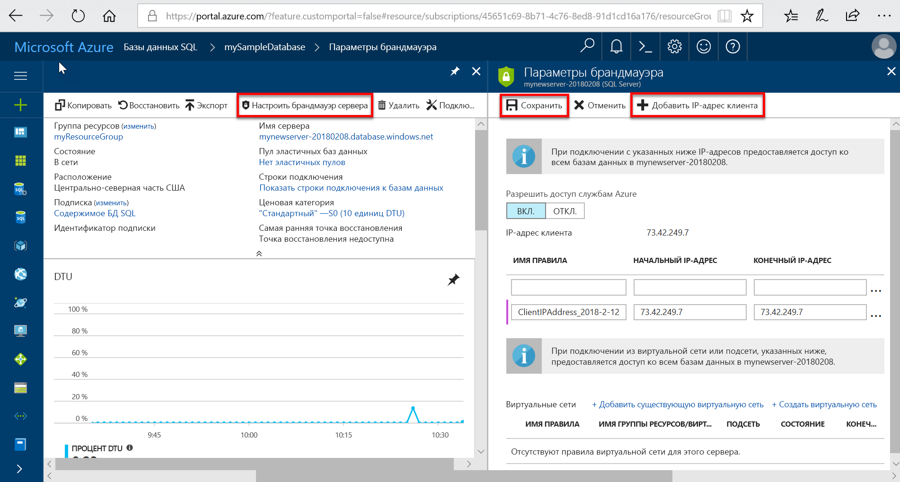

# Создание логических серверов и отдельных баз данных в Базе данных SQL Azure и управление ими 

Вы можете создавать логические серверы и отдельные базы данных SQL Azure и управлять ими с помощью портала Azure, PowerShell, Azure CLI, REST API и Transact-SQL.

## Портал Azure: управление логическими серверами и базами данных

Группу ресурсов базы данных SQL Azure можно создать заблаговременно или при создании самого сервера. Существует несколько методов перехода к форме создания сервера SQL Server. Можно создать сервер SQL Server отдельно или при создании базы данных. 

### Создание пустого сервера SQL Server (логического сервера)

Чтобы создать сервер базы данных SQL Azure (без базы данных) с помощью [портала Azure](https://portal.azure.com), перейдите к пустой форме "SQL Server (логический сервер)".  

### Создание пустой базы данных SQL или примера базы данных SQL

Чтобы создать базу данных SQL Azure с помощью [портала Azure](https://portal.azure.com), перейдите к пустой форме "База данных SQL" и введите необходимую информацию. Группу ресурсов базы данных SQL Azure и логический сервер можно создать заблаговременно или при создании самой базы данных. Можно создать пустую базу данных или пример базы данных на основе Adventure Works LT. 

  

> [!IMPORTANT]
> Сведения о выборе ценовой категории для базы данных приведены в разделах [Выбор уровня службы на основе DTU, уровень производительности и ресурсы хранилища](sql-database-service-tiers-dtu.md) и [Выбор уровня служб для виртуальных ядер, ресурсов вычислений, памяти, хранилища и операций ввода-вывода](sql-database-service-tiers-vcore.md).

Сведения о создании управляемого экземпляра см. в статье [Создание управляемого экземпляра](sql-database-managed-instance-create-tutorial-portal.md).

### Управление существующим сервером SQL Server

Для управления существующим сервером перейдите к нему, воспользовавшись одним из множества способов. Например, это можно сделать со страницы определенной базы данных SQL, страницы **Серверы SQL Server** или страницы **Все ресурсы**. 

Для управления существующей базой данных перейдите на страницу **Базы данных SQL** и щелкните нужную базу данных. На следующем снимке экрана показано, как можно начать настройку брандмауэра уровня сервера для базы данных на странице **Обзор** для базы данных. 

    

> [!IMPORTANT]
> Сведения о настройке свойств базы данных приведены в разделах [Выбор уровня службы на основе DTU, уровень производительности и ресурсы хранилища](sql-database-service-tiers-dtu.md) и [Выбор уровня служб для виртуальных ядер, ресурсов вычислений, памяти, хранилища и операций ввода-вывода](sql-database-service-tiers-vcore.md).
>

> [!TIP]
> Краткое руководство по работе с порталом Azure приведено в статье о [создании базы данных SQL Azure на портале Azure](sql-database-get-started-portal.md).

## PowerShell: управление логическими серверами и базами данных

Для создания сервера Azure SQL, баз данных и брандмауэров и управления ими с помощью Azure PowerShell используйте приведенные ниже командлеты PowerShell. Если вам нужно выполнить установку или обновление PowerShell, см. статью [об установке модуля Azure PowerShell](/powershell/azure/install-azurerm-ps). 

> [!TIP]
> Краткое руководство по PowerShell приведено в разделе [Создание отдельной базы данных SQL Azure с помощью PowerShell](sql-database-get-started-portal.md). Образцы скриптов PowerShell, см. в статьях [Создание отдельной базы данных SQL и настройка правила брандмауэра с помощью PowerShell](scripts/sql-database-create-and-configure-database-powershell.md) и [Мониторинг и масштабирование отдельной базы данных SQL с помощью PowerShell](scripts/sql-database-monitor-and-scale-database-powershell.md).
>

| Командлет | ОПИСАНИЕ |
| --- | --- |
|[New-AzureRmSqlDatabase](/powershell/module/azurerm.sql/new-azurermsqldatabase)|Создает базу данных. |
|[Get-AzureRmSqlDatabase](/powershell/module/azurerm.sql/get-azurermsqldatabase)|Получает одну или несколько баз данных.|
|[Set-AzureRmSqlDatabase](/powershell/module/azurerm.sql/set-azurermsqldatabase)|Определяет свойства базы данных или перемещает ее в эластичный пул.|
|[Remove-AzureRmSqlDatabase](/powershell/module/azurerm.sql/remove-azurermsqldatabase)|Удаляет базу данных.|
|[New-AzureRmResourceGroup](/powershell/module/azurerm.resources/new-azurermresourcegroup)|Создает группу ресурсов.|
|[New-AzureRmSqlServer](/powershell/module/azurerm.sql/new-azurermsqlserver)|Создает сервер.|
|[Get-AzureRmSqlServer](/powershell/module/azurerm.sql/get-azurermsqlserver)|Возвращает сведения о серверах.|
|[Set-AzureRmSqlServer](https://docs.microsoft.com/powershell/module/azurerm.sql/set-azurermsqlserver)|Изменяет свойства сервера.|
|[Remove-AzureRmSqlServer](/powershell/module/azurerm.sql/remove-azurermsqlserver)|Удаляет сервера.|
|[New-AzureRmSqlServerFirewallRule](/powershell/module/azurerm.sql/new-azurermsqlserverfirewallrule)|Создает правило брандмауэра уровня сервера. |
|[Get-AzureRmSqlServerFirewallRule](/powershell/module/azurerm.sql/get-azurermsqlserverfirewallrule)|Получает правила брандмауэра для сервера.|
|[Set-AzureRmSqlServerFirewallRule](/powershell/module/azurerm.sql/set-azurermsqlserverfirewallrule)|Изменяет правило брандмауэра на сервере.|
|[Remove-AzureRmSqlServerFirewallRule](/powershell/module/azurerm.sql/remove-azurermsqlserverfirewallrule)|Удаляет правило брандмауэра с сервера.|
| New-AzureRmSqlServerVirtualNetworkRule | Создает [*правило виртуальной сети*](sql-database-vnet-service-endpoint-rule-overview.md) на основе подсети, в которая является конечной точкой службы виртуальной сети. |

## Azure CLI: управление логическими серверами и базами данных

Для создания сервера SQL Azure, баз данных SQL Azure и брандмауэров и управления ими с помощью [Azure CLI](/cli/azure) используйте приведенные ниже команды [Azure CLI для Базы данных SQL](/cli/azure/sql/db). Запускайте интерфейс командной строки в браузере с помощью [Cloud Shell](/azure/cloud-shell/overview) либо [установите](/cli/azure/install-azure-cli) его на платформе macOS, Linux или Windows. Изучите дополнительные сведения о создании [эластичных пулов](sql-database-elastic-pool.md) и управлении ими.

> [!TIP]
> Краткое руководство по Azure CLI приведено в статье [Создание отдельной базы данных SQL Azure с помощью Azure CLI](sql-database-get-started-cli.md). Образцы скриптов Azure CLI, см. в статьях [Создание отдельной базы данных SQL и настройка правила брандмауэра с помощью интерфейса командной строки](scripts/sql-database-create-and-configure-database-cli.md) и [Мониторинг и масштабирование отдельной базы данных SQL с помощью интерфейса командной строки](scripts/sql-database-monitor-and-scale-database-cli.md).
>

| Командлет | ОПИСАНИЕ |
| --- | --- |
|[az sql db create](/cli/azure/sql/db#az_sql_db_create) |Создает базу данных.|
|[az sql db list](/cli/azure/sql/db#az_sql_db_list)|Выводит список всех баз данных и хранилищ данных на сервере или всех баз данных в эластичном пуле.|
|[az sql db list-editions](/cli/azure/sql/db#az_sql_db_list_editions)|Выводит список доступных целевых служб и ограничений хранилища.|
|[az sql db list-usages](/cli/azure/sql/db#az_sql_db_list_usages)|Возвращает данные об использовании баз данных.|
|[az sql db show](/cli/azure/sql/db#az_sql_db_show)|Возвращает сведения о базе данных или хранилище данных.|
|[az sql db update](/cli/azure/sql/db#az_sql_db_update)|Обновляет базу данных.|
|[az sql db delete](/cli/azure/sql/db#az_sql_db_delete)|Удаляет базу данных.|
|[az group create](/cli/azure/group#az_group_create)|Создает группу ресурсов.|
|[az sql server create](/cli/azure/sql/server#az_sql_server_create)|Создает сервер.|
|[az sql server list](/cli/azure/sql/server#az_sql_server_list)|Выводит список серверов.|
|[az sql server list-usages](/cli/azure/sql/server#az_sql_server_list_usages)|Возвращает данные об использовании серверов.|
|[az sql server show](/cli/azure/sql/server#az_sql_server_show)|Возвращает сервер.|
|[az sql server update](/cli/azure/sql/server#az_sql_server_update)|Обновляет сервер.|
|[az sql server delete](/cli/azure/sql/server#az_sql_server_delete)|Удаляет сервер.|
|[az sql server firewall-rule create](/cli/azure/sql/server/firewall-rule#az_sql_server_firewall_rule_create)|Создает правило брандмауэра для сервера.|
|[az sql server firewall-rule list](/cli/azure/sql/server/firewall-rule#az_sql_server_firewall_rule_list)|Выводит список правил брандмауэра на сервере.|
|[az sql server firewall-rule show](/cli/azure/sql/server/firewall-rule#az_sql_server_firewall_rule_show)|Отображает сведения о правиле брандмауэра.|
|[az sql server firewall-rule update](/cli/azure/sql/server/firewall-rule##az_sql_server_firewall_rule_update)|Обновляет правило брандмауэра.|
|[az sql server firewall-rule delete](/cli/azure/sql/server/firewall-rule#az_sql_server_firewall_rule_delete)|Удаляет правило брандмауэра.|

## Transact-SQL: управление логическими серверами и базами данных

Для создания сервера Azure SQL, баз данных и брандмауэров и управления ими с помощью Transact-SQL используйте приведенные ниже команды T-SQL. Можно выполнить эти команды на портале Azure, в [SQL Server Management Studio](/sql/ssms/use-sql-server-management-studio), [Visual Studio Code](https://code.visualstudio.com/docs) или любой другой программе, которая может подключаться к серверу базы данных SQL Azure и передавать команды Transact-SQL. Ознакомьтесь с дополнительными сведениями об управлении [эластичными пулами](sql-database-elastic-pool.md).

> [!TIP]
> Краткое руководство по использованию SQL Server Management Studio в Microsoft Windows приведено в разделе [Подключайтесь к базе данных Azure SQL и создавайте запросы к ней с помощью SQL Server Management Studio](sql-database-connect-query-ssms.md). Краткое руководство по использованию Visual Studio Code в macOS, Linux и Windows приведено в статье [База данных SQL Azure: подключение и запрос данных с помощью Visual Studio Code](sql-database-connect-query-vscode.md).

> [!IMPORTANT]
> С помощью Transact-SQL невозможно создать или удалить сервер.
>

| Get-Help | ОПИСАНИЕ |
| --- | --- |
|[CREATE DATABASE (база данных SQL Azure)](/sql/t-sql/statements/create-database-azure-sql-database)|Создает базу данных. Для создания базы данных требуется подключение к базе данных master.|
| [ALTER DATABASE (база данных SQL Azure)](/sql/t-sql/statements/alter-database-azure-sql-database) |Изменяет базу данных SQL Azure. |
|[ALTER DATABASE (хранилище данных SQL Azure)](/sql/t-sql/statements/alter-database-azure-sql-data-warehouse)|Изменяет хранилище данных SQL Azure.|
|[DROP DATABASE (Transact-SQL)](/sql/t-sql/statements/drop-database-transact-sql)|Удаляет базу данных.|
|[sys.database_service_objectives (база данных SQL Azure)](/sql/relational-databases/system-catalog-views/sys-database-service-objectives-azure-sql-database)|Возвращает сведения о выпуске (уровень служб), целевой службе (ценовую категорию), а также имя эластичного пула (при наличии) для базы данных SQL Azure или хранилища данных SQL Azure. В системе базы данных master на сервере базы данных SQL Azure возвращает сведения обо всех базах данных. Для использования хранилища данных SQL Azure необходимо подключиться к базе данных master.|
|[sys.dm_db_resource_stats (база данных SQL Azure)](/sql/relational-databases/system-dynamic-management-views/sys-dm-db-resource-stats-azure-sql-database)| Возвращает сведения об использовании ЦП, операциях ввода-вывода и потреблении памяти для базы данных в службе "База данных SQL Azure". Новая строка создается каждые 15 секунд, даже если в базе данных не выполняется никаких действий.|
|[sys.resource_stats (база данных SQL Azure)](/sql/relational-databases/system-catalog-views/sys-resource-stats-azure-sql-database)|Возвращает сведения об использовании ЦП и хранилища для базы данных SQL Azure. Данные собираются и объединяются за пятиминутные интервалы.|
|[sys.database_connection_stats (база данных SQL Azure)](/sql/relational-databases/system-catalog-views/sys-database-connection-stats-azure-sql-database)|Содержит статистику о событиях подключения к базе данных в базе данных SQL, предоставляя общие сведения об успешных и неудачных попытках подключения. |
|[sys.event_log (база данных SQL Azure)](/sql/relational-databases/system-catalog-views/sys-event-log-azure-sql-database)|Возвращает сведения об успешных подключениях к базе данных в базе данных SQL Azure, а также о сбоях подключения и взаимоблокировках. С помощью этой информации можно отслеживать действия с базой данных в базе данных SQL или устранять возникшие неполадки.|
|[sp_set_firewall_rule (база данных SQL Azure)](/sql/relational-databases/system-stored-procedures/sp-set-firewall-rule-azure-sql-database)|Создает или обновляет параметры брандмауэра уровня сервера для сервера базы данных SQL. Эта хранимая процедура доступна только в базе данных master для имени для входа субъекта серверного уровня. Правило брандмауэра уровня сервера можно будет создать с помощью Transact-SQL только после того, как пользователь, имеющий разрешения уровня Azure, создаст первое правило брандмауэра уровня сервера.|
|[sys.firewall_rules (база данных SQL Azure)](/sql/relational-databases/system-catalog-views/sys-firewall-rules-azure-sql-database)|Возвращает сведения о параметрах брандмауэра уровня сервера, связанных с базой данных SQL Microsoft Azure.|
|[sp_delete_firewall_rule (база данных SQL Azure)](/sql/relational-databases/system-stored-procedures/sp-delete-firewall-rule-azure-sql-database)|Удаляет параметры брандмауэра уровня сервера с сервера базы данных SQL. Эта хранимая процедура доступна только в базе данных master для имени для входа субъекта серверного уровня.|
|[sp_set_database_firewall_rule (база данных SQL Azure)](/sql/relational-databases/system-stored-procedures/sp-set-database-firewall-rule-azure-sql-database)|Создает или обновляет правила брандмауэра уровня базы данных для базы данных SQL Azure или хранилища данных SQL. Можно настроить правила брандмауэра базы данных для базы данных master и пользовательских баз данных в Базе данных SQL. Правила брандмауэра базы данных полезны в тех случаях, когда применяются пользователи автономной базы данных. |
|[sys.database_firewall_rules (база данных SQL Azure)](/sql/relational-databases/system-catalog-views/sys-database-firewall-rules-azure-sql-database)|Возвращает сведения о параметрах брандмауэра уровня базы данных, связанных с базой данных SQL Microsoft Azure. |
|[sp_delete_database_firewall_rule (база данных SQL Azure)](/sql/relational-databases/system-stored-procedures/sp-delete-database-firewall-rule-azure-sql-database)|Удаляет параметр брандмауэра уровня базы данных из базы данных SQL Azure или хранилища данных SQL. |

## REST API: управление логическими серверами и базами данных

Для создания сервера Azure SQL Server, баз данных и брандмауэров и управления используются приведенные ниже запросы REST API.

| Get-Help | ОПИСАНИЕ |
| --- | --- |
|[Серверы: создание или обновление](/rest/api/sql/servers/createorupdate)|Создает или обновляет сервер.|
|[Серверы: удаление](/rest/api/sql/servers/delete)|Удаляет сервер SQL Server.|
|[Серверы: получение](/rest/api/sql/servers/get)|Получает сервер.|
|[Серверы: вывод списка](/rest/api/sql/servers/list)|Возвращает список серверов.|
|[Серверы: вывод списка по группе ресурсов](/rest/api/sql/servers/listbyresourcegroup)|Возвращает список серверов в группе ресурсов.|
|[Серверы: обновление](/rest/api/sql/servers/update)|Обновляет существующий сервер.|
|[Базы данных: создание или обновление](/rest/api/sql/databases/createorupdate)|Создает новую базу данных или обновляет имеющуюся.|
|[Базы данных: получение](/rest/api/sql/databases/get)|Получает базу данных.|
|[Базы данных: вывод списка по эластичному пулу](/rest/api/sql/databases/listbyelasticpool)|Возвращает список баз данных в пуле эластичных баз данных.|
|[Базы данных: вывод списка по серверу](/rest/api/sql/databases/listbyserver)|Возвращает список баз данных на сервере.|
|[Базы данных: обновление](/rest/api/sql/databases/update)|Обновляет имеющуюся базу данных.|
|[Правила брандмауэра: создание и изменение](/rest/api/sql/firewallrules/createorupdate)|Создает или обновляет правило брандмауэра.|
|[Правила брандмауэра: удаление](/rest/api/sql/firewallrules/delete)|Удаляет правило брандмауэра.|
|[Правила брандмауэра: получение](/rest/api/sql/firewallrules/get)|Получает правило брандмауэра.|
|[Правила брандмауэра: вывод списка по серверу](/rest/api/sql/firewallrules/listbyserver)|Возвращает список правил брандмауэра.|

## Дополнительная информация

- Чтобы узнать о переносе базы данных SQL Server в Azure, ознакомьтесь с разделом [Миграция базы данных SQL Server в базу данных SQL в облаке](sql-database-cloud-migrate.md).
- Дополнительные сведения о поддерживаемых функциях см. [здесь](sql-database-features.md).
