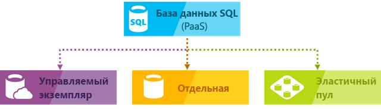
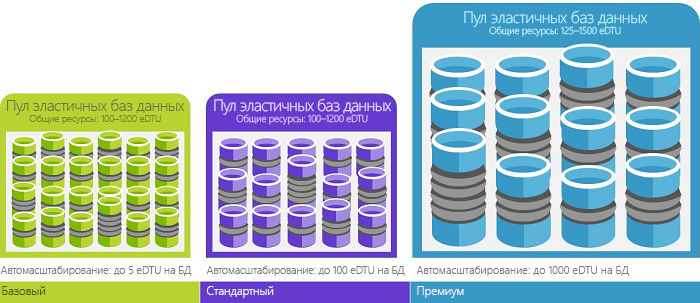
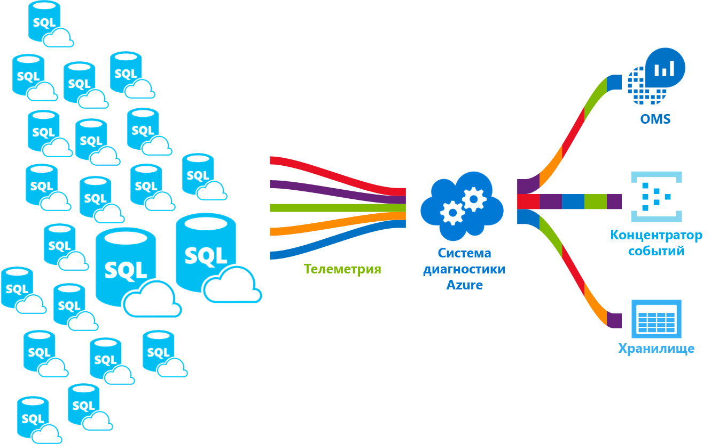

# Функции службы базы данных SQL Azure 

База данных SQL — это реляционная база данных общего назначения (управляемая служба) в Microsoft Azure, которая поддерживает такие структуры, как реляционные данные, JSON, пространственные данные и XML. Эта служба предоставляет возможности динамического масштабирования производительности в двух разных моделях приобретения: на основе [виртуальных ядер](sql-database-service-tiers-vcore.md) и [DTU](sql-database-service-tiers-dtu.md). База данных SQL также предоставляет такие компоненты, как [индексы columnstore](https://docs.microsoft.com/sql/relational-databases/indexes/columnstore-indexes-overview) для экстремального аналитического анализа и отчетности и [выполняющуюся в памяти OLTP](sql-database-in-memory.md) для экстремальной обработки транзакций. Майкрософт быстро и эффективно обрабатывает исправления и обновления базы кода SQL, а также упрощает обслуживание базовой инфраструктуры. 

База данных SQL Azure предоставляет следующие возможности развертывания для Базы данных SQL Azure:
- как отдельную базу данных с собственным набором ресурсов, управляемую с помощью логического сервера; 
- как базу данных, которая находится в [эластичном пуле](sql-database-elastic-pool.md) с общим набором ресурсов, управляемых с помощью логического сервера;
- в качестве части коллекции баз данных, известной как [управляемый экземпляр](sql-database-managed-instance.md), которая содержит базы данных системы и пользователей и общий набор ресурсов.

Эти варианты развертывания показаны на рисунке ниже:

 

База данных SQL использует свою базу кода совместно с [ядром СУБД Microsoft SQL Server](https://docs.microsoft.com/sql/sql-server/sql-server-technical-documentation). С облачной стратегией Майкрософт новейшие возможности SQL Server сначала выпускаются для базы данных SQL, а затем для самой платформы SQL Server. Такой подход позволяет использовать новейшие возможности SQL Server без лишних расходов на внесение исправлений или обновлений. При этом эти функции проверены на миллионах баз данных. Дополнительные сведения о новых возможностях вы можете узнать с помощью следующих источников:

- **[Стратегия развития Azure для базы данных SQL](https://azure.microsoft.com/roadmap/?category=databases)**: здесь вы можете узнать о новых возможностях и других перспективах. 
- **[Блог базы данных SQL Azure](https://azure.microsoft.com/blog/topics/database)**: здесь участники команды по разработке продукта SQL Server добавляют новые сведения о возможностях и новостях, касающихся баз данных SQL. 

> [!IMPORTANT]
> Отличия между функциями Базы данных SQL и SQL Server см. в описании [функций SQL](sql-database-features.md). 

База данных SQL предоставляет предсказуемую производительность с несколькими типами ресурсов на нескольких уровнях служб и с объемами вычислительных ресурсов, что обеспечивает динамическое масштабирование без простоя, встроенную интеллектуальную оптимизацию, глобальные масштабируемость и доступность, а также расширенные параметры безопасности. Все это без необходимости администрирования. Эти возможности позволяют вам не тратить драгоценное время и ресурсы на управление виртуальными машинами и инфраструктурой, а сосредоточиться на быстрой разработке приложений и ускорить выход на рынок. Служба базы данных SQL размещается в 38 центрах обработки данных по всему миру. К большинству баз данных можно подключиться в любое время, что позволяет запускать базу данных в близлежащем центре обработки данных.

## Масштабируемая производительность и пулы

В Базе данных SQL каждая база данных изолирована от других и является переносимой — с собственным уровнем обслуживания в рамках моделей приобретения (на основе [DTU](sql-database-service-tiers-dtu.md) и [виртуальных ядер](sql-database-service-tiers-vcore.md)) и гарантированным объемов вычислительных ресурсов. База данных SQL предоставляет разные объемы вычислительных ресурсов для различных потребностей, а также позволяет помещать базы данных в пул для оптимизации использования ресурсов и экономии средств.

- При использовании [Управляемого экземпляра базы данных SQL](sql-database-managed-instance.md) каждый из экземпляров изолирован от другого и имеет гарантированные ресурсы. Дополнительные сведения см. в статье [What is a Managed Instance (preview)?](sql-database-managed-instance.md) (Сведения об Управляемом экземпляре (предварительная версия)).
- При использовании [уровня служб "Гипермасштабирование"](sql-database-hyperscale.md) (предварительная версия) в модели приобретения на основе виртуальных ядер можно выполнять масштабирование до 100 ТБ и применять возможности быстрого резервного копирования и восстановления.

### Настройка производительности и масштабирования без простоя

База данных SQL предоставляет [модель приобретения на основе DTU](sql-database-service-tiers-dtu.md) или [виртуальных ядер](sql-database-service-tiers-vcore.md). 
- В модели приобретения на основе DTU набор вычислительных операций, памяти и ресурсов ввода-вывода предоставляется на трех уровнях обслуживания: "Базовый", "Стандартный" и "Премиум". Каждый уровень предусматривает поддержку различных рабочих нагрузок баз данных. Для каждого объема вычислительных ресурсов на всех уровнях обслуживания предусмотрено отдельное сочетание этих ресурсов, к которым можно добавить ресурсы хранилища.
- Модель приобретения на основе виртуального ядра позволяет выбрать число виртуальных ядер, объем памяти, а также объем и скорость хранилища.

Вы можете создать первое приложение на основе небольшой отдельной базы данных на уровне служб общего назначения по оптимальной ежемесячной цене, а затем в любое время изменить уровень служб на "Критически важный для бизнеса" вручную или программным способом в соответствии с требованиями вашего решения. Вы можете настроить производительность без простоя для приложения и работы клиентов. Динамическая масштабируемость позволяет базе данных прозрачно реагировать на быстро меняющиеся требования к ресурсам. Кроме того, таким образом вы можете платить только за необходимые ресурсы, и только когда они вам нужны.

> [!IMPORTANT]
> Переходить с уровня служб общего назначения или "Критически важный для бизнеса" на уровень [Гипермасштабирование](sql-database-hyperscale.md) нельзя. Однако вы можете менять уровни производительности на уровне "Гипермасштабирование".

Динамическое масштабирование отличается от автомасштабирования. Автомасштабирование — процесс, когда масштабирование службы проходит автоматически (в зависимости от критериев). В то время как динамическая масштабируемость дает возможность для ручного масштабирования без простоев. Единая база данных Azure SQL поддерживает только динамическую масштабируемость, а не автомасштабирование. Чтобы изучить *автомасштабирование* более детально, необходимо рассмотреть возможность использования эластичных пулов, которые позволяют базам данных обмениваться ресурсами в пуле, исходя из потребностей конкретной базы данных. Тем не менее, существуют сценарии, которые могут помочь автоматизировать масштабируемость для единой базы данных SQL Azure. С ними можно ознакомится в статье [Мониторинг и масштабирование отдельной базы данных SQL с помощью PowerShell](scripts/sql-database-monitor-and-scale-database-powershell.md). 

### Эластичные пулы для максимального использования ресурсов

Для многих организаций и приложений достаточно иметь возможность создавать отдельные базы данных и уменьшать или увеличивать их производительность по запросу, особенно если закономерности использования базы данных предсказуемы. Но если закономерности использования непредсказуемы, это может усложнить управление расходами и бизнес-моделью. [Эластичные пулы](sql-database-elastic-pool.md) предназначены для решения этой проблемы. Идея проста. Вы выделяете ресурсы для повышения производительности пула, а не отдельную базу данных, и оплачиваете ресурсы общей производительности пула, а не производительность отдельных баз данных. 

   

Благодаря использованию эластичных пулов не нужно концентрироваться на повышении или понижении производительности базы данных в соответствии с колебаниями потребностей в ресурсах. Базы данных в составе пула потребляют ресурсы производительности пула эластичных баз данных по мере необходимости. Базы данных в составе пула используют ресурсы пула, но не превышают ограничений пула, поэтому ваши расходы остаются прогнозируемыми, даже если производительность отдельной базы данных прогнозировать сложно. Более того, можно [добавлять базы данных в пул и удалять их из него](sql-database-elastic-pool-manage-portal.md), масштабируя приложение так, чтобы количество используемых баз данных составляло от нескольких экземпляров до многих тысяч, не выходя за рамки бюджета. Вы также можете управлять минимальным и максимальным объемом ресурсов, доступных для баз данных в пуле. Таким образом ни одна база данных в пуле не будет потреблять все ресурсы пула, и в каждой из этих баз данных будет гарантированный минимальный объем ресурсов. Дополнительные сведения о шаблонах разработки для приложений SaaS, использующих эластичные пулы, см. в статье [Шаблоны разработки для мультитенантных приложений SaaS и Базы данных SQL Azure](sql-database-design-patterns-multi-tenancy-saas-applications.md). 

Сценарии могут быть полезны для использования в мониторинге и масштабировании эластичных пулов. С ними можно ознакомится в статье [Отслеживание и масштабирование эластичного пула SQL в Базе данных SQL Azure с помощью PowerShell](scripts/sql-database-monitor-and-scale-pool-powershell.md)

> [!IMPORTANT]
> В Управляемом экземпляре базы данных SQL не поддерживаются эластичные пулы.

### Совмещение отдельных баз данных и баз данных в составе пула

Независимо от того, что вы выбрали — отдельные базы данных или пулы эластичных баз данных, — ваши возможности не ограничиваются. Вы можете смешивать отдельные базы данных с пулами эластичных баз данных и изменять уровни обслуживания отдельных баз данных и пулов эластичных баз данных, что позволяет легко и быстро адаптировать их под конкретные задачи. Благодаря возможностям Azure вы сможете сочетать службы Azure с базами данных SQL, чтобы удовлетворить уникальные потребности архитектуры приложений, повысить эффективность использования ресурсов и снизить расходы, а также узнать о новых возможностях для развития бизнеса.

### Возможности комплексного мониторинга и оповещения

Но как сравнить относительную производительность отдельных баз данных и пулов эластичных баз данных? Как узнать, где остановиться при увеличении или уменьшении масштаба базы данных? Вы можете использовать [встроенные средства мониторинга производительности](sql-database-performance.md) и [оповещения](sql-database-insights-alerts-portal.md) в сочетании с рейтингами производительности. Используя эти средства, вы сможете быстро оценить эффект от увеличения и уменьшения масштаба, исходя из текущей или планируемой загрузки. См. дополнительные сведения о [модели приобретения на основе DTU](sql-database-service-tiers-dtu.md) и [виртуальных ядер](sql-database-service-tiers-vcore.md).

Кроме того, база данных SQL может [выдавать значения метрик и журналы диагностики](sql-database-metrics-diag-logging.md) для упрощения мониторинга. Вы можете настроить базу данных SQL для хранения сведений об использовании ресурсов, о рабочих ролях и сеансах, а также настроить подключение к одному из этих ресурсов Azure:

- **Служба хранилища Azure**: для архивации больших объемов телеметрии по оптимальной стоимости.
- **Концентратор событий Azure**: для интеграции телеметрии базы данных SQL с настраиваемым решением для мониторинга или горячими конвейерами.
- **Azure Log Analytics**: для встроенного решения для мониторинга с возможностями предоставления отчетов, предупреждений и выполнения исправлений. Azure Log Analytics входит в пакет [Operations Management Suite (OMS)](../operations-management-suite/operations-management-suite-overview.md).

    

## Возможности доступности

Соглашение об уровне обслуживания [(SLA)](http://azure.microsoft.com/support/legal/sla/)в Azure, предусматривающее самый высокий в отрасли уровень доступности (99,99 %) и глобальную сеть центров обработки данных под управлением Майкрософт, обеспечит непрерывную работу приложения — 24 часа в сутки и 7 дней в неделю. Платформа Azure полностью управляет каждой базой данных SQL Azure и гарантирует высокий процент доступности данных без их потери. Azure автоматически обрабатывает исправления, резервное копирование, репликацию, выявление сбоев, потенциальные сбои основного оборудования, программного обеспечения или сети, исправления ошибок при развертывании, отработку отказа, обновления баз данных и другие задачи обслуживания. На уровне "Стандартный" доступность достигается за счет разделения уровня вычислений и уровня хранения. На уровне "Премиум" доступность достигается за счет интеграции вычислительных систем и хранилища на одном узле для повышения производительности, а также за счет реализации групп доступности AlwaysOn. Полное описание возможностей для обеспечения высокого уровня доступности, предоставляемых в Базе данных SQL Azure, см. в статье [Высокая доступность и база данных SQL Azure](sql-database-high-availability.md). Кроме того, база данных SQL обеспечивает встроенные функции [непрерывности бизнес-процессов и глобальной масштабируемости](sql-database-business-continuity.md), в частности:

- **[Автоматическое создание резервных копий](sql-database-automated-backups.md)**: база данных SQL автоматически создает полные, разностные копии и резервные копии журналов транзакций.
- **[Восстановление до определенной точки во времени](sql-database-recovery-using-backups.md)**: база данных SQL поддерживает восстановление на любой момент времени в пределах автоматического периода удержания резервной копии.
- **[Активная георепликация](sql-database-geo-replication-overview.md)**: база данных SQL позволяет настроить до четырех доступных для чтения баз данных-получателей в одном или глобально распределенных центрах обработки данных Azure.  Например, при наличии приложения SaaS с базой данных каталога, содержащей большой объем параллельных транзакций, доступных только для чтения, необходимо использовать активную георепликацию, чтобы включить глобальный масштаб чтения и удалить узкие места в базе данных-источнике, возникшие из-за рабочих нагрузок считывания. 
- **[Группы отработки отказа](sql-database-geo-replication-overview.md)**: база данных SQL позволяет обеспечить глобальные высокий уровень доступности и балансировку нагрузки, включая прозрачную георепликацию и отработку отказа больших наборов баз данных и эластичных пулов. Группы отработки отказа и активная георепликация позволяют создавать глобально распределенные приложения SaaS с минимальными расходами на администрирование, оставляя мониторинг, маршрутизацию и оркестрацию отработки отказа базе данных SQL.
- **[Базы данных, избыточные в пределах зоны](sql-database-high-availability.md)**. База данных SQL позволяет подготовить базы данных и эластичные пулы уровня "Премиум" или "Критически важный для бизнеса" в нескольких зонах доступности. Так как эти базы данных или эластичные пулы имеют несколько избыточных реплик для обеспечения высокого уровня доступности, размещение этих реплик в нескольких зонах доступности гарантирует более высокую устойчивость, включая возможность автоматического восстановления после масштабных сбоев центра обработки данных без потери данных.  

## Встроенная система аналитики

С базой данных SQL вы получаете встроенную систему аналитики, которая позволяет значительно сократить расходы на выполнение и обслуживание баз данных, а также повышает производительность и безопасность приложения. Круглосуточно выполняя миллионы пользовательских рабочих нагрузок, база данных SQL собирает и обрабатывает большие объемы данных телеметрии при обеспечении конфиденциальности пользователей. Различные алгоритмы постоянно оценивают данные телеметрии, чтобы служба могла согласовать работу с приложением. На основе этого анализа служба определяет рекомендации по улучшению производительности для конкретной рабочей нагрузки. 

### Автоматический мониторинг и настройка производительности

База данных SQL обеспечивает точное представление о запросах, которые необходимо отслеживать. База данных SQL дает возможность адаптировать схемы базы данных к рабочей нагрузке на основе шаблонов базы данных. База данных SQL предоставляет [рекомендации по настройке производительности](sql-database-advisor.md). Вы можете просмотреть действия по настройке и применить их. 

Однако постоянный мониторинг базы данных — это сложная и трудоемкая задача, особенно при работе с несколькими базами данных. [Intelligent Insights](sql-database-intelligent-insights.md) делает это автоматически, отслеживая производительность базы данных SQL в нужном масштабе и сообщая о проблемах снижения производительности. Это решение определяет первопричину проблемы и предлагает рекомендации по повышению производительности, если это возможно.

Эффективное управление огромным числом баз данных невозможно даже с учетом всех доступных средств и отчетов, предоставленных базой данных SQL и порталом Azure. Вместо того чтобы вручную выполнять мониторинг и настройку базы данных, мы рекомендуем делегировать некоторые действия по настройке и мониторингу Базе данных SQL с помощью [автоматической настройки](sql-database-automatic-tuning.md). База данных SQL автоматически применяет рекомендации, тестирует и проверяет все действия по настройке, чтобы гарантировать оптимальную производительность. В этом случае база данных SQL автоматически безопасно адаптируется к рабочей нагрузке. Автоматическая настройка означает, что производительность базы данных тщательно отслеживается и сравнивается перед выполнением действия настройки и после него. Если производительность не улучшается, действие настройки отменяется.

Сейчас многие наши партнеры, выполняющие [мультитенантные приложения SaaS](sql-database-design-patterns-multi-tenancy-saas-applications.md) на основе базы данных SQL, используют автоматическую настройку производительности для обеспечения стабильности и предсказуемой производительности приложений. Они уверены, что эта функция значительно уменьшает риск снижения производительности ночью. Кроме того, так как часть клиентской базы также использует SQL Server, они применяют те же рекомендации по индексации, предоставленные базой данных SQL, для поддержки клиентов SQL Server.

[В базе данных SQL](sql-database-automatic-tuning.md) есть две функции автоматической настройки.

- **Автоматическое управление индексами**: определяет индексы, которые необходимо добавить в базу данных или удалить.
- **Автоматическое изменение плана**: определяет проблемные планы и исправляет проблемы с производительностью плана SQL (ожидается в ближайшее время, уже доступна в SQL Server 2017).

### Адаптивная обработка запросов

Мы также добавили в базу данных SQL семейство функций [адаптивной обработки запросов](/sql/relational-databases/performance/adaptive-query-processing), включая чередующееся выполнение для функций с табличными значениями и несколькими инструкциями, обратную связь с выделением памяти в пакетном режиме и адаптивные соединения в пакетном режиме. Каждая из этих функций адаптивной обработки запросов применяет сходные методы "обучения и адаптации", чтобы устранить в дальнейшем проблемы производительности, связанные с традиционно трудноразрешимыми проблемами оптимизации запросов.

## Расширенный уровень безопасности и соответствие требованиям

База данных SQL обеспечивает ряд [встроенных функций безопасности и соответствия](sql-database-security-overview.md), чтобы выполнить различные требования по защите вашего приложения. 

### Расширенная защита от угроз

Служба "Расширенная защита от угроз SQL" представляет собой унифицированный пакет расширенных возможностей безопасности SQL. К ним относятся такие функции, как обнаружение и классификация конфиденциальных данных, управление уязвимостями базы данных, а также выявление аномальной активности, которая может указывать на угрозу для базы данных. Эта служба предоставляет единый центр для включения этих возможностей и управления ими.

- Служба [обнаружения и классификации данных](sql-database-data-discovery-and-classification.md) (в настоящее время находится на этапе предварительной версии) предоставляет возможности, встроенные в службу "База данных SQL Azure", для обнаружения, классификации, добавления меток и защиты конфиденциальных данных в базах данных. Она может использоваться для просмотра состояния классификации базы данных, а также отслеживания доступа к конфиденциальным данным в базе данных и за ее пределами.
- [Оценка уязвимостей](sql-vulnerability-assessment.md) — это легко настраиваемая служба, которая помогает обнаруживать, отслеживать и устранять потенциальные уязвимости базы данных. Эта служба обеспечивает представление о состоянии безопасности и предлагает практические действия для устранения проблем безопасности и усиления защиты базы данных.
- Служба [обнаружения угроз](sql-database-threat-detection.md) выявляет аномальные операции, указывающие на нестандартные и потенциально вредоносные попытки получить доступ к базам данных или воспользоваться их уязвимостями. Она непрерывно отслеживает базу данных для выявления подозрительных действий и немедленно выдает оповещения системы безопасности о потенциальных уязвимостях, атаках путем внедрения кода SQL и аномальных шаблонах доступа к базам данных. Оповещения об обнаружении угроз содержат сведения о подозрительных операциях и рекомендации о том, как исследовать причину угрозы и устранить ее.

### Аудит для обеспечения безопасности и соответствия

[Аудит базы данных SQL](sql-database-auditing.md) позволяет отслеживать события базы данных и записывать их в журнал аудита в учетной записи хранения Azure. Аудит может помочь вам соблюсти требования нормативов, проанализировать работу с базой данных и получить представление о расхождениях и аномалиях, которые могут указывать на бизнес-проблемы или предполагаемые нарушения безопасности.

### Шифрование данных

Служба "База данных SQL" обеспечивает защиту данных, шифруя передаваемые данные с использованием протокола [TLS](https://support.microsoft.com/kb/3135244), неактивные данные с использованием [прозрачного шифрования данных](https://docs.microsoft.com/sql/relational-databases/security/encryption/transparent-data-encryption-azure-sql) и используемые данные с помощью функции [Always Encrypted](https://docs.microsoft.com/sql/relational-databases/security/encryption/always-encrypted-database-engine).

### Интеграция Azure Active Directory и Многофакторная идентификация

База данных SQL позволяет централизованно управлять удостоверениями пользователя базы данных и другими службами Майкрософт с помощью [интеграции Azure Active Directory](sql-database-aad-authentication.md). Эта возможность упрощает управление разрешениями и повышает уровень безопасности. Azure Active Directory поддерживает [Многофакторную идентификацию](sql-database-ssms-mfa-authentication.md) (MFA) для повышения безопасности данных и приложений, поддерживая процесс единого входа.

### Сертификат соответствия

База данных SQL участвует в регулярном аудите и сертифицирована для нескольких стандартов соответствия. Дополнительные сведения см. в [центре управления безопасностью Microsoft Azure](https://azure.microsoft.com/support/trust-center/), где представлен актуальный список [сертификатов соответствия базы данных SQL](https://azure.microsoft.com/support/trust-center/services/).

## Простые в использовании инструменты

База данных SQL делает создание и обслуживание приложений более удобным и эффективным. Она позволяет сконцентрироваться на том, что у вас получается лучше всего, — на создании отличных приложений. В базе данных SQL вы можете разрабатывать и обслуживать базы данных с помощью средств и навыков, которые у вас уже есть.

- **[Портал Azure](https://portal.azure.com/)**: веб-приложение для управления всеми службами Azure. 
- **[SQL Server Management Studio](https://docs.microsoft.com/sql/ssms/download-sql-server-management-studio-ssms)**: бесплатное, доступное для скачивания клиентское приложение для управления любой инфраструктурой SQL, от SQL Server до базы данных SQL.
- **[SQL Server Data Tools в Visual Studio](https://docs.microsoft.com/sql/ssdt/download-sql-server-data-tools-ssdt)**: бесплатное, доступное для скачивания клиентское приложение для разработки реляционных баз данных SQL Server, баз данных SQL Azure, пакетов Integration Services, моделей данных Analysis Services и отчетов Reporting Services.
- **[Visual Studio Code](https://code.visualstudio.com/docs)**: бесплатный, доступный для скачивания редактор кода с открытым кодом для Windows, macOS и Linux, поддерживающий расширения, включая [расширение mssql](https://aka.ms/mssql-marketplace) для выполнения запросов к Microsoft SQL Server, базе данных SQL Azure и хранилищу данных SQL.

База данных SQL поддерживает создание приложений на языках Python, Java, Node.js, PHP, Ruby и .NET для операционных систем MacOS, Windows и Linux. База данных SQL поддерживает те же [библиотеки подключений](sql-database-libraries.md), что и SQL Server.

## Связаться с командой разработчиков SQL Server

- [StackExchange для администраторов баз данных:](https://dba.stackexchange.com/questions/tagged/sql-server) вопросы по администрированию баз данных
- [Переполнение стека:](http://stackoverflow.com/questions/tagged/sql-server) вопросы по разработке
- [Форумы MSDN:](https://social.msdn.microsoft.com/Forums/home?category=sqlserver) технические вопросы
- [Отзывы:](http://aka.ms/sqlfeedback) информирование об ошибках и подача запросов
- [Reddit:](https://www.reddit.com/r/SQLServer/) обсуждение SQL Server

## Дополнительная информация

- Сравнение цен и калькуляторы для отдельных баз данных и пулов эластичных баз данных см. на [странице расценок](https://azure.microsoft.com/pricing/details/sql-database/).

- См. эти краткие руководства по быстрому запуску:

  - [Create and query a single Azure SQL database in the Azure portal](sql-database-get-started-portal.md) (Создание отдельной базы данных SQL с помощью портала Azure)  
  - [Создание базы данных SQL Azure и отправка к ней запросов с помощью Azure CLI](sql-database-get-started-cli.md)
  - [Создание отдельной базы данных SQL Azure с помощью PowerShell](sql-database-get-started-powershell.md)

- Примеры использования Azure CLI и PowerShell:
  - [Примеры Azure CLI для базы данных SQL Azure](sql-database-cli-samples.md)
  - [Примеры Azure PowerShell для базы данных SQL Azure](sql-database-powershell-samples.md)
