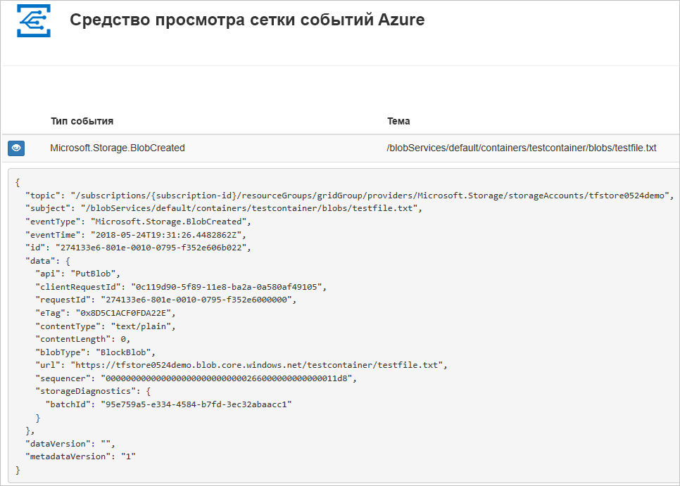
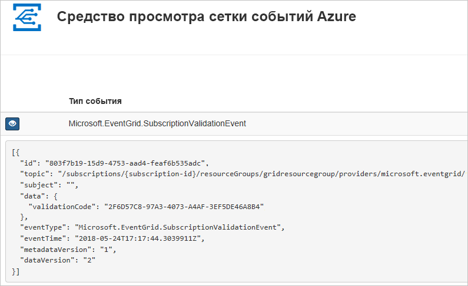

# <a name="route-blob-storage-events-to-a-custom-web-endpoint-with-azure-cli"></a>Перенаправление событий хранилища BLOB-объектов в пользовательскую конечную веб-точку с помощью Azure CLI

"Сетка событий Azure" — это служба обработки событий для облака. В этой статье с помощью интерфейса командной строки Azure вы создадите подписку на события хранилища BLOB-объектов и активируете событие, чтобы увидеть результат.

Как правило, события отправляются на конечную точку, которая обрабатывает данные событий и выполняет соответствующие действия. Но в этой статье для простоты события отправляются в веб-приложение, которое собирает и отображает сообщения.

Выполнив действия, описанные в этой статье, вы увидите, что данные событий отправлены в веб-приложение.




[!INCLUDE [quickstarts-free-trial-note.md](../../../includes/quickstarts-free-trial-note.md)]

[!INCLUDE [cloud-shell-try-it.md](../../../includes/cloud-shell-try-it.md)]

Если вы решили установить и использовать интерфейс командной строки локально, для работы с этой статьей вам понадобится Azure CLI 2.0.24 или более поздней версии. Чтобы узнать версию, выполните команду `az --version`. Если вам необходимо выполнить установку или обновление, см. статью [Установка Azure CLI 2.0](/cli/azure/install-azure-cli).

Если вы не используете Cloud Shell, сначала выполните вход с помощью `az login`.

## <a name="create-a-resource-group"></a>Создание группы ресурсов

Темами событий сетки являются ресурсы Azure, которые необходимо поместить в группу ресурсов Azure. Группа ресурсов Azure — это логическая коллекция, в которой выполняется развертывание и администрирование ресурсов Azure.

Создайте группу ресурсов с помощью команды [az group create](/cli/azure/group#az_group_create). 

В следующем примере создается группа ресурсов с именем `<resource_group_name>` в расположении *westcentralus*.  Замените `<resource_group_name>` уникальным именем для группы ресурсов.

```azurecli-interactive
az group create --name <resource_group_name> --location westcentralus
```

## <a name="create-a-storage-account"></a>Создание учетной записи хранения

Для использования событий хранилища BLOB-объектов требуется либо [учетная запись хранения BLOB-объектов](../common/storage-create-storage-account.md?toc=%2fazure%2fstorage%2fblobs%2ftoc.json#blob-storage-accounts), либо [учетная запись хранения общего назначения версии 2](../common/storage-account-options.md#general-purpose-v2-accounts). Учетные записи **общего назначения версии 2 (GPv2)** являются учетными записями хранения, которые поддерживают все функции для всех служб хранилища, включая большие двоичные объекты, файлы, очереди и таблицы. **Учетные записи хранения BLOB-объектов** — это специализированные учетные записи хранения таких неструктурированных данных, как большие двоичные объекты, в службе хранилища Azure. Учетные записи хранилища BLOB-объектов похожи на учетные записи хранения общего назначения и обладают такими же функциями обеспечения устойчивости, надежности, масштабируемости и производительности, которые вы уже используете, а также отличаются полной согласованностью API в плане блочных BLOB-объектов и добавления больших двоичных объектов. Для приложений, требующих только блокировки или добавления больших двоичных объектов, рекомендуется использовать учетные записи хранения больших двоичных объектов. 

Замените `<storage_account_name>` уникальным именем своей учетной записи хранения, а `<resource_group_name>` — именем группы ресурсов, созданной ранее.

```azurecli-interactive
az storage account create \
  --name <storage_account_name> \
  --location westcentralus \
  --resource-group <resource_group_name> \
  --sku Standard_LRS \
  --kind BlobStorage \
  --access-tier Hot
```

## <a name="create-a-message-endpoint"></a>Создание конечной точки сообщения

Перед подпиской на раздел необходимо создать конечную точку для сообщения о событии. Обычно конечная точка выполняет действия на основе данных событий. Чтобы упростить работу с этим руководством, разверните [готовое веб-приложение](https://github.com/Azure-Samples/azure-event-grid-viewer), которое отображает сообщения о событиях. Развернутое решение содержит план службы приложений, веб-приложение службы приложений и исходный код из GitHub.

Замените `<your-site-name>` уникальным именем для вашего веб-приложения. Имя веб-приложения должно быть уникальным, так как оно включается в запись DNS.

```azurecli-interactive
sitename=<your-site-name>

az group deployment create \
  --resource-group <resource_group_name> \
  --template-uri "https://raw.githubusercontent.com/Azure-Samples/azure-event-grid-viewer/master/azuredeploy.json" \
  --parameters siteName=$sitename hostingPlanName=viewerhost
```

Завершение развертывания может занять несколько минут. Когда развертывание успешно завершится, откройте веб-приложение и убедитесь, что оно работает. Откройте браузер и перейдите по адресу `https://<your-site-name>.azurewebsites.net`.

Вы увидите сайт, на котором сейчас не отображаются никакие сообщения.

[!INCLUDE [event-grid-register-provider-cli.md](../../../includes/event-grid-register-provider-cli.md)]

## <a name="subscribe-to-your-storage-account"></a>Подписка на учетную запись хранения

Подписка на раздел предоставляет Сетке событий Azure информацию о том, какие события вы намерены отслеживать и куда их следует отправлять. В следующем примере создается подписка на созданную учетную запись хранения и передается URL-адрес из веб-приложения в качестве конечной точки для уведомления о событии. Замените `<event_subscription_name>` именем подписки на событие. Для `<resource_group_name>` и `<storage_account_name>` используйте созданные ранее значения.

Конечная точка веб-приложения должна содержать суффикс `/api/updates/`.

```azurecli-interactive
storageid=$(az storage account show --name <storage_account_name> --resource-group <resource_group_name> --query id --output tsv)
endpoint=https://$sitename.azurewebsites.net/api/updates

az eventgrid event-subscription create \
  --resource-id $storageid \
  --name <event_subscription_name> \
  --endpoint $endpoint
```

Теперь снова откройте веб-приложение и убедитесь, что оно успешно получило отправленное событие подтверждения подписки. Щелкните значок с изображением глаза, чтобы развернуть данные события. Сетка событий отправляет событие подтверждения, чтобы конечная точка могла подтвердить, что она готова получать данные события. Веб-приложение содержит код для проверки подписки.



## <a name="trigger-an-event-from-blob-storage"></a>Активация события из хранилища BLOB-объектов

Теперь необходимо активировать событие, чтобы увидеть, как Сетка событий Azure распределяет сообщение к вашей конечной точке. Сначала мы настроим имя и ключ учетной записи хранения, затем создадим контейнер, после чего создадим и отправим файл. Еще раз: для `<storage_account_name>` и `<resource_group_name>` используются значения, созданные ранее.

```azurecli-interactive
export AZURE_STORAGE_ACCOUNT=<storage_account_name>
export AZURE_STORAGE_ACCESS_KEY="$(az storage account keys list --account-name <storage_account_name> --resource-group <resource_group_name> --query "[0].value" --output tsv)"

az storage container create --name testcontainer

touch testfile.txt
az storage blob upload --file testfile.txt --container-name testcontainer --name testfile.txt
```

Кроме того, вы активировали событие, а служба "Сетка событий" отправила сообщение в конечную точку, настроенную вами при подписке. Откройте веб-приложение и просмотрите в нем отправленные события.


```json
[{
  "topic": "/subscriptions/xxxxxxxx-xxxx-xxxx-xxxx-xxxxxxxxxxxx/resourceGroups/myrg/providers/Microsoft.Storage/storageAccounts/myblobstorageaccount",
  "subject": "/blobServices/default/containers/testcontainer/blobs/testfile.txt",
  "eventType": "Microsoft.Storage.BlobCreated",
  "eventTime": "2017-08-16T20:33:51.0595757Z",
  "id": "4d96b1d4-0001-00b3-58ce-16568c064fab",
  "data": {
    "api": "PutBlockList",
    "clientRequestId": "d65ca2e2-a168-4155-b7a4-2c925c18902f",
    "requestId": "4d96b1d4-0001-00b3-58ce-16568c000000",
    "eTag": "0x8D4E4E61AE038AD",
    "contentType": "text/plain",
    "contentLength": 0,
    "blobType": "BlockBlob",
    "url": "https://myblobstorageaccount.blob.core.windows.net/testcontainer/testblob1.txt",
    "sequencer": "00000000000000EB0000000000046199",
    "storageDiagnostics": {
      "batchId": "dffea416-b46e-4613-ac19-0371c0c5e352"
    }
  },
  "dataVersion": "",
  "metadataVersion": "1"
}]

```

## <a name="clean-up-resources"></a>Очистка ресурсов
Если вы планируете продолжать работу с этой учетной записью хранения и подпиской на события, не очищайте ресурсы, созданные при работе с этой статьей. Если вы не планируете продолжать работу, удалите все созданные ресурсы в этой статье.

Замените `<resource_group_name>` именем группы ресурсов, созданной ранее.

```azurecli-interactive
az group delete --name <resource_group_name>
```

## <a name="next-steps"></a>Дополнительная информация

Теперь, когда вы знаете, как создавать разделы и подписки на события, ознакомьтесь с дополнительными сведениями о событиях хранилища BLOB-объектов и возможностях службы "Сетка событий":

- [Reacting to Blob storage events (preview)](storage-blob-event-overview.md) (Реагирование на события хранилища BLOB-объектов)
- [An introduction to Azure Event Grid](../../event-grid/overview.md) (Общие сведения о службе "Сетка событий Azure")
