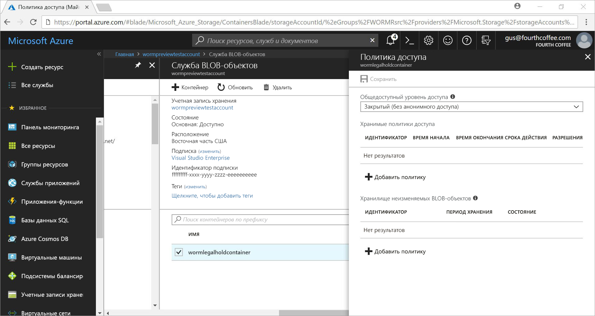
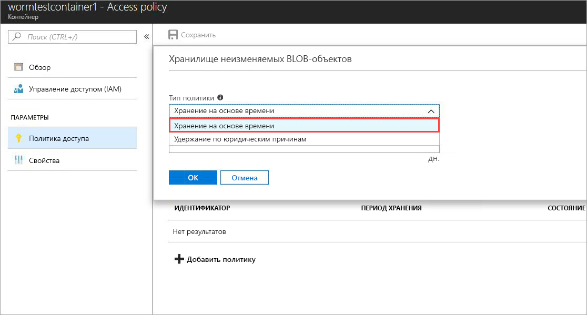
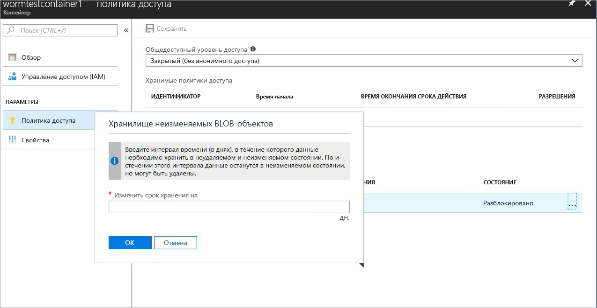
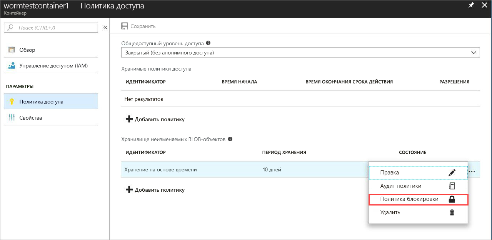
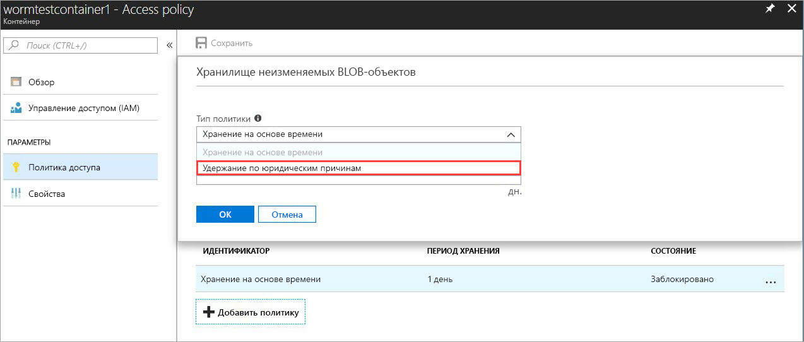
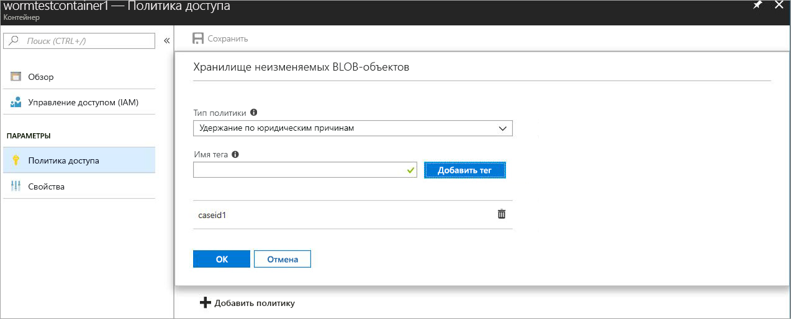

# <a name="immutable-storage-feature-of-azure-blob-storage-preview"></a>Функция неизменного хранения данных в неизменяемом виде в хранилище BLOB-объектов Azure (Предварительная версия)

Функция неизменного хранения данных BLOB-функций Azure дает пользователям возможность хранить критически важные для бизнеса данные в хранилище BLOB-объектов в состоянии вирус-ЧЕРВЬ. Это состояние делает их нестираемыми и неизменяемыми в течение определенного пользователем интервала времени. BLOB-объекты можно создать и прочитать, но не изменять или удалять в течение периода удержания.

## <a name="overview"></a>Обзор

Функция неизменного хранения данных позволяет организациям во многих регулируемых отраслях, в частности брокерско-дилерских, хранить данные в соответствии с требованиями SEC 17a-4 (f) и другими нормами.

Распространенные приложения включают следующее.

- **Соответствие нормативным требованиям**. Функция неизменного хранения данных больших двоичных объектов Azure призвана помочь в финансовых учреждениях и связанных отраслях, которые регулируются SEC 17a-4(f), CFTC 1.31©-(d), FINRA и т. д.

- **Безопасное хранение документов**. Пользователи получают максимальную защиту данных, поскольку служба хранилища BLOB-объектов защищает данные от изменения или удаления пользователями, включая пользователей с правами администратора учетной записи.

- **Юридическое удержание**. Функция неизменного хранения данных BLOB-объектов Azure позволяет пользователям хранить конфиденциальную информацию, критически важную для судебного или уголовного расследования и т. д., в защищенном от несанкционированного доступа состоянии в течение желаемой продолжительности времени.

Функция хранения данных в неизменяемом виде включает следующее.

- **Поддержка политики хранения на основе времени**. Пользователи задают политики для хранения данных в течение указанного интервала времени.

- **Поддержка политики юридического удержания**. Когда интервал хранения неизвестен, пользователи могут установить юридическое удержание для хранения данных до тех пор, пока юридическое удержание не будет снято.  Когда устанавливается юридическое удержание, большие двоичные объекты можно создавать и читать, но невозможно изменять или удалять. Каждое юридическое удержание связано с определяемым пользователем буквенно-цифровым тегом, который используется в качестве строки идентификатора (например, идентификатор дела).

- **Поддержка для всех уровней хранилища BLOB-объектов**. Политики WORM не зависят от уровня хранилища BLOB-объектов Azure и применяются ко всем уровням: горячим, холодным и архивным. Это позволяет клиентам хранить данные на наиболее оптимизированном по стоимости уровне для своей рабочей нагрузки, сохраняя неизменность данных.

- **Настройка уровня контейнера**. Функция хранения данных в неизменяемом виде позволяет пользователям на уровне контейнера настроить временные политики периода удержания и теги юридического удержания.  Пользователи могут создавать и блокировать временные политики удержания, расширять период хранения, устанавливать и очищать юридические удержания и т. д. с помощью простых настроек уровня контейнера.  Эти политики применяются для всех существующих и новых BLOB-объектов в контейнере.

- **Поддержка ведения журнала аудита**. В каждом контейнере содержится журнал аудита, содержащий до пяти временных команд хранения для временно заблокированных политик хранения с не более тремя журналами для расширений интервалов хранения.  Для временного хранения журнал содержит идентификатор пользователя, тип команды, отметки времени и интервал периода удержания. Для юридического удержания журнал содержит идентификатор пользователя, тип команды, отметки времени и теги юридического удержания. Этот журнал удерживается в течение срока службы контейнера согласно директивам SEC 17a-4 (f). Более подробный журнал управления планом действий можно найти в разделе [Журнал действий Azure](https://docs.microsoft.com/en-us/azure/monitoring-and-diagnostics/monitoring-overview-activity-logs). Пользователь постоянно несет ответственность за хранение этих журналов в соответствии с нормативами или другими требованиями.

 Эта функция включена во всех общедоступных регионах Azure.

## <a name="how-it-works"></a>Принцип работы

Неизменяемое хранилище для BLOB-объектов Azure для дисков WORM или неизменяемых политик поддерживает два типа удержаний: временное и юридическое. Подробные сведения о том, как создавать неизменяемые политики, см. в разделе [Начало работы](#Getting-started).
Когда в контейнере применяется политика хранения на основе времени или юридическое удержание, все существующие BLOB-объекты будут переходить в неизменяемое состояние (защищенное от изменения и удаления). Все новые BLOB-объекты, загруженные в контейнер, также будут переходить в неизменяемое состояние.

> [!IMPORTANT]
> Политика хранения на основе времени должна быть *заблокирована*, чтобы BLOB-объект находился в неизменяемом состоянии (защищенном от изменения и удаления) для SEC 17a-4 (f) и соответствовал другим нормативам. Рекомендуется блокировать политику в течение приемлемого времени, обычно на 24 часа. Не рекомендуется использовать *разблокированное* состояние для любых целей, кроме краткосрочных пробных процедур.

 Когда политика хранения на основе времени применяется в контейнере, все BLOB-объекты контейнера остаются в неизменяемом состоянии в течение *действующего* периода удержания. Период эффективного удержания для существующих BLOB-объектов равен разнице между временем их создания и интервалом удержания, определяемым пользователем. Для новых BLOB-объектов период эффективного удержания равен интервалу удержания, определяемого пользователем. Поскольку пользователи могут изменять интервал удержания, самое последнее его значение будет использоваться для вычисления периода эффективного удержания.

> [!TIP]
> Пример: Пользователь создает политику хранения на основе времени с пятилетним интервалом удержания.
> В этом контейнере существует BLOB-объект, testblob1, создан год назад. Период эффективного удержания для testblob1 будет четыре года.
> А новый BLOB-объект, testblob2, передается в контейнер. Период эффективного удержания для этого большого двоичного объекта будет составлять пять лет.

### <a name="legal-holds"></a>Юридические удержания

Все существующие и новые BLOB-объекты, которые находятся в юридическом удержании, остаются в неизменяемом состоянии, пока юридическое удержание не будет снято.
Дополнительные сведения о том, как настроить и снять юридические удержания, см. в разделе [Начало работы](#Getting-started).

Контейнер может иметь одновременно и юридическое удержание, и политику хранения на основе времени. Все BLOB-объекты в этом контейнере остаются в неизменяемом состоянии, пока все юридические удержания не будут сняты, даже если период эффективного хранения истёк. И наоборот, BLOB-объект остается в неизменяемом состоянии до тех пор, пока не истечет период эффективного хранения, хотя все юридические удержания сняты.
В следующей таблице показаны типы операций с BLOB-объектами, которые будут отключены в разных сценариях использования неизменяемых объектов.
Подробные сведения об интерфейсе REST API больших двоичных объектов см. в документации [Azure Blob Service API](https://docs.microsoft.com/en-us/rest/api/storageservices/blob-service-rest-api).

|Сценарий  |Состояние BLOB-объектов  |Недопустимые операции с BLOB-объектами  |
|---------|---------|---------|
|Эффективный интервал удержания большого двоичного объекта еще не истек, и (или) установлено юридическое удержание     |Неизменяемость: защита от удаления и от записи         |Удаление контейнера, удаление большого двоичного объекта, вставка Blob1, вставка блока, вставка списка блоков, задание метаданных больших двоичных объектов, вставка страницы, задание свойства большого двоичного объекта, создание моментального снимка большого двоичного объекта, инкрементное копирование больших двоичных объектов, добавление блока         |
|Срок действия интервала эффективного хранения большого двоичного объекта истек.     |Защита только от записи (разрешены операции удаления)         |Вставка BLOB-объекта, вставка блока, вставка списка блоков, установка метаданных BLOB-объектов, вставка страницы, установка свойства большого двоичного объекта, создание моментального снимка BLOB-объекта, инкрементное копирование больших двоичных объектов, добавление блока         |
|Все юридические удержания сняты, а в контейнере не задана политика хранения на основе времени     |Изменяемый         |None         |
|Политика диска WORM не создана (период удержания на основе времени или юридическое удержание)     |Изменяемый         |None         |

> [!NOTE]
> В первых двух сценариях из приведенной выше таблицы все последующие операции запрещены, кроме операций начальной вставки BLOB-объекта, вставки блока и вставки списка блоков, необходимых для создания BLOB-объекта.
> Функция хранения данных в неизменяемом виде доступна только в учетных записях хранения GPv2 и BLOB-объектов и должна создаваться с помощью [Azure Resource Manager](https://docs.microsoft.com/en-us/azure/azure-resource-manager/resource-group-overview).

## <a name="pricing"></a>Цены

За использование этой возможности не взимается дополнительная плата, а неизменяемые данные оцениваются так же, как и обычные изменяемые данные. Соответствующие сведения о ценах см. на странице [Страница ценообразования Azure](https://azure.microsoft.com/pricing/details/storage/blobs/).

### <a name="restrictions"></a>Ограничения

Во время публичного просмотра действуют следующие ограничения:

- **Не хранить важные данные о производстве или бизнесе**
- Применяются все ограничения предварительной версии и соглашения о неразглашении

## <a name="getting-started"></a>Приступая к работе

Хранение данных в неизменяемом виде в хранилище BLOB-объектов Azure поддерживается в последних выпусках [портал Azure](http://portal.azure.com), Azure [CLI 2.0](https://docs.microsoft.com/en-us/cli/azure/install-azure-cli?view=azure-cli-latest) и Azure [PowerShell](https://github.com/Azure/azure-powershell/releases/tag/Azure.Storage.v4.4.0-preview-May2018)

### <a name="azure-portal"></a>Портал Azure

1. Создайте новый контейнер или выберите существующий контейнер для хранения BLOB-объектов, которые должны храниться в неизменяемом состоянии.
 Контейнер должен находиться в учетной записи хранилища GPv2.
2. В настройках контейнера щелкните "Политика доступа", а затем щелкните **Добавить политику** в разделе политики **Хранилище неизменяемых BLOB-объектов**, как показано ниже.

    

3. Чтобы включить временный период удержания, в раскрывающемся меню выберите "Хранение на основе времени".

    

4. Введите интервал, требуемый для периода удержания в днях (минимум один день)

    

    Как видно выше, изначальное состояние политики разблокировано. Это позволяет протестировать возможность с меньшим интервалом периода удержания и внести изменения в политику перед блокировкой. Блокировка необходима в соответствии с нормативными требованиями SEC 17a-4 и другими.

5. Заблокируйте политику, щелкнув правой кнопкой мыши..., и появится следующее меню:

    

    Щелкните "Политика блокировки", и состояние политики теперь будет отображаться как "Заблокированная". После блокировки политику невозможно будет удалить и разрешено будет только продлевать период удержания.

6. Чтобы включить юридические удержания, щелкните "+ Добавить политику" и в раскрывающемся меню выберите "Юридическое удержание".

    

7. Создайте юридическое удержание с одним или несколькими тегами

    

### <a name="cli-20"></a>CLI 2.0

Установите [расширение CLI](http://docs.microsoft.com/en-us/cli/azure/install-azure-cli?view=azure-cli-latest) с помощью `az extension add -n storage-preview`

Когда расширение установлено, используйте следующую команду, чтобы включить возможность хранения данных в неизменяемом виде в хранилище: `az extension update -n storage-preview`

Эта возможность доступна в следующих группах команд (запустите команду с ключом -h, чтобы вывести все команды): `az storage container immutability-policy` и `az storage container legal-hold`.

### <a name="powershell"></a>PowerShell

Функция хранения данных в неизменяемом виде поддерживается на [предварительной версии PowerShell 4.4.0](https://github.com/Azure/azure-powershell/releases/tag/Azure.Storage.v4.4.0-preview-May20180).
Чтобы включить эту функцию, выполните следующие шаги:

1. Убедитесь, что установлена последняя версия PowerShellGet `Install-Module PowerShellGet –Repository PSGallery –Force`
2. Удалите все предыдущие версии PowerShell Azure
3. Установка AzureRM (Azure можно установить аналогично из этого репозитория) `Install-Module AzureRM –Repository PSGallery –AllowClobber`
4. Установите предварительную версию командлетов плоскости управления хранилища`Install-Module -Name AzureRM.Storage -AllowPrerelease -Repository PSGallery -AllowClobber`

Ниже приводится образец кода PowerShell, иллюстрирующий использование функции.

## <a name="client-libraries"></a>Клиентские библиотеки

Функция хранения данных в неизменяемом виде в хранилище BLOB-объектов Azure поддерживается в следующих версиях библиотеки клиента

- [Клиентская библиотека .NET (предварительная версия 7.2.0 и более поздние версии)](https://www.nuget.org/packages/Microsoft.Azure.Management.Storage/7.2.0-preview)
- [Клиентская библиотека node.js (версии 4.0.0 и ранняя)](https://www.npmjs.com/package/azure-arm-storage)
- [Клиентская библиотека Python (версия 2.0.0, версия-кандидат 2 и более поздняя версия)](https://pypi.org/project/azure-mgmt-storage/2.0.0rc1/)

## <a name="supported-values"></a>Поддерживаемые значения

- Минимальный интервал периода удержания составляет один день, максимальный — 400 лет
- Для заданной учетной записи хранения количество контейнеров на одну учетную запись хранения с заблокированными неизменяемыми политиками составляет не более 1000
- Для заданной учетной записи хранилища количество контейнеров с параметром юридического удержания составляет не более 1000
- Для заданного контейнера число тегов юридического удержания составляет не более 10
- Максимальная длина тега юридического удержания составляет 23, а минимальная — 3 буквенно-цифровых символа
- Для заданного контейнера хранения допустимое количество расширений интервалов периода удержания для заблокированных неизменяемых политик составляет не более трех
- Для заданного контейнера с заблокированной неизменяемой политикой существует не более пяти журналов политики хранения на основе времени и не более десяти журналов политики, которые хранятся в течение времени существования контейнера.

## <a name="faq"></a>Часто задаваемые вопросы

**Используется ли эта возможность только для блочных BLOB-объектов или ее можно использовать также для страничных и добавочных BLOB-объектов?**

Функцию хранения данных в неизменяемом виде можно использовать с любым типом BLOB-объектов.  Обратите внимание, что эту возможность рекомендуется использовать преимущественно для блочных BLOB-объектов. В отличие от блочных BLOB-объектов, страничные и добавочные BLOB-объекты необходимо создавать вне WORM-контейнера, а затем скопировать в него.  После того, как это будет сделано, не разрешаются больше никакие *добавления* в добавочный или изменения в страничном BLOB-объектах.

**Всегда ли нужно создавать новую учетную запись хранения, чтобы использовать эту возможность?**

Можно использовать функцию хранения данных в неизменяемом виде в хранилище с помощью существующей учетной записи GPv2 или с новыми учетными записями хранения типа GPv2. Эта возможность доступна только в хранилище BLOB-объектов.

**Что произойдет при попытке удалить контейнер с *заблокированной* политикой хранения на основе времени или юридическим удержанием?**

Операция "Удалить контейнер" не будет выполнена, если в нем находится хотя бы один BLOB-объект с заблокированной политикой хранения на основе времени или юридическим удержанием. Операция "Удалить контейнер" выполнится, если там не присутствует BLOB-объект с действующим интервалом периода удержания и юридические удержания. Прежде чем удалить контейнер, необходимо сначала удалить BLOB-объекты.

**Что произойдет при попытке удалить учетную запись хранения с WORM-контейнером, который имеет *заблокированную* политику хранения на основе времени или юридическое удержание?**

Удаление учетной записи хранилища не будет выполнено, если там присутствует хотя бы один WORM-контейнер с юридическим удержанием или BLOB-объект с действующим интервалом периода удержания.  Прежде чем удалить учетную запись хранения, необходимо сначала удалить все WORM-контейнеры.  Сведения об удалении контейнера см. в разделе 2.

**Можно ли перемещать данные по различным уровням BLOB-объектов (горячий, прохладный и холодный уровень доступа), когда он находится в неизменяемом состоянии?**

Да, можно использовать команду "Настройка уровня BLOB-объекта" для перемещения данных по его уровням, сохраняя данные в неизменяемом состоянии. Функция хранения данных в неизменяемом виде в хранилище поддерживается на горячем, холодном и автономном уровнях хранения BLOB-объектов.

**Что произойдет, если не внести оплату, при том что срок интервала периода удержания еще не истек?**

В случае неоплаты будут применяться обычные правила хранения данных в соответствии с условиями, указанными в условиях вашего контракта с Microsoft.

**Предлагаете ли вы пробный или льготный период, чтобы просто попробовать эту функцию?**

Да, в начале, при создании политики хранения на основе времени, она будет находиться в *разблокированном* состоянии. В этом состоянии можно делать любое нужное изменение, такие как увеличение или уменьшение, и даже удаление политики. После блокировки политика навсегда остается в таком состоянии, что означает невозможность ее удаления. Кроме того, при блокировке политики интервал периода удержания не может быть уменьшен. Мы настоятельно рекомендуем использовать *разблокированное* состояние только для пробных целей и заблокировать политику в течение 24 часов, чтобы не подвергать риску несоответствие требованиям SEC 17a-4 (f) и другим нормам.

**Является ли эта возможность доступной для национальных и правительственных облаков?**

В настоящее время возможность хранения данных в неизменяемом виде в хранилище доступна только в общедоступных регионах Azure. По электронной почте azurestoragefeedback@microsoft.com в отношении интересующего определенного национального облака.

## <a name="sample-code"></a>Пример кода

Ниже приведен пример PowerShell скрипта для ознакомления.
Этот скрипт создает новую учетную запись хранения и контейнер. Затем он показывает, как задавать и снимать юридические удержания, создавать и блокировать политику хранения на основе времени (aka ImmutabilityPolicy), продлевать интервал хранения и другое.

```powershell
\$ResourceGroup = "\<Enter your resource group\>”

\$StorageAccount = "\<Enter your storage account name\>"

\$container = "\<Enter your container name\>"

\$container2 = "\<Enter another container name\>”

\$location = "\<Enter the storage account location\>"

\# Login to the Azure Resource Manager Account

Login-AzureRMAccount

Register-AzureRmResourceProvider -ProviderNamespace "Microsoft.Storage"

\# Create your Azure Resource Group

New-AzureRmResourceGroup -Name \$ResourceGroup -Location \$location

\# Create your Azure storage account

New-AzureRmStorageAccount -ResourceGroupName \$ResourceGroup -StorageAccountName
\$StorageAccount -SkuName Standard_LRS -Location \$location -Kind Storage

\# Create a new container

New-AzureRmStorageContainer -ResourceGroupName \$ResourceGroup
-StorageAccountName \$StorageAccount -Name \$container

\# Create Container 2 with Storage Account object

\$accountObject = Get-AzureRmStorageAccount -ResourceGroupName \$ResourceGroup
-StorageAccountName \$StorageAccount

New-AzureRmStorageContainer -StorageAccount \$accountObject -Name \$container2

\# Get container

Get-AzureRmStorageContainer -ResourceGroupName \$ResourceGroup
-StorageAccountName \$StorageAccount -Name \$container

\# Get Container with Account object

\$containerObject = Get-AzureRmStorageContainer -StorageAccount \$accountObject
-Name \$container

\#list container

Get-AzureRmStorageContainer -ResourceGroupName \$ResourceGroup
-StorageAccountName \$StorageAccount

\#remove container (Add -Force to dismiss prompt)

Remove-AzureRmStorageContainer -ResourceGroupName \$ResourceGroup
-StorageAccountName \$StorageAccount -Name \$container2

\#with Account object

Remove-AzureRmStorageContainer -StorageAccount \$accountObject -Name
\$container2

\#with Container object

\$containerObject2 = Get-AzureRmStorageContainer -StorageAccount \$accountObject
-Name \$container2

Remove-AzureRmStorageContainer -InputObject \$containerObject2

\#Set LegalHold

Add-AzureRmStorageContainerLegalHold -ResourceGroupName \$ResourceGroup
-StorageAccountName \$StorageAccount -Name \$container -Tag tag1,tag2

\#with Account object

Add-AzureRmStorageContainerLegalHold -StorageAccount \$accountObject -Name
\$container -Tag tag3

\#with Container object

Add-AzureRmStorageContainerLegalHold -Container \$containerObject -Tag tag4,tag5

\#Clear LegalHold

Remove-AzureRmStorageContainerLegalHold -ResourceGroupName \$ResourceGroup
-StorageAccountName \$StorageAccount -Name \$container -Tag tag2

\#with Account object

Remove-AzureRmStorageContainerLegalHold -StorageAccount \$accountObject -Name
\$container -Tag tag3,tag5

\#with Container object

Remove-AzureRmStorageContainerLegalHold -Container \$containerObject -Tag tag4

\# create/update ImmutabilityPolicy

\#\# with account/container name

Set-AzureRmStorageContainerImmutabilityPolicy -ResourceGroupName \$ResourceGroup
-StorageAccountName \$StorageAccount -ContainerName \$container
-ImmutabilityPeriod 10

\#with Account object

Set-AzureRmStorageContainerImmutabilityPolicy -StorageAccount \$accountObject
-ContainerName \$container -ImmutabilityPeriod 1 -Etag \$policy.Etag

\#with Container object

\$policy = Set-AzureRmStorageContainerImmutabilityPolicy -Container
\$containerObject -ImmutabilityPeriod 7

\#\# with ImmutabilityPolicy object

Set-AzureRmStorageContainerImmutabilityPolicy -ImmutabilityPolicy \$policy
-ImmutabilityPeriod 5

\#get ImmutabilityPolicy

Get-AzureRmStorageContainerImmutabilityPolicy -ResourceGroupName \$ResourceGroup
-StorageAccountName \$StorageAccount -ContainerName \$container

\#with Account object

Get-AzureRmStorageContainerImmutabilityPolicy -StorageAccount \$accountObject
-ContainerName \$container

\#with Container object

Get-AzureRmStorageContainerImmutabilityPolicy -Container \$containerObject

\#Lock ImmutabilityPolicy (Add -Force to dismiss prompt)

\#\# with ImmutabilityPolicy object

\$policy = Get-AzureRmStorageContainerImmutabilityPolicy -ResourceGroupName
\$ResourceGroup -StorageAccountName \$StorageAccount -ContainerName \$container

\$policy = Lock-AzureRmStorageContainerImmutabilityPolicy -ImmutabilityPolicy
\$policy -force

\#\# with account/container name

\$policy = Lock-AzureRmStorageContainerImmutabilityPolicy -ResourceGroupName
\$ResourceGroup -StorageAccountName \$StorageAccount -ContainerName \$container
-Etag \$policy.Etag

\#with Account object

\$policy = Lock-AzureRmStorageContainerImmutabilityPolicy -StorageAccount
\$accountObject -ContainerName \$container -Etag \$policy.Etag

\#with Container object

\$policy = Lock-AzureRmStorageContainerImmutabilityPolicy -Container
\$containerObject -Etag \$policy.Etag -force

\#Extend ImmutabilityPolicy

\#\# with ImmutabilityPolicy object

\$policy = Get-AzureRmStorageContainerImmutabilityPolicy -ResourceGroupName
\$ResourceGroup -StorageAccountName \$StorageAccount -ContainerName \$container

\$policy = Set-AzureRmStorageContainerImmutabilityPolicy -ImmutabilityPolicy
\$policy -ImmutabilityPeriod 11 -ExtendPolicy

\#\# with account/container name

\$policy = Set-AzureRmStorageContainerImmutabilityPolicy -ResourceGroupName
\$ResourceGroup -StorageAccountName \$StorageAccount -ContainerName \$container
-ImmutabilityPeriod 11 -Etag \$policy.Etag -ExtendPolicy

\#with Account object

\$policy = Set-AzureRmStorageContainerImmutabilityPolicy -StorageAccount
\$accountObject -ContainerName \$container -ImmutabilityPeriod 12 -Etag
\$policy.Etag -ExtendPolicy

\#with Container object

\$policy = Set-AzureRmStorageContainerImmutabilityPolicy -Container
\$containerObject -ImmutabilityPeriod 13 -Etag \$policy.Etag -ExtendPolicy

\#Remove ImmutabilityPolicy (Add -Force to dismiss prompt)

\#\# with ImmutabilityPolicy object

\$policy = Get-AzureRmStorageContainerImmutabilityPolicy -ResourceGroupName
\$ResourceGroup -StorageAccountName \$StorageAccount -ContainerName \$container

Remove-AzureRmStorageContainerImmutabilityPolicy -ImmutabilityPolicy \$policy

\#\# with account/container name

Remove-AzureRmStorageContainerImmutabilityPolicy -ResourceGroupName
\$ResourceGroup -StorageAccountName \$StorageAccount -ContainerName \$container
-Etag \$policy.Etag

\#with Account object

Remove-AzureRmStorageContainerImmutabilityPolicy -StorageAccount \$accountObject
-ContainerName \$container -Etag \$policy.Etag

\#with Container object

Remove-AzureRmStorageContainerImmutabilityPolicy -Container \$containerObject
-Etag \$policy.Etag
```