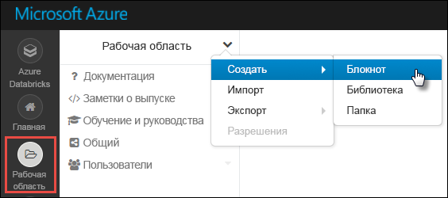
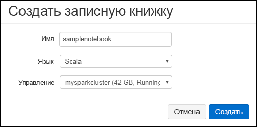

# <a name="tutorial-extract-transform-and-load-data-using-azure-databricks"></a>Руководство. Извлечение, преобразование и загрузка данных с помощью Azure Databricks

С помощью этого руководства можно выполнить операцию извлечения, преобразования и загрузки данных для перемещения данных из предварительной версии Azure Data Lake Storage Gen2 в хранилище данных SQL Azure, с помощью Azure Databricks.

На следующем рисунке показан поток в приложении.


В рамках этого руководства рассматриваются следующие задачи:

> [!div class="checklist"]
> * Создание рабочей области Azure Databricks
> * Создание кластера Spark в Azure Databricks.
> * Создание поддерживаемой учетной записи хранилища Azure Data Lake Gen2.
> * Отправка данных в Azure Data Lake Storage Gen2.
> * Создание записной книжки в Azure Databricks.
> * Извлечение данных из Data Lake Storage Gen2.
> * Преобразование данных в Azure Databricks.
> * Загрузка данных в хранилище данных Azure SQL

Если у вас еще нет подписки Azure, [создайте бесплатную учетную запись Azure](https://azure.microsoft.com/free/), прежде чем начинать работу.

## <a name="prerequisites"></a>Предварительные требования

Для работы с этим руководством:

* Создайте хранилище данных SQL Azure, создайте правило брандмауэра на уровне сервера и подключитесь к серверу с правами администратора. Инструкции см. в статье [Краткое руководство. Создание хранилища данных SQL Azure на портале Azure и отправка запросов к этому хранилищу данных](../../sql-data-warehouse/create-data-warehouse-portal.md).
* Создайте главный ключ базы данных для хранилища данных SQL Azure. Инструкции см. в статье [Создание главного ключа базы данных](https://docs.microsoft.com/sql/relational-databases/security/encryption/create-a-database-master-key).
* [Создайте учетную запись Data Lake Storage Gen2 Azure](quickstart-create-account.md)

## <a name="sign-in-to-the-azure-portal"></a>Вход на портал Azure

Войдите на [портале Azure](https://portal.azure.com/).

## <a name="create-an-azure-databricks-workspace"></a>Создание рабочей области Azure Databricks

В этом разделе вы создадите рабочую область Azure Databricks с помощью портала Azure. 

1. На портале Azure выберите **Создать ресурс** > **Analytics** > **Azure Databricks**.

    

2. В разделе **службы Azure Databricks** укажите значения для создания рабочей области Databricks.

    

    Укажите следующие значения.

    |Свойство  |ОПИСАНИЕ  |
    |---------|---------|
    |**Имя рабочей области**     | Укажите имя рабочей области Databricks.        |
    |**Подписка**     | Выберите подписку Azure в раскрывающемся списке.        |
    |**Группа ресурсов**     | Укажите, следует ли создать новую группу ресурсов или использовать имеющуюся. Группа ресурсов — это контейнер, содержащий связанные ресурсы для решения Azure. Дополнительные сведения см. в [обзоре группы ресурсов Azure](../../azure-resource-manager/resource-group-overview.md). |
    |**Местоположение.**     | Выберите **Западная часть США 2**. Другие доступные регионы см. в статье о [доступности служб Azure по регионам](https://azure.microsoft.com/regions/services/).        |
    |**Ценовая категория**     |  Вы можете выбрать уровень **Стандартный** или **Премиум**. Дополнительные сведения об этих ценовых категориях см. на [странице цен на Databricks](https://azure.microsoft.com/pricing/details/databricks/).       |

    Установите флажок **Закрепить на панели мониторинга** и щелкните **Создать**.

3. Создание учетной записи займет несколько минут. Во время создания учетной записи на портале с правой стороны отображается плитка **Submitting deployment for Azure Databricks** (Идет отправка развертывания для Databricks). Возможно, вам потребуется прокрутить панель мониторинга, чтобы увидеть эту плитку. В верхней части экрана также будет отображаться индикатор хода выполнения. Следить за выполнением можно с помощью любого из этих элементов.

    

## <a name="create-a-spark-cluster-in-databricks"></a>Создание кластера Spark в Databricks

1. На портале Azure перейдите к созданной рабочей области Databricks, а затем выберите **Launch Workspace** (Запуск рабочей области).

2. Вы будете перенаправлены на портал Azure Databricks. На портале выберите **Кластер**.

    

3. На странице **создания кластера** укажите значения для создания кластера.

    

    Заполните значения в следующих полях, и примите значения по умолчанию для других полей.

    * Введите имя кластера.
    * В рамках этой статьи создайте кластер со средой выполнения **4.2**.
    * Убедитесь, что установлен флажок **Terminate after ___ minutes of activity** (Завершить работу после ___ минут отсутствия активности). Укажите длительность (в минутах) для завершения работы кластера, если тот не используется.

    Выберите **Create cluster** (Создать кластер). После запуска кластера можно вложить записные книжки в кластер и запустить задания Spark.

## <a name="create-storage-account-file-system"></a>Создание файловой системы учетной записи хранения

В этом разделе показано создание записной книжки в рабочей области Azure Databricks и выполнение фрагментов кода для настройки учетной записи хранения.

1. На [портале Azure](https://portal.azure.com) перейдите к созданной рабочей области Azure Databricks, а затем выберите **Launch Workspace** (Запуск рабочей области).

2. В левой области выберите **Рабочая область**. В раскрывающемся списке **Рабочая область** выберите **Создать** > **Notebook** (Записная книжка).

    

3. В диалоговом окне **создания записной книжки** введите имя записной книжки. Выберите **Scala** в качестве языка, а затем выберите созданный ранее кластер Spark.

    

    Нажмите кнопку **Создать**.

4. Введите следующий код в первую ячейку и выполните его.

    ```scala
    spark.conf.set("fs.azure.account.key.<ACCOUNT_NAME>.dfs.core.windows.net", "<ACCOUNT_KEY>") 
    spark.conf.set("fs.azure.createRemoteFileSystemDuringInitialization", "true")
    dbutils.fs.ls("abfs://<FILE_SYSTEM_NAME>@<ACCOUNT_NAME>.dfs.core.windows.net/")
    spark.conf.set("fs.azure.createRemoteFileSystemDuringInitialization", "false") 
    ```

    Чтобы выполнить ячейку кода, нажмите клавиши **SHIFT+ВВОД**.

    Теперь файловая система учетной записи хранения создана.

## <a name="upload-data-to-the-storage-account"></a>Отправка данных в учетную запись хранения

На следующем шаге образец файла данных загружается в учетную запись хранилища для последующего преобразования в Azure Databricks. 

> [!NOTE]
> Если у вас еще нет учетной записи Azure Data Lake Storage Gen2, ознакомьтесь с [кратким руководством по ее созданию](./quickstart-create-account.md).

1. Загрузите (**small_radio_json.json**) из репозитория [Примеры U-SQL и отслеживание вопросов](https://github.com/Azure/usql/blob/master/Examples/Samples/Data/json/radiowebsite/small_radio_json.json) и запишите путь, куда сохраняете файл.

2. Затем передайте данные примера в учетную запись хранения. Метод, который используется для отправки данных в учетную запись хранения, зависит от того, включено ли иерархическое пространство имен.

    Если иерархическое пространство имен включено для учетной записи службы хранилища Azure, созданной для учетной записи Gen2, то для обработки загрузки можно использовать фабрику данных Azure, distp или AzCopy (версия 10). AzCopy версия 10 доступна для клиентов только в предварительной версии. Чтобы использовать AzCopy, вставьте следующий код в окно командной строки:

    ```bash
    set ACCOUNT_NAME=<ACCOUNT_NAME>
    set ACCOUNT_KEY=<ACCOUNT_KEY>
    azcopy cp "<DOWNLOAD_PATH>\small_radio_json.json" https://<ACCOUNT_NAME>.dfs.core.windows.net/data --recursive 
    ```
    
## <a name="extract-data-from-azure-storage"></a>Извлечение данных из службы хранилища Azure

Вернитесь к DataBricks Notebook и введите в новую ячейку следующий код.

1. Добавьте следующий фрагмент кода в пустую ячейку кода и замените значения заполнителей значениями, сохраненными ранее из учетной записи хранения.

    ```scala
    dbutils.widgets.text("storage_account_name", "STORAGE_ACCOUNT_NAME", "<YOUR_STORAGE_ACCOUNT_NAME>")
    dbutils.widgets.text("storage_account_access_key", "YOUR_ACCESS_KEY", "<YOUR_STORAGE_ACCOUNT_SHARED_KEY>")
    ```

    Чтобы выполнить ячейку кода, нажмите клавиши **SHIFT+ВВОД**.

2. Теперь можно загрузить пример JSON-файла в виде кадра данных в Azure Databricks. Вставьте следующий код в новую ячейку, затем нажмите **SHIFT+ВВОД**(чтобы заменить значения заполнителя):

    ```scala
    val df = spark.read.json("abfs://<FILE_SYSTEM_NAME>@<ACCOUNT_NAME>.dfs.core.windows.net/data/small_radio_json.json")
    ```

3. Чтобы просмотреть содержимое кадра данных, запустите следующий код.

    ```scala
    df.show()
    ```

    Должен отобразиться результат, аналогичный приведенному ниже фрагменту кода.

    ```bash
    +---------------------+---------+---------+------+-------------+----------+---------+-------+--------------------+------+--------+-------------+---------+--------------------+------+-------------+------+
    |               artist|     auth|firstName|gender|itemInSession|  lastName|   length|  level|            location|method|    page| registration|sessionId|                song|status|           ts|userId|
    +---------------------+---------+---------+------+-------------+----------+---------+-------+--------------------+------+--------+-------------+---------+--------------------+------+-------------+------+
    | El Arrebato         |Logged In| Annalyse|     F|            2|Montgomery|234.57914| free  |  Killeen-Temple, TX|   PUT|NextSong|1384448062332|     1879|Quiero Quererte Q...|   200|1409318650332|   309|
    | Creedence Clearwa...|Logged In|   Dylann|     M|            9|    Thomas|340.87138| paid  |       Anchorage, AK|   PUT|NextSong|1400723739332|       10|        Born To Move|   200|1409318653332|    11|
    | Gorillaz            |Logged In|     Liam|     M|           11|     Watts|246.17751| paid  |New York-Newark-J...|   PUT|NextSong|1406279422332|     2047|                DARE|   200|1409318685332|   201|
    ...
    ...
    ```

В результате были извлечены данные из Azure Data Lake Storage Gen2 в Azure Databricks.

## <a name="transform-data-in-azure-databricks"></a>Преобразование данных в Azure Databricks.

Пример необработанных данных **small_radio_json.json** содержит сведения о слушателях радиостанции и имеет множество столбцов. В этом разделе мы преобразуем данные, чтобы извлечь только определенные столбцы из набора данных.

1. Сначала извлеките только столбцы *firstName*, *lastName*, *gender*, *location* и *level* из кадра данных, который был создан ранее.

    ```scala
    val specificColumnsDf = df.select("firstname", "lastname", "gender", "location", "level")
    ```

    Вывод должен выглядеть также, как показано в следующем фрагменте кода:

    ```bash
    +---------+----------+------+--------------------+-----+
    |firstname|  lastname|gender|            location|level|
    +---------+----------+------+--------------------+-----+
    | Annalyse|Montgomery|     F|  Killeen-Temple, TX| free|
    |   Dylann|    Thomas|     M|       Anchorage, AK| paid|
    |     Liam|     Watts|     M|New York-Newark-J...| paid|
    |     Tess|  Townsend|     F|Nashville-Davidso...| free|
    |  Margaux|     Smith|     F|Atlanta-Sandy Spr...| free|
    |     Alan|     Morse|     M|Chicago-Napervill...| paid|
    |Gabriella|   Shelton|     F|San Jose-Sunnyval...| free|
    |   Elijah|  Williams|     M|Detroit-Warren-De...| paid|
    |  Margaux|     Smith|     F|Atlanta-Sandy Spr...| free|
    |     Tess|  Townsend|     F|Nashville-Davidso...| free|
    |     Alan|     Morse|     M|Chicago-Napervill...| paid|
    |     Liam|     Watts|     M|New York-Newark-J...| paid|
    |     Liam|     Watts|     M|New York-Newark-J...| paid|
    |   Dylann|    Thomas|     M|       Anchorage, AK| paid|
    |     Alan|     Morse|     M|Chicago-Napervill...| paid|
    |   Elijah|  Williams|     M|Detroit-Warren-De...| paid|
    |  Margaux|     Smith|     F|Atlanta-Sandy Spr...| free|
    |     Alan|     Morse|     M|Chicago-Napervill...| paid|
    |   Dylann|    Thomas|     M|       Anchorage, AK| paid|
    |  Margaux|     Smith|     F|Atlanta-Sandy Spr...| free|
    +---------+----------+------+--------------------+-----+
    ```

2.  Эти данные можно еще преобразовывать, переименовав столбец **level** на **subscription_type**.

    ```scala
    val renamedColumnsDF = specificColumnsDf.withColumnRenamed("level", "subscription_type")
    renamedColumnsDF.show()
    ```

    Вывод должен выглядеть также, как показано в следующем фрагменте кода.

    ```bash
    +---------+----------+------+--------------------+-----------------+
    |firstname|  lastname|gender|            location|subscription_type|
    +---------+----------+------+--------------------+-----------------+
    | Annalyse|Montgomery|     F|  Killeen-Temple, TX|             free|
    |   Dylann|    Thomas|     M|       Anchorage, AK|             paid|
    |     Liam|     Watts|     M|New York-Newark-J...|             paid|
    |     Tess|  Townsend|     F|Nashville-Davidso...|             free|
    |  Margaux|     Smith|     F|Atlanta-Sandy Spr...|             free|
    |     Alan|     Morse|     M|Chicago-Napervill...|             paid|
    |Gabriella|   Shelton|     F|San Jose-Sunnyval...|             free|
    |   Elijah|  Williams|     M|Detroit-Warren-De...|             paid|
    |  Margaux|     Smith|     F|Atlanta-Sandy Spr...|             free|
    |     Tess|  Townsend|     F|Nashville-Davidso...|             free|
    |     Alan|     Morse|     M|Chicago-Napervill...|             paid|
    |     Liam|     Watts|     M|New York-Newark-J...|             paid|
    |     Liam|     Watts|     M|New York-Newark-J...|             paid|
    |   Dylann|    Thomas|     M|       Anchorage, AK|             paid|
    |     Alan|     Morse|     M|Chicago-Napervill...|             paid|
    |   Elijah|  Williams|     M|Detroit-Warren-De...|             paid|
    |  Margaux|     Smith|     F|Atlanta-Sandy Spr...|             free|
    |     Alan|     Morse|     M|Chicago-Napervill...|             paid|
    |   Dylann|    Thomas|     M|       Anchorage, AK|             paid|
    |  Margaux|     Smith|     F|Atlanta-Sandy Spr...|             free|
    +---------+----------+------+--------------------+-----------------+
    ```

## <a name="load-data-into-azure-sql-data-warehouse"></a>Загрузка данных в хранилище данных Azure SQL

В этом разделе преобразованные данные отправляются в хранилище данных SQL Azure. С помощью соединителя хранилища данных SQL Azure для Azure Databricks можно напрямую отправить кадр данных в виде таблицы в хранилище данных SQL.

Как упоминалось ранее, соединитель хранилища данных SQL использует хранилище BLOB-объектов Azure в качестве временного хранилища для передачи данных между Azure Databricks и хранилищем данных SQL Azure. Таким образом сначала нужно предоставить конфигурацию для подключения к учетной записи хранения. Вы уже должны были создать учетную запись, выполняя предварительные требования для этой статьи.

1. Предоставьте конфигурацию для получения доступа к учетной записи хранения Azure из Azure Databricks.

    ```scala
    val storageURI = "<STORAGE_ACCOUNT_NAME>.dfs.core.windows.net"
    val fileSystemName = "<FILE_SYSTEM_NAME>"
    val accessKey =  "<ACCESS_KEY>"
    ```

2. Укажите временную папку, которая будет использоваться при перемещении данных между Azure Databricks и хранилищем данных SQL Azure.

    ```scala
    val tempDir = "abfs://" + fileSystemName + "@" + storageURI +"/tempDirs"
    ```

3. Запустите следующий фрагмент кода, чтобы сохранить ключ доступа к хранилищу BLOB-объектов Azure в конфигурации. Благодаря этому вам не придется хранить ключ доступа в записной книжке в виде обычного текста.

    ```scala
    val acntInfo = "fs.azure.account.key."+ storageURI
    sc.hadoopConfiguration.set(acntInfo, accessKey)
    ```

4. Укажите значения для подключения к экземпляру хранилища данных SQL Azure. Вы должны были создать хранилище данных SQL, выполняя предварительные требования для этой статьи.

    ```scala
    //SQL Data Warehouse related settings
    val dwDatabase = "<DATABASE NAME>"
    val dwServer = "<DATABASE SERVER NAME>" 
    val dwUser = "<USER NAME>"
    val dwPass = "<PASSWORD>"
    val dwJdbcPort =  "1433"
    val dwJdbcExtraOptions = "encrypt=true;trustServerCertificate=true;hostNameInCertificate=*.database.windows.net;loginTimeout=30;"
    val sqlDwUrl = "jdbc:sqlserver://" + dwServer + ".database.windows.net:" + dwJdbcPort + ";database=" + dwDatabase + ";user=" + dwUser+";password=" + dwPass + ";$dwJdbcExtraOptions"
    val sqlDwUrlSmall = "jdbc:sqlserver://" + dwServer + ".database.windows.net:" + dwJdbcPort + ";database=" + dwDatabase + ";user=" + dwUser+";password=" + dwPass
    ```

5. Выполните следующий фрагмент кода, чтобы загрузить преобразованный кадр данных **renamedColumnsDF** в качестве таблицы в хранилище данных SQL. Этот фрагмент кода создает таблицу с именем **SampleTable** в базе данных SQL.

    ```scala
    spark.conf.set(
        "spark.sql.parquet.writeLegacyFormat",
        "true")
    
    renamedColumnsDF.write
        .format("com.databricks.spark.sqldw")
        .option("url", sqlDwUrlSmall) 
        .option("dbtable", "SampleTable")
        .option( "forward_spark_azure_storage_credentials","True")
        .option("tempdir", tempDir)
        .mode("overwrite")
        .save()
    ```

6. Подключитесь к базе данных SQL и убедитесь, что вы видите таблицу **SampleTable**.

    

7. Выполните запрос SELECT, чтобы проверить содержимое таблицы. В ней должны быть те же данные, что и в кадре данных **renamedColumnsDF**.

    

## <a name="clean-up-resources"></a>Очистка ресурсов

После выполнения заданий из этого руководства вы можете завершить работу кластера. Для этого в рабочей области Azure Databricks на левой панели выберите **Кластеры**. Для кластера, работу которого необходимо завершить, переместите указатель мыши на многоточие в столбце **Actions** (Действия) и выберите значок **Завершить**.


Если не завершить работу кластера вручную, это можно сделать автоматически, выбрав флажок **Terminate after __ minutes of inactivity** (Завершить работу после __ минут бездействия) во время создания кластера. В этом случае работа кластера завершается автоматически, если кластер был неактивным в течение определенного времени.

## <a name="next-steps"></a>Дополнительная информация

Из этого руководства вы узнали, как выполнить следующие задачи:

> [!div class="checklist"]
> * Создание рабочей области Azure Databricks
> * Создание кластера Spark в Azure Databricks.
> * Создание поддерживаемой учетной записи хранилища Azure Data Lake Gen2.
> * Отправка данных в Azure Data Lake Storage Gen2.
> * Создание записной книжки в Azure Databricks.
> * Извлечение данных из Data Lake Storage Gen2.
> * Преобразование данных в Azure Databricks.
> * Загрузка данных в хранилище данных Azure SQL

Перейдите к следующему руководству, чтобы узнать о потоковой передачи данных в реальном времени в Azure Databricks с помощью концентраторов событий Azure.

> [!div class="nextstepaction"]
>[Потоковая передача данных в Azure Databricks при помощи службы "Концентраторы событий"](../../azure-databricks/databricks-stream-from-eventhubs.md)
