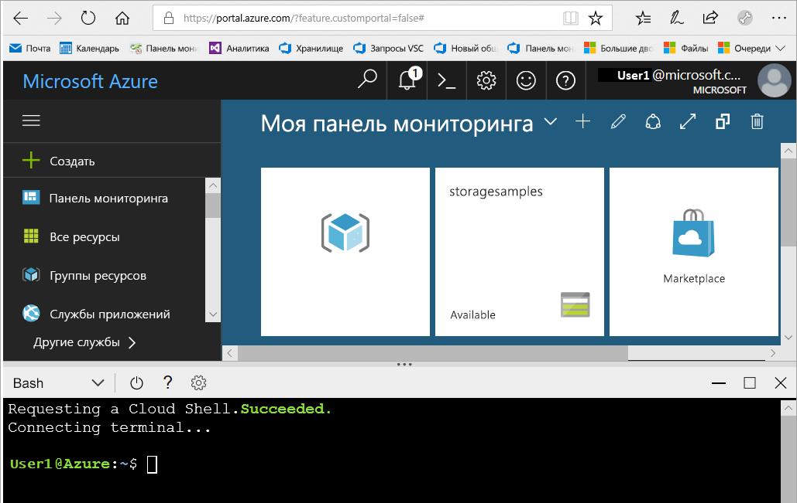
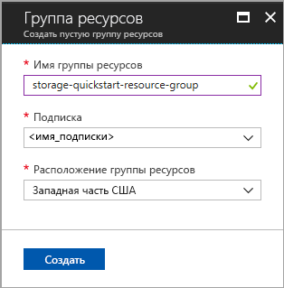
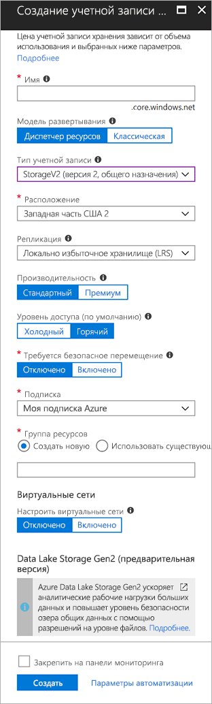

# <a name="quickstart-create-an-azure-data-lake-storage-gen2-preview-storage-account"></a>Краткое руководство. Создание учетной записи хранения Azure Data Lake Gen2 (предварительная версия)

Учетная запись Azure Data Lake Gen2 (предварительная версия) [поддерживает иерархическую службу пространства имен](introduction.md), которая предоставляет собственную файловую систему на основе каталогов, предназначенную для работы с распределенной файловой системой Hadoop (HDFS). Доступ к данным Data Lake Storage Gen2 из распределенной файловой системы Hadoop доступен с помощью [драйвера ABFS](abfs-driver.md).

Для включения возможностей Data Lake Storage Gen2 в учетной записи хранения [заполните опрос предварительной версии, чтобы запросить доступ](https://aka.ms/adlsgen2signup). После утверждения можно создать новую учетную запись Data Lake Storage Gen2. В этом кратком руководстве показано, как создать учетную запись с помощью [портала Azure](https://portal.azure.com/), [Azure PowerShell](https://docs.microsoft.com/powershell/azure/overview) или [Azure CLI](https://docs.microsoft.com/cli/azure?view=azure-cli-latest).

> [!NOTE]
> Создание учетной записи пользовательского интерфейса на портале Azure обновляется после утверждения учетной записи Data Lake Storage Gen2. Таким же образом аргументы PowerShell и CLI, связанные с Data Lake Storage Gen2, работают только после утверждения учетной записи в предварительной версии.

## <a name="prerequisites"></a>предварительным требованиям

Если у вас еще нет подписки Azure, [создайте бесплатную учетную запись Azure](https://azure.microsoft.com/free/), прежде чем начинать работу.

|           | Предварительные требования |
|-----------|--------------|
|Microsoft Azure     | None         |
|PowerShell | Для работы с этим кратким руководством требуется модуль Azure PowerShell **5.0.4-предварительная версия** или более поздней версии. Чтобы узнать, какая версия используется сейчас, выполните команду `Get-Module -ListAvailable AzureRM`. Если вам необходимо выполнить установку или обновление, см. статью [об установке модуля Azure PowerShell](/powershell/azure/install-azurerm-ps). |
|Интерфейс командной строки        | Вы можете войти в Azure и выполнить команды Azure CLI одним из двух способов: <ul><li>Выполнить команды CLI на портале Azure в Azure Cloud Shell. </li><li>Установить CLI и выполнить команды CLI локально.</li></ul>|

При работе в командной строке можно запустить оболочку Azure Cloud или локально установить интерфейс командной строки.

### <a name="use-azure-cloud-shell"></a>Использование Azure Cloud Shell

Azure Cloud Shell — это бесплатная оболочка Bash, которую можно запускать непосредственно на портале Azure. Она включает предварительно установленный интерфейс Azure CLI и настроена для использования с вашей учетной записью. Нажмите кнопку меню **Cloud Shell** в правом верхнем углу окна портала Azure.

[](https://portal.azure.com)

Эта кнопка запускает интерактивную оболочку, с помощью которой можно выполнять действия, описанные в этом кратком руководстве:

[](https://portal.azure.com)

### <a name="install-the-cli-locally"></a>Установка CLI локально

Azure CLI также можно установить и применять локально. Для этого руководства требуется Azure CLI версии 2.0.4 или более поздней. Чтобы узнать версию, выполните команду `az --version`. Если вам необходимо выполнить установку или обновление, см. статью [Установка Azure CLI 2.0](/cli/azure/install-azure-cli).

## <a name="overview-of-creating-an-azure-data-lake-storage-gen2-account"></a>Общие сведения о создании учетной записи Data Lake Storage Gen2 Azure

Прежде чем создать учетную запись, сначала создайте группу ресурсов, которая будет исполнять роль логического контейнера для хранения учетных записей или других ресурсов Azure, которые вы создаете. Если нужно очистить ресурсы, созданные при работе с этим кратким руководством, можно просто удалить группу ресурсов. При этом удаляется связанная учетная запись хранения и другие ресурсы, связанные с этой группой ресурсов. Дополнительные сведения о группах ресурсов см. в статье [Обзор Azure Resource Manager](../../azure-resource-manager/resource-group-overview.md).

> [!NOTE]
> Чтобы воспользоваться преимуществами функций Data Lake Storage Gen2, необходимо создать новые учетные записи хранения типа **StorageV2 (общего назначения V2)**.  

Дополнительные сведения о типах учетных записей хранения см. в статье [Варианты учетной записи хранения Azure](../common/storage-account-options.md).

Помните о следующих правилах при назначении имени учетной записи хранения.

- Имя учетной записи хранения должно содержать от 3 до 24 символов и состоять только из цифр и строчных букв.
- Имя учетной записи хранения должно быть уникальным в Azure. Две учетные записи хранения не могут иметь одно имя.

## <a name="create-an-account-using-the-azure-portal"></a>Создание учетной записи с использованием портала Azure

Войдите на [портал Azure](https://portal.azure.com).

### <a name="create-a-resource-group"></a>Создание группы ресурсов

Чтобы создать группу ресурсов на портале Azure, сделайте следующее:

1. На портале Azure разверните меню слева, чтобы открыть меню служб, и выберите **Resource Groups** (Группы ресурсов).
2. Нажмите кнопку **Add** (Добавить), чтобы добавить новую группу ресурсов.
3. Введите имя для группы ресурсов.
4. Выберите подписку, в которой нужно создать группу ресурсов.
5. Выберите расположение группы ресурсов.
6. Нажмите кнопку **Создать** .  



### <a name="create-a-general-purpose-v2-storage-account"></a>Создание учетной записи хранения общего назначения v2

Чтобы создать учетную запись хранения общего назначения версии 2 на портале Azure, сделайте следующее:

> [!NOTE]
> Иерархическое пространство имен включено только в западной части США 2 и западно-центральной части США. Убедитесь, что при создании учетной записи хранения указано одно из этих расположений.

1. На портале Azure разверните меню слева, чтобы открыть меню служб, и выберите **Все службы**. Прокрутите вниз до пункта **Хранилище** и выберите **Учетные записи хранения**. В появившемся окне **Учетные записи хранения** выберите **добавить**.
2. Выберите имя для своей учетной записи хранения.
3. Оставьте параметру **Модель развертывания** значение заданное по умолчанию.
4. В поле **Account kind** (Тип учетной записи) выберите **StorageV2 (general-purpose v2)** (Хранилище версии 2 (общего назначения)).
5. Задайте параметру **Расположение** значение **Западный регион США 2**.
6. В поле **Replication**(Репликация) оставьте **Locally Redundant storage (LRS)** (Локально избыточное хранилище (LRS)).
7. Оставьте эти поля установленными по умолчанию: **Репликация**, **Производительность**, **Уровень доступа**.
8. Выберите подписку, в которой нужно создать учетную запись хранения.
9. В разделе **Resource group** (Группа ресурсов) щелкните **Use existing** (Использовать имеющуюся), а затем выберите группу ресурсов, созданную в предыдущем разделе.
10. Оставьте значение по умолчанию для поля **Виртуальные сети**.
11. В разделе **Data Lake Storage Gen2 (предварительная версия)** установите **иерархическому пространству имен** параметр **Включить**.
12. Щелкните **Создать** , чтобы создать учетную запись хранения.



Теперь учетная запись хранилища создана с помощью портала.

### <a name="clean-up-resources"></a>Очистка ресурсов

Чтобы удалить группу ресурсов с помощью портала Azure, сделайте следующее:

1. На портале Azure разверните меню слева, чтобы открыть меню служб, и выберите **Resource Groups** (Группы ресурсов), чтобы просмотреть список групп ресурсов.
2. Найдите группу ресурсов, которую нужно удалить, и щелкните правой кнопкой мыши кнопку **More** (Дополнительно) (**...**) справа от списка.
3. Выберите **Удалить группу ресурсов** и подтвердите выбор.

## <a name="create-an-account-using-powershell"></a>Создание учетной записи с помощью PowerShell

Чтобы выполнить проверку подлинности, войдите в подписку Azure с помощью команды `Login-AzureRmAccount` и следуйте инструкциям на экране.

```powershell
Login-AzureRmAccount
```

### <a name="create-a-resource-group"></a>Создание группы ресурсов

Чтобы создать группу ресурсов с помощью PowerShell, выполните команду [New-AzureRmResourceGroup](/powershell/module/azurerm.resources/new-azurermresourcegroup). 

> [!NOTE]
> Иерархическое пространство имен включено только в западной части США 2 и западно-центральной части США. Убедитесь, что при создании учетной записи хранения указано одно из этих расположений.

```powershell
# put resource group in a variable so you can use the same group name going forward,
# without hardcoding it repeatedly
$resourceGroup = "storage-quickstart-resource-group"
$location = "westus2"
New-AzureRmResourceGroup -Name $resourceGroup -Location $location
```

### <a name="create-a-general-purpose-v2-storage-account"></a>Создание учетной записи хранения общего назначения v2

Чтобы создать учетную запись хранения общего назначения версии 2 с локально избыточным хранилищем с помощью PowerShell, примените команду [New-AzureRmStorageAccount](/powershell/module/azurerm.storage/New-AzureRmStorageAccount):

```powershell
Get-AzureRmLocation | select Location 
$location = "westus2"

New-AzureRmStorageAccount -ResourceGroupName $resourceGroup `
  -Name "storagequickstart" `
  -Location $location `
  -SkuName Standard_LRS `
  -Kind StorageV2 
  -HierarchialNamespace $True
```

### <a name="clean-up-resources"></a>Очистка ресурсов

Чтобы удалить группу ресурсов и связанные с ней ресурсы, включая новую учетную запись хранения, используйте команду [Remove-AzureRmResourceGroup](/powershell/module/azurerm.resources/remove-azurermresourcegroup): 

```powershell
Remove-AzureRmResourceGroup -Name $resourceGroup
```

## <a name="create-an-account-using-azure-cli"></a>Создание учетной записи с помощью Azure CLI 

Чтобы запустить Azure Cloud Shell, войдите на [портал Azure](https://portal.azure.com).

Чтобы войти в локальную установку CLI, выполните команду входа:

```cli
az login
```
### <a name="create-a-resource-group"></a>Создание группы ресурсов

Чтобы создать группу ресурсов с помощью Azure CLI, используйте команду [az group create](/cli/azure/group#az_group_create). 

```azurecli-interactive
az group create \
    --name storage-quickstart-resource-group \
    --location westus2
```

> [!NOTE]
> Иерархическое пространство имен включено только в западной части США 2 и западно-центральной части США. Убедитесь, что при создании учетной записи хранения указано одно из этих расположений.

### <a name="create-a-general-purpose-v2-storage-account"></a>Создание учетной записи хранения общего назначения v2

Чтобы создать учетную запись хранения общего назначения версии 2 с локально избыточным хранилищем с помощью Azure CLI, примените команду [az storage account create](/cli/azure/storage/account#az_storage_account_create).

```azurecli-interactive
az storage account create \
    --name storagequickstart \
    --resource-group storage-quickstart-resource-group \
    --location westus2 \
    --sku Standard_LRS \
    --kind StorageV2 \
    --hierarchical-namespace true
```

### <a name="clean-up-resources"></a>Очистка ресурсов

Чтобы удалить группу ресурсов и связанные с ней ресурсы, включая новую учетную запись хранения, используйте команду [az group delete](/cli/azure/group#az_group_delete).

```azurecli-interactive
az group delete --name myResourceGroup
```

## <a name="next-steps"></a>Дополнительная информация

В этом кратком руководстве была создана учетная запись хранения Data Lake Storage Gen2. Сведения об отправке и скачивании больших двоичных объектов в учетную запись хранения и обратно см. в кратком руководстве по хранилищу BLOB-объектов.

* [Перемещение данных в хранилище BLOB-объектов Azure и из него с помощью AzCopy](https://docs.microsoft.com/en-us/azure/machine-learning/team-data-science-process/move-data-to-azure-blob-using-azcopy)