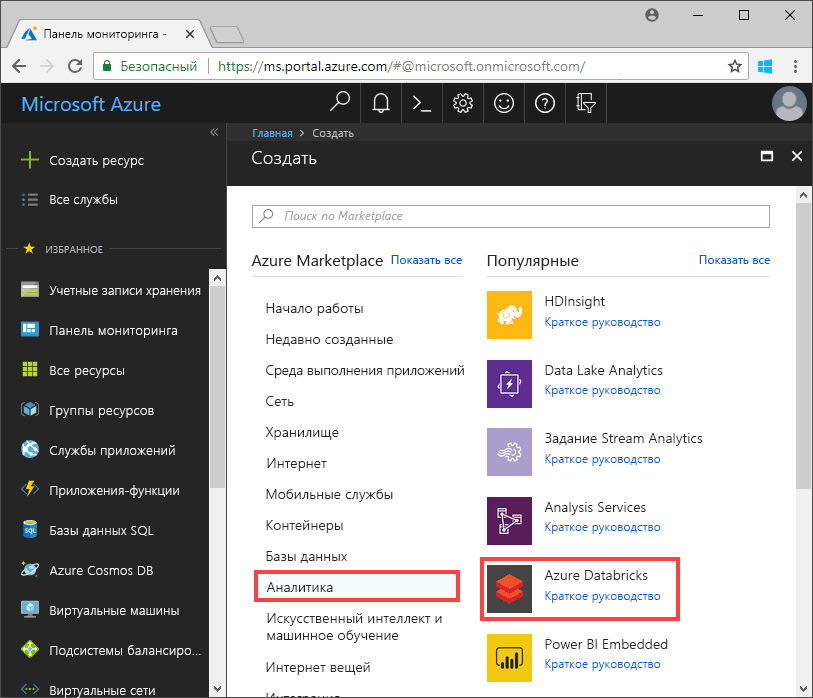
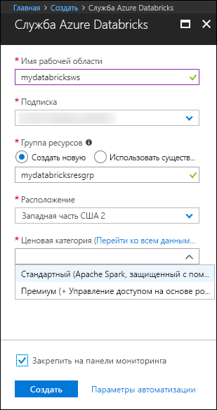
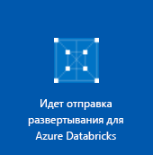
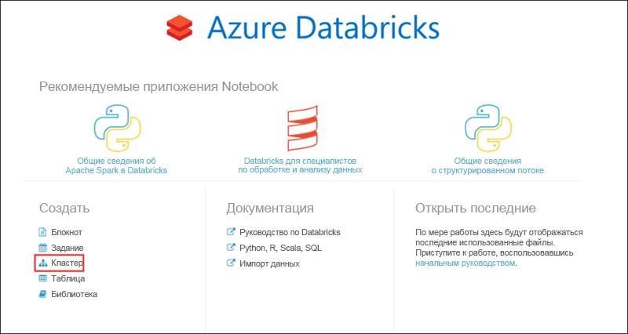
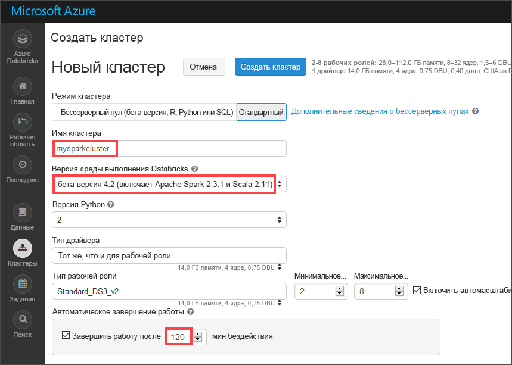
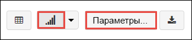
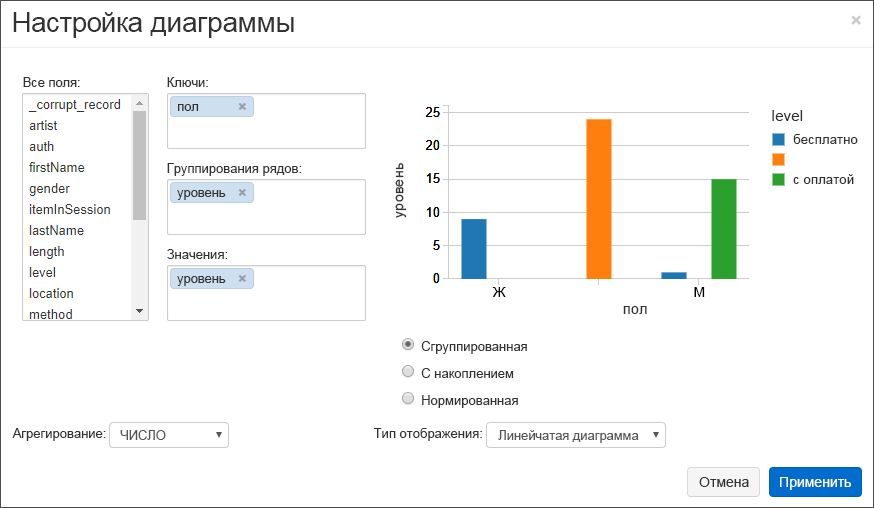
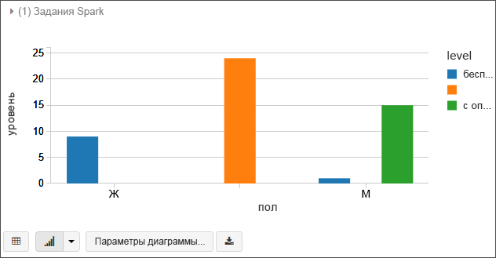
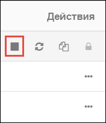

# <a name="quickstart-run-a-spark-job-on-azure-databricks-using-the-azure-portal"></a>Краткое руководство. Запуск задания Spark в Azure Databricks с помощью портала Azure

Это краткое руководство содержит сведения о запуске задания Apache Spark используя Azure Databricks для выполнения анализа данных, которые хранятся в Azure Data Lake Storage Gen2 (предварительная версия).

В рамках задания Spark показано как анализировать данные подписки на радиоканал, чтобы получить сведения о бесплатном и оплачиваемом использовании на основе демографических данных.

Если у вас еще нет подписки Azure, [создайте бесплатную учетную запись Azure](https://azure.microsoft.com/free/), прежде чем начинать работу.

## <a name="prerequisites"></a>Предварительные требования

- [Создайте учетную запись Data Lake Storage Gen2 Azure](quickstart-create-account.md)

## <a name="set-aside-storage-account-configuration"></a>Отдельная настройка учетной записи хранения

> [!IMPORTANT]
> Для этого руководства необходимо иметь доступ к имени учетной записи хранилища и к ключу доступа. На портале Azure выберите **Все службы** и фильтр *Хранилище*. Выберите **Учетные записи хранения** и найдите учетную запись, созданную для этого руководства.
>
> Скопируйте **имя учетной записи хранения** из окна **Обзор** в текстовый редактор. Затем выберите **Ключи доступа** и скопируйте значение для **key1** в текстовый редактор, так как оба значения будут необходимы для команд позднее.

## <a name="create-an-azure-databricks-workspace"></a>Создание рабочей области Azure Databricks

В этом разделе вы создадите рабочую область Azure Databricks с помощью портала Azure.

1. На портале Azure выберите **Создать ресурс** > **Analytics** > **Azure Databricks**. 

    

2. В разделе **службы Azure Databricks** укажите значения для создания рабочей области Databricks.

    

    Укажите следующие значения.
     
    |Свойство  |ОПИСАНИЕ  |
    |---------|---------|
    |**Имя рабочей области**     | Укажите имя рабочей области Databricks.        |
    |**Подписка**     | Выберите подписку Azure в раскрывающемся списке.        |
    |**Группа ресурсов**     | Укажите, следует ли создать новую группу ресурсов или использовать имеющуюся. Группа ресурсов — это контейнер, содержащий связанные ресурсы для решения Azure. Дополнительные сведения см. в [обзоре группы ресурсов Azure](../../azure-resource-manager/resource-group-overview.md). |
    |**Местоположение.**     | Выберите **Западная часть США 2**. Другие доступные регионы см. в статье о [доступности служб Azure по регионам](https://azure.microsoft.com/regions/services/).        |
    |**Ценовая категория**     |  Вы можете выбрать уровень **Стандартный** или **Премиум**. Дополнительные сведения об этих ценовых категориях см. на [странице цен на Databricks](https://azure.microsoft.com/pricing/details/databricks/).       |

    Выберите **Закрепить на панели мониторинга** и щелкните **Создать**.

3. Создание рабочей области займет несколько минут. Во время создания рабочей области на портале с правой стороны отображается плитка **Идет отправка развертывания для Azure Databricks**. Возможно, вам потребуется прокрутить панель мониторинга, чтобы увидеть эту плитку. В верхней части экрана также будет отображаться индикатор хода выполнения. Следить за выполнением можно с помощью любого из этих элементов.

    

## <a name="create-a-spark-cluster-in-databricks"></a>Создание кластера Spark в Databricks

1. На портале Azure перейдите к созданной рабочей области Databricks, а затем выберите **Launch Workspace** (Запуск рабочей области).

2. Вы будете перенаправлены на портал Azure Databricks. На портале выберите **Новый** > **Кластер**.

    

3. На странице **создания кластера** укажите значения для создания кластера.

    

    Для всех остальных параметров, кроме следующих, примите значения по умолчанию:

    * Введите имя кластера.
    * Создайте кластер со средой выполнения **4.2 бета-версия**.
    * Убедитесь, что установлен флажок **Terminate after 120 minutes of activity** (Завершить работу после 120 минут отсутствия активности). Укажите длительность (в минутах) для завершения работы кластера, если тот не используется.

4. Выберите **Create cluster** (Создать кластер). После запуска кластера можно вложить записные книжки в кластер и запустить задания Spark.

Дополнительные сведения о создании кластеров см. в статье [о создании кластера Spark в Azure Databricks](https://docs.azuredatabricks.net/user-guide/clusters/create.html).

## <a name="create-storage-account-file-system"></a>Создание файловой системы учетной записи хранения

В этом разделе показано создание записной книжки в рабочей области Azure Databricks и выполнение фрагментов кода для настройки учетной записи хранения.

1. На [портале Azure](https://portal.azure.com) перейдите к созданной рабочей области Azure Databricks, а затем выберите **Launch Workspace** (Запуск рабочей области).

2. В левой области выберите **Рабочая область**. В раскрывающемся списке **Рабочая область** выберите **Создать** > **Notebook** (Записная книжка).

    

3. В диалоговом окне **создания записной книжки** введите имя записной книжки. Выберите **Scala** в качестве языка, а затем выберите созданный ранее кластер Spark.

    

    Нажмите кнопку **Создать**.

4. В следующем коде замените текст **ACCOUNT_NAME** и **ACCOUNT_KEY** значениями, сохраненными в начале работы с этим кратким руководством. Кроме того, замените текст **FILE_SYSTEM_NAME** именем, которым надо назвать файловую систему. Затем введите код в первую ячейку.

    ```scala
    spark.conf.set("fs.azure.account.key.<ACCOUNT_NAME>.dfs.core.windows.net", "<ACCOUNT_KEY>") 
    spark.conf.set("fs.azure.createRemoteFileSystemDuringInitialization", "true")
    dbutils.fs.ls("abfss://<FILE_SYSTEM_NAME>@<ACCOUNT_NAME>.dfs.core.windows.net/")
    spark.conf.set("fs.azure.createRemoteFileSystemDuringInitialization", "false") 
    ```

    Чтобы выполнить ячейку кода, нажмите клавиши **SHIFT+ВВОД**.

    Теперь файловая система учетной записи хранения создана.

## <a name="ingest-sample-data"></a>Принятие демонстрационных данных

Прежде чем приступить к работе с этим разделом, выполните следующие предварительные требования.

Введите следующий код в ячейку записной книжки:

    %sh wget -P /tmp https://raw.githubusercontent.com/Azure/usql/master/Examples/Samples/Data/json/radiowebsite/small_radio_json.json

В ячейке нажмите клавишу `Shift` + `Enter`, чтобы выполнить вход.

Теперь в новую ячейку под этой ячейкой введите следующий код (замените **FILE_SYSTEM** и **ACCOUNT_NAME** значениями, использованными ранее):

    dbutils.fs.cp("file:///tmp/small_radio_json.json", "abfss://<FILE_SYSTEM>@<ACCOUNT_NAME>.dfs.core.windows.net/")

В ячейке нажмите клавишу `Shift` + `Enter`, чтобы выполнить вход.

## <a name="run-a-spark-sql-job"></a>Выполнение задания SQL Spark

Выполните следующие задачи для выполнения задания SQL Spark на основе данных.

1. Выполните инструкцию SQL для создания временной таблицы, используя данные образца файла данных JSON, **small_radio_json.json**. В указанном ниже фрагменте кода замените значения заполнителя именем файловой системы и учетной записи хранения. Используя созданные ранее заметки, вставьте фрагмент кода в ячейку нового кода в записной книжке, а затем нажмите сочетание клавиш SHIFT + ВВОД.

    ```sql
    %sql
    DROP TABLE IF EXISTS radio_sample_data;
    CREATE TABLE radio_sample_data
    USING json
    OPTIONS (
     path  "abfss://<FILE_SYSTEM_NAME>@<ACCOUNT_NAME>.dfs.core.windows.net/<PATH>/small_radio_json.json"
    )
    ```

    После успешного выполнения команды все данные из файла JSON будут отображаться в виде таблицы в кластере Databricks.

    Волшебная команда языка `%sql` позволяет выполнить код SQL из записной книжки, даже если записная книжка другого типа. Дополнительные сведения см. в статье об [объединении языков программирования в записной книжке](https://docs.azuredatabricks.net/user-guide/notebooks/index.html#mixing-languages-in-a-notebook).

2. Рассмотрим моментальный снимок примера данных JSON, чтобы лучше ознакомиться с запросом, который вы выполняете. Вставьте следующий фрагмент кода в ячейку кода и нажмите клавиши **SHIFT + ВВОД**.

    ```sql
    %sql 
    SELECT * from radio_sample_data
    ```

3. Отобразятся табличные данные, как показано на следующем снимке экрана (показаны только некоторые столбцы).

    

    Среди прочего пример данных демонстрирует пол аудитории радиоканала (имя столбца **gender**), а также категорию подписки (бесплатная или платная) (имя столбца **level**).

4. Теперь можно создать визуальное представление данных по каждому полу, а также по числу пользователей с бесплатными и платными учетными записями. В нижней части выходных табличных данных щелкните значок **линейчатой диаграммы**, а затем — **параметры построения**.

    

5. В разделе **настроек построения** перетащите значения, как показано на снимке экрана.

    

    - Для параметра **Ключи** задайте значение **gender**.
    - Для параметра **Series groupings** (Группирование ряда) задайте значение **level**.
    - Для параметра **Значения** задайте значение **level**.
    - Для параметра **Агрегирование** задайте значение **COUNT**.

6. Нажмите кнопку **Применить**.

7. Выходные данные отображают визуальное представление, как показано на следующем снимке экрана:

     

## <a name="clean-up-resources"></a>Очистка ресурсов

После завершения выполнения задачи из статьи можно будет завершить работу кластера. В рабочей области Azure Databricks выберите **Кластеры** и найдите кластер, работу которого необходимо завершить. Наведите указатель мыши на многоточие в столбце **Действия** и выберите значок **Завершить**.



Если не завершить работу кластера вручную, это можно сделать автоматически, во время создания кластера выбрав флажок **Terminate after __ minutes of inactivity** (Завершить работу после __ минут бездействия). Если установить эту опцию, кластер завершит роботу после того, как не будет активен в течение заданного промежутка времени.

## <a name="next-steps"></a>Дополнительная информация

В этой статье был создан кластер Spark в Azure Databricks и запущено задание Spark с использованием данных в Data Lake Storage Gen2 Azure. Вы также можете просмотреть [источники данных Spark](https://docs.azuredatabricks.net/spark/latest/data-sources/index.html), чтобы узнать, как импортировать данные из источников данных в Azure Databricks. Перейдите к следующей статье, чтобы узнать, как выполнять операции ETL (извлечения, преобразование и загрузка данных) с помощью Azure Databricks.

> [!div class="nextstepaction"]
>[Извлечение, преобразование и загрузка данных с помощью Azure Databricks](../../azure-databricks/databricks-extract-load-sql-data-warehouse.md)
