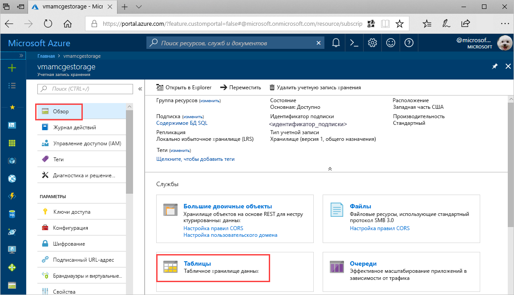
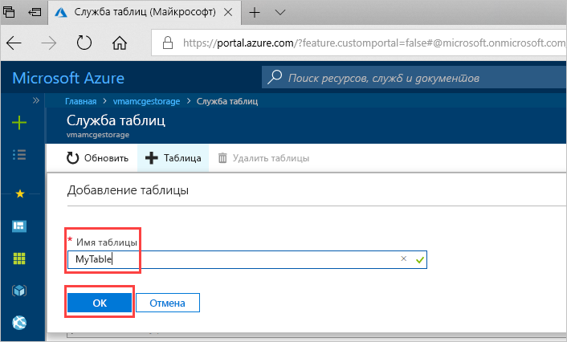

# Краткое руководство. Создание таблицы службы хранилища Azure на портале Azure 

В этом кратком руководстве описано, как создать таблицы и сущности на веб-портале Azure. Здесь объясняется, как создать учетную запись хранения Azure.

[!INCLUDE [quickstarts-free-trial-note](../../../includes/quickstarts-free-trial-note.md)]

## Предварительные требования

Для работы с этим кратким руководством сначала создайте учетную запись хранения Azure на [портале Azure](https://portal.azure.com/#create/Microsoft.StorageAccount-ARM). Инструкции по созданию учетной записи хранения см. в статье [Создайте учетную запись хранения](../common/storage-quickstart-create-account.md).

## Добавление таблицы

Теперь вы можете использовать Хранилище таблиц на портале Azure для создания таблицы.

1. Щелкните "Обзор" > "Таблицы".

   

2. Щелкните **+Таблицы**.

   

3. Введите имя таблицы в поле **Имя таблицы**, а затем нажмите кнопку **ОК**. 

   

## Дополнительная информация

- [Рекомендации по разработке таблиц](table-storage-design-guidelines.md)