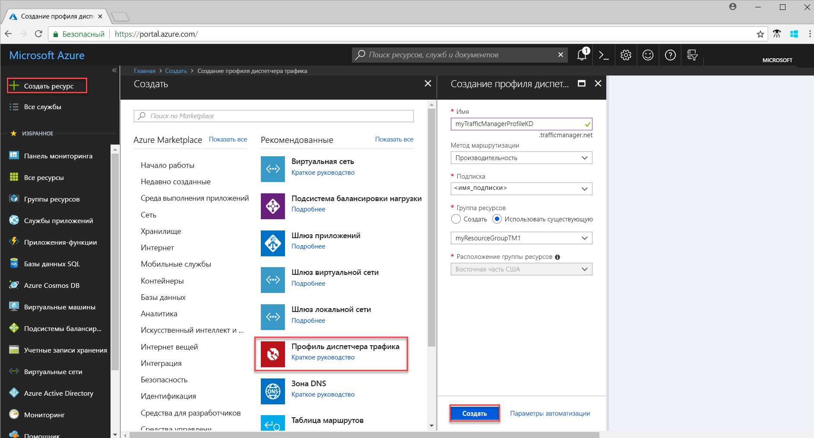
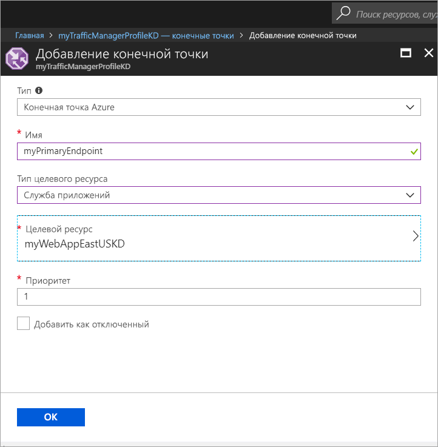
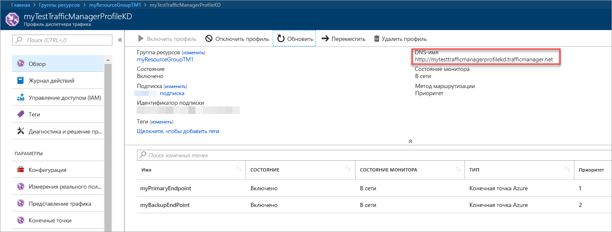
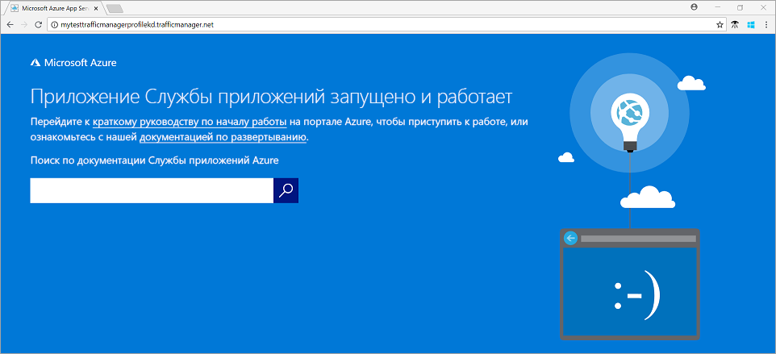

# Краткое руководство. Создание профиля диспетчера трафика для обеспечения высокодоступного веб-приложения

В этом кратком руководстве показано, как создать профиль диспетчера трафика, который обеспечивает высокий уровень доступности веб-приложения. 

Описанный здесь сценарий охватывает два экземпляра веб-приложения, выполняющиеся в разных регионах Azure. Мы создадим профиль диспетчера трафика на основе [приоритета конечной точки](traffic-manager-routing-methods.md#priority), который помогает направлять пользовательский трафик к основному сайту, где запущено приложение. Диспетчер трафика постоянно отслеживает веб-приложение и обеспечивает автоматический переход на другой ресурс с резервной копией сайта, когда основной сайт недоступен.

Если у вас еще нет подписки Azure, [создайте бесплатную учетную запись Azure](https://azure.microsoft.com/free/?WT.mc_id=A261C142F), прежде чем начинать работу.

## Вход в Azure 
Войдите на портал Azure по адресу https://portal.azure.com.

## Предварительные требования
Для этого краткого руководства необходимо развернуть два экземпляра веб-приложения, выполняющиеся в разных регионах Azure (*восточная часть США* и *Западная Европа*). Два экземпляра веб-приложения служат в качестве основной и резервной конечных точек для диспетчера трафика.

1. В верхней левой части экрана выберите **Создать ресурс** > **Интернет** > **Веб-приложение** > **Создать**.
2. В колонке **Веб-приложение** введите или выберите следующие сведения и введите параметры по умолчанию там, где они отсутствуют.

     | Параметр         | Значение     |
     | ---              | ---  |
     | ИМЯ           | Введите уникальное имя для вашего веб-приложения.  |
     | Группа ресурсов          | Выберите **Создать**, а затем введите *myResourceGroupTM1*. |
     | Расположение или план службы приложений         | Нажмите кнопку **Создать**.  В поле "План службы приложений" введите *myAppServicePlanEastUS*, а затем выберите **ОК**. 
     |      Расположение  |   Восточная часть США        |
    |||

3. Нажмите кнопку **Создать**.
4. Веб-сайт по умолчанию будет создан при успешном развертывании веб-приложения.
5. Повторите шаги 1–3, чтобы создать второй веб-сайт в другом регионе Azure со следующими параметрами:

     | Параметр         | Значение     |
     | ---              | ---  |
     | ИМЯ           | Введите уникальное имя для вашего веб-приложения.  |
     | Группа ресурсов          | Выберите **Создать**, а затем введите *myResourceGroupTM2*. |
     | Расположение или план службы приложений         | Нажмите кнопку **Создать**.  В поле "План службы приложений" введите *myAppServicePlanWestEurope*, а затем выберите **ОК**. 
     |      Расположение  |   Западная Европа      |
    |||

## Создание профиля диспетчера трафика
Создайте профиль диспетчера трафика, который направляет пользовательский трафик по приоритету конечной точки.

1. В верхней левой части экрана выберите **Создать ресурс** > **Сети** > **Профиль диспетчера трафика** > **Создать**.
2. В разделе **Создание профиля диспетчера трафика** введите или выберите следующие сведения, примите значения по умолчанию для остальных параметров и нажмите кнопку **Создать**:
    
    | Параметр                 | Значение                                              |
    | ---                     | ---                                                |
    | ИМЯ                   | Оно должно быть уникальным в пределах зоны trafficmanager.net. В результате будет создано DNS-имя **trafficmanager.net**, которое будет использоваться для доступа к профилю диспетчера трафика.|
    | Метод маршрутизации          | Выберите метод маршрутизации по **приоритету**.|
    | Подписка            | Выберите свою подписку.|
    | Группа ресурсов          | Щелкните **Existing** (Существующая), а затем выберите *myResourceGroupTM1*.|
    |Расположение |Этот параметр задает расположение группы ресурсов и не влияет на профиль диспетчера трафика, который будет развернут глобально.|
    |||
    
    
   

## Добавление конечных точек диспетчера трафика

Добавьте веб-сайт в регионе *Восточная часть США* как основную конечную точку для маршрутизации всего пользовательского трафика. Добавьте веб-сайт в регионе *Западная Европа* как резервную конечную точку. Если основная конечная точка недоступна, трафик автоматически направляется на дополнительную конечную точку.

1. На панели поиска портала выполните поиск имени профиля диспетчера трафика, созданного в предыдущем разделе, и выберите профиль в отображаемых результатах.
2. В колонке **Профиль диспетчера трафика** в разделе **Параметры** щелкните **Конечные точки**, а затем выберите **Добавить**.
3. Введите или выберите следующие значения, примите значения по умолчанию для остальных параметров и нажмите кнопку **ОК**:

    | Параметр                 | Значение                                              |
    | ---                     | ---                                                |
    | type                    | Конечная точка Azure                                   |
    | ИМЯ           | myPrimaryEndpoint                                        |
    | Тип целевого ресурса           | Служба приложений                          |
    | Целевой ресурс          | **Выберите службу приложений**, чтобы отобразить список веб-приложений, размещенных в одной подписке. В колонке **Ресурсы** выберите службу приложений, которую требуется добавить в качестве первой конечной точки. |
    | Приоритет               | Выберите **1**. Теперь весь трафик будет поступать на эту конечную точку, если она работоспособна.    |
    
4. Повторите шаги 2 и 3 для следующей конечной точки веб-приложения. Обязательно добавьте ее с **приоритетом** **2**.
5.  После добавления обе конечные точки отобразятся в колонке **Профиль диспетчера трафика** с состоянием **В сети**.

    

## Тестирование профиля диспетчера трафика
В этом разделе вы сначала определите доменное имя вашего профиля диспетчера трафика, а затем просмотрите, как диспетчер трафика выполняет отработку отказа на дополнительную конечную точку при недоступности основной конечной точки.
### Определение DNS-имени
1.  На панели поиска портала выполните поиск имени **профиля диспетчера трафика**, созданного в предыдущем разделе. В отображенных результатах щелкните профиль диспетчера трафика.
2. Нажмите **Обзор**.
3. В **профиле диспетчера трафика** отображается DNS-имя только что созданного профиля диспетчера трафика.
  
   

### Просмотр диспетчера трафика в действии

1. В веб-браузере введите DNS-имя вашего профиля диспетчера трафика, чтобы просмотреть веб-сайт по умолчанию для веб-приложения. В этом кратком сценарии все запросы направляются к основной конечной точке, которой присваивается **приоритет 1**.

2. Чтобы просмотреть отработку отказа диспетчера трафика в действии, отключите ваш основной сайт следующим образом.
    1. На странице профиля диспетчера трафика выберите **Параметры**>**Конечные точки**>*MyPrimaryEndpoint*.
    2. Для *MyPrimaryEndpoint*выберите **Отключено**. 
    3. Основная конечная точка *MyPrimaryEndpoint* теперь отображается с состоянием **Отключено**.
3. Скопируйте DNS-имя вашего профиля диспетчера трафика из предыдущего шага, чтобы просмотреть веб-сайт в веб-браузере. Если основная конечная точка отключена, пользовательский трафик направляется на дополнительную конечную точку.

## Очистка ресурсов
Ставшие ненужными группы ресурсов, веб-приложения и все связанные ресурсы можно удалить. Чтобы сделать это, выберите группы ресурсов (*myResourceGroupTM1* и *myResourceGroupTM2*) и нажмите кнопку **Удалить**.

## Дополнительная информация
В этом кратком руководстве вы создали профиль диспетчера трафика, который позволяет перенаправлять пользовательский трафик для обеспечения высокодоступного веб-приложения. Дополнительные сведения о маршрутизации трафика см. в руководствах по диспетчеру трафика.

> [!div class="nextstepaction"]
> [Руководства по диспетчеру трафика](tutorial-traffic-manager-improve-website-response.md)

