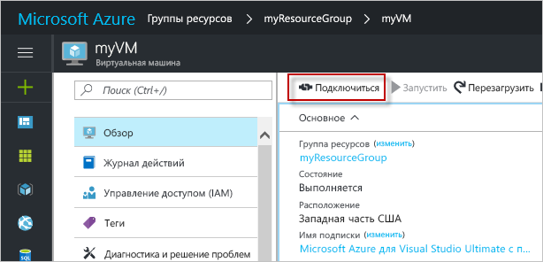

# <a name="quickstart-create-a-linux-virtual-machine-in-the-azure-portal"></a>Краткое руководство. Создание виртуальной машины под управлением Linux на портале Azure

Виртуальные машины Azure можно создать на портале Azure. В этом случае для создания виртуальных машин и всех связанных ресурсов используется пользовательский интерфейс в браузере. В этом кратком руководстве показано, как с помощью портала Azure развернуть в Azure виртуальную машину Linux под управлением Ubuntu. Чтобы проверить работу виртуальной машины, вы подключитесь к ней по протоколу SSH и установите веб-сервер NGINX.

Если у вас еще нет подписки Azure, [создайте бесплатную учетную запись Azure](https://azure.microsoft.com/free/?WT.mc_id=A261C142F), прежде чем начинать работу.

## <a name="create-ssh-key-pair"></a>Создание пары ключей SSH

Для работы с этим кратким руководством вам понадобится пара ключей SSH. Если у вас уже есть пара ключей SSH, этот шаг можно пропустить.

Чтобы создать пару ключей SSH и войти на виртуальную машину Linux, выполните приведенную ниже команду в оболочке Bash и следуйте инструкциям на экране. Например, можно использовать [Azure Cloud Shell](../../cloud-shell/overview.md) или [подсистему Windows для Linux](/windows/wsl/install-win10). Выходные данные команды включают имя файла открытого ключа. Скопируйте содержимое файла открытого ключа (`cat ~/.ssh/id_rsa.pub`) в буфер обмена.

```bash
ssh-keygen -t rsa -b 2048
```

Подробные сведения о создании пар ключей SSH, в том числе с помощью PuTTy, вы найдете в статье [Как использовать ключи SSH с Windows в Azure](ssh-from-windows.md).

## <a name="log-in-to-azure"></a>Вход в Azure

Войдите на портал Azure по адресу http://portal.azure.com.

## <a name="create-virtual-machine"></a>Создание виртуальной машины

1. Выберите **Создать ресурс** в верхнем левом углу окна портала Azure.

1. В поле поиска над списком ресурсов Azure Marketplace найдите и выберите **Ubuntu Server 16.04 LTS** от Canonical, затем выберите **Создать**.

1. На вкладке **Основные сведения** в разделе **Сведения о проекте** убедитесь, что выбрана правильная подписка и при необходимости щелкните **Создать** под полем **Группы ресурсов**. Во всплывающем элементе введите имя *myResourceGroup* для группы ресурсов и нажмите кнопку **ОК*. 

    

1. В разделе **Подробности об экземпляре** введите *myVM* в поле **Имя виртуальной машины** и выберите *Восточная часть США* в поле **Регион**. Оставьте другие значения по умолчанию.

    

1. В разделе **Учетная запись администратора** выберите **Открытый ключ SSH**, введите имя пользователя и вставьте открытый ключ в текстовое поле. Удалите из открытого ключа все начальные или конечные пробелы.

    

1. В разделе **Правила входящего порта** > **Общедоступные входящие порты**, щелкните **Разрешить выбранные порты**, а затем выберите **SSH (22)** и **HTTP (80)** из раскрывающегося списка. 

    

1. Оставьте остальные значения по умолчанию и нажмите кнопку **Просмотр и создание**, расположенную в нижней части страницы.

    
## <a name="connect-to-virtual-machine"></a>Подключение к виртуальной машине

Создайте SSH-подключение к виртуальной машине.

1. Нажмите кнопку **Подключиться** на странице обзора виртуальной машины. 

    

2. На странице **подключения к виртуальной машине** сохраните значения по умолчанию, чтобы использовать подключение по DNS-имени через порт 22. В поле **Вход с использованием локальной учетной записи ВМ** представлена команда для подключения. Нажмите кнопку рядом, чтобы скопировать эту команду. Ниже представлен пример команды подключения по SSH:

    ```bash
    ssh azureuser@myvm-123abc.eastus.cloudapp.azure.com
    ```

3. Вставьте команду подключения по SSH в командную оболочку, например Azure Cloud Shell или Bash на Ubuntu в Windows, чтобы создать подключение. 

## <a name="install-web-server"></a>Установка веб-сервера

Чтобы проверить работу виртуальной машины, установите веб-сервер NGINX. Чтобы обновить источники пакетов и установить последнюю версию пакета NGINX, выполните следующие команды в сеансе SSH:

```bash
# update packages
sudo apt-get -y update

# install NGINX
sudo apt-get -y install nginx
```

Выполнив это действие, закройте сеанс SSH командой `exit` и вернитесь на страницу свойств виртуальной машины на портале Azure.


## <a name="view-the-web-server-in-action"></a>Проверка работы веб-сервера

Установив NGINX и открыв порт 80 для виртуальной машины, вы можете получить доступ к веб-серверу через Интернет. Откройте веб-браузер и введите общедоступный IP-адрес виртуальной машины. Общедоступный IP-адрес можно найти на странице обзора виртуальной машины или в верхней части страницы *Сети*, где вы ранее добавляли правило для входящего порта.


## <a name="clean-up-resources"></a>Очистка ресурсов

Если группа ресурсов, виртуальная машина и все связанные с ними ресурсы вам больше не требуются, их можно удалить. Для этого выберите группу ресурсов для виртуальной машины, выберите действие **Удалить** и подтвердите имя удаляемой группы ресурсов.

## <a name="next-steps"></a>Дополнительная информация

При работе с этим кратким руководство вы развернули простую виртуальную машину, создали группу безопасности сети и правило для нее, а также установили простой веб-сервер. Дополнительные сведения о виртуальных машинах Azure см. в руководстве для виртуальных машин Linux.

> [!div class="nextstepaction"]
> [Создание виртуальных машин Linux и управление ими с помощью Azure CLI](./tutorial-manage-vm.md)
