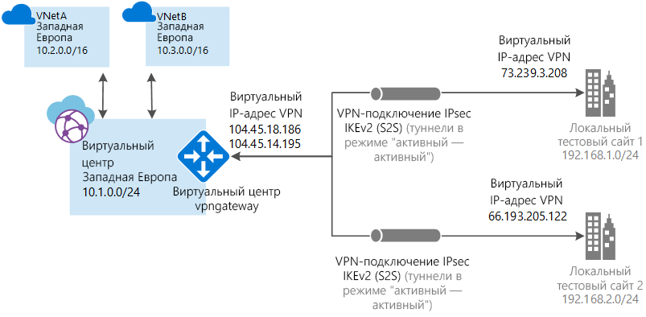

# <a name="tutorial-create-a-site-to-site-connection-using-azure-virtual-wan"></a>Руководство. Создание подключения "сеть — сеть" с помощью Виртуальной глобальной сети Azure

В этом руководстве объясняется, как создать подключение к ресурсам в Azure через VPN-соединение IPsec/IKE (IKEv1 и IKEv2) с помощью Виртуальной глобальной сети. Для этого типа подключения требуется локальное VPN-устройство, которому назначен внешний общедоступный IP-адрес. Дополнительные сведения о Виртуальной глобальной сети см. в [этой статье](virtual-wan-about.md).

> [!NOTE]
> Обычно при наличии большого количества сайтов для создания этой конфигурации используется [партнер Виртуальной глобальной сети](https://aka.ms/virtualwan). Однако вы можете создать эту конфигурацию самостоятельно, если вы знакомы с работой с сетью и умеете настраивать собственное VPN-устройство.
>



Из этого руководства вы узнаете, как выполнять следующие задачи:

> [!div class="checklist"]
> * Создание глобальной сети.
> * Создание сайта.
> * Создание концентратора.
> * Подключение концентратора к сайту.
> * Подключение виртуальной сети к концентратору.
> * Скачивание и применение конфигурации VPN-устройства.
> * Просмотр виртуальной глобальной сети.
> * Просмотр состояния работоспособности ресурса.
> * Мониторинг подключения.

## <a name="before-you-begin"></a>Перед началом работы

[!INCLUDE [Before you begin](../../includes/virtual-wan-tutorial-vwan-before-include.md)]

## <a name="vnet"></a>1. Создать виртуальную сеть

[!INCLUDE [Create a virtual network](../../includes/virtual-wan-tutorial-vnet-include.md)]

## <a name="openvwan"></a>2. Создание виртуальной глобальной сети

В браузере откройте [портал Azure](https://portal.azure.com) и выполните вход с помощью учетной записи Azure.

[!INCLUDE [Create a virtual WAN](../../includes/virtual-wan-tutorial-vwan-include.md)]

## <a name="site"></a>3. Создание сайта.

Создайте нужное количество сайтов, которые соответствуют вашим физическим расположениям. Например, если у вас есть филиал в Нью-Йорке, в Лондоне, а также в Лос-Анджелесе, создайте три отдельных сайта. Эти сайты содержат конечные точки локального VPN-устройства. На данный момент вы можете указать только одно личное адресное пространство для вашего сайта.

1. Щелкните имя глобальной сети, которую вы создали. На странице глобальной сети в разделе **архитектуры глобальной сети** щелкните **Сайты VPN**, чтобы открыть соответствующую страницу.
2. На странице **Сайты VPN** щелкните **+Создать сайт**.
3. На странице **создания сайта** заполните следующие поля:

  * **Имя**. Имя, с помощью которого вы будете ссылаться на свой локальный сайт.
  * **Общедоступный IP-адрес**. Это общедоступный IP-адрес VPN-устройства, которое находится на локальном сайте.
  * **Частное адресное пространство**. Это пространство IP-адресов, которое находится на локальном сайте. Трафик, предназначенный для этого адресного пространства, перенаправляется на ваш локальный сайт.
  * **Подписка**. Проверьте подписку.
  * **Группа ресурсов**. Выберите нужную группу ресурсов.
  * **Расположение.**
4. Щелкните **Show advanced** (Показать расширенные параметры), чтобы просмотреть дополнительные параметры. Вы можете выбрать **BGP**, чтобы включить этот протокол и применить эту функцию для всех подключений, созданных для этой сети в Azure. Вы также можете указать **сведения об устройстве** (необязательные поля). Они помогут команде Azure лучше понять вашу среду, чтобы добавить дополнительные возможности оптимизации в будущем или помочь вам устранить неполадки.
5. Щелкните **Confirm** (Подтвердить).
6. Щелкнув **Подтвердить**, просмотрите состояние на странице сетей VPN. Состояние должно измениться с **Идет подготовка** на **Подготовлено**.

## <a name="hub"></a>4. Создание концентратора.

[!INCLUDE [Create a virtual WAN](../../includes/virtual-wan-tutorial-hub-include.md)]

## <a name="associate"></a>5. Связывание сайтов с концентратором

Как правило, концентраторы должны быть связаны с сайтами, расположенными в том же регионе, что и виртуальные сети.

1. На странице **Сайты VPN** выберите сайт или сайты, которые нужно связать с концентратором, а затем щелкните **+Создать связь с концентратором**.
2. На странице **связывания сайтов с одним или несколькими концентраторами** выберите концентратор в раскрывающемся списке. Чтобы связать сайт с дополнительными концентраторами, щелкните **+Добавить связь**.
3. Здесь также можно добавить определенный **общий ключ** или использовать указанный по умолчанию.
4. Щелкните **Confirm** (Подтвердить).
5. Вы можете посмотреть состояние подключения на странице **Сайты VPN**.

## <a name="vnet"></a>6. Подключение виртуальной сети к концентратору

На этом шаге вы создаете пиринговое подключение между концентратором и виртуальной сетью. Повторите эти шаги для каждой виртуальной сети, которую вы хотите подключить.

1. На странице своей глобальной сети щелкните **Подключения к виртуальной сети**.
2. На странице подключения к виртуальной сети щелкните **+Добавить подключение**.
3. На странице **Добавление подключения** заполните следующие поля.

    * **Имя подключения**. Укажите имя своего подключения.
    * **Концентраторы**. Выберите концентратор, который нужно связать с этим подключением.
    * **Подписка**. Проверьте подписку.
    * **Виртуальная сеть**. Выберите виртуальную сеть, которую вы хотите подключить к этому концентратору. В виртуальной сети не должно быть шлюза виртуальной сети.
4. Нажмите кнопку **ОК**, чтобы создать пиринговое подключение.

## <a name="device"></a>7. Загрузка конфигурации VPN

Используйте конфигурацию VPN-устройства для настройки локального VPN-устройства.

1. На странице своей виртуальной глобальной сети щелкните **Обзор**.
2. В верхней части страницы щелкните **Скачать конфигурацию VPN**. Azure создает учетную запись хранения в группе ресурсов microsoft-network-[расположение], где используется расположение глобальной сети. Применив конфигурацию к VPN-устройствам, вы можете удалить эту учетную запись хранения.
3. После завершения создания файла вы можете скачать его, щелкнув ссылку.
4. Примените конфигурацию к VPN-устройству.

### <a name="understanding-the-vpn-device-configuration-file"></a>Основные сведения о файле конфигурации VPN-устройства

Файл конфигурации устройства содержит параметры, которые необходимо использовать при настройке локального VPN-устройства. При просмотре этого файла обратите внимание на следующие сведения:

* **vpnSiteConfiguration**. В этом разделе указаны сведения об устройстве, настроенные как сайт, подключенный к виртуальной глобальной сети. Они содержат имя и общедоступный IP-адрес устройства филиала.
* **vpnSiteConnections**. В этом разделе представлены следующие сведения:

    * **Адресное пространство** виртуальных концентраторов виртуальной сети.<br>Пример:
 
        ```
        "AddressSpace":"10.1.0.0/24"
        ```
    * **Адресное пространство** виртуальных сетей, подключенных к концентратору.<br>Пример:

         ```
        "ConnectedSubnets":["10.2.0.0/16","10.30.0.0/16"]
         ```
    * **IP-адреса** VPN-шлюзов виртуального концентратора. Так как каждое подключение VPN-шлюза состоит из двух туннелей в конфигурации "активный — активный", в этом файле будут указаны оба IP-адреса. В данном примере вы видите Instance0 и Instance1 для каждого сайта.<br>Пример:

        ``` 
        "Instance0":"104.45.18.186"
        "Instance1":"104.45.13.195"
        ```
    * **Сведения о конфигурации подключения к Vpngateway**, такие как протокол BGP, общий ключ и т. д. PSK — это автоматически созданный общий ключ. Вы всегда можете изменить подключение на странице обзора для настраиваемого ключа PSK.
  
### <a name="example-device-configuration-file"></a>Пример файла конфигурации устройства

  ```
  { 
      "configurationVersion":{ 
         "LastUpdatedTime":"2018-07-03T18:29:49.8405161Z",
         "Version":"r403583d-9c82-4cb8-8570-1cbbcd9983b5"
      },
      "vpnSiteConfiguration":{ 
         "Name":"testsite1",
         "IPAddress":"73.239.3.208"
      },
      "vpnSiteConnections":[ 
         { 
            "hubConfiguration":{ 
               "AddressSpace":"10.1.0.0/24",
               "Region":"West Europe",
               "ConnectedSubnets":[ 
                  "10.2.0.0/16",
                  "10.30.0.0/16"
               ]
            },
            "gatewayConfiguration":{ 
               "IpAddresses":{ 
                  "Instance0":"104.45.18.186",
                  "Instance1":"104.45.13.195"
               }
            },
            "connectionConfiguration":{ 
               "IsBgpEnabled":false,
               "PSK":"bkOWe5dPPqkx0DfFE3tyuP7y3oYqAEbI",
               "IPsecParameters":{ 
                  "SADataSizeInKilobytes":102400000,
                  "SALifeTimeInSeconds":3600
               }
            }
         }
      ]
   },
   { 
      "configurationVersion":{ 
         "LastUpdatedTime":"2018-07-03T18:29:49.8405161Z",
         "Version":"1f33f891-e1ab-42b8-8d8c-c024d337bcac"
      },
      "vpnSiteConfiguration":{ 
         "Name":" testsite2",
         "IPAddress":"66.193.205.122"
      },
      "vpnSiteConnections":[ 
         { 
            "hubConfiguration":{ 
               "AddressSpace":"10.1.0.0/24",
               "Region":"West Europe"
            },
            "gatewayConfiguration":{ 
               "IpAddresses":{ 
                  "Instance0":"104.45.18.187",
                  "Instance1":"104.45.13.195"
               }
            },
            "connectionConfiguration":{ 
               "IsBgpEnabled":false,
               "PSK":"XzODPyAYQqFs4ai9WzrJour0qLzeg7Qg",
               "IPsecParameters":{ 
                  "SADataSizeInKilobytes":102400000,
                  "SALifeTimeInSeconds":3600
               }
            }
         }
      ]
   },
   { 
      "configurationVersion":{ 
         "LastUpdatedTime":"2018-07-03T18:29:49.8405161Z",
         "Version":"cd1e4a23-96bd-43a9-93b5-b51c2a945c7"
      },
      "vpnSiteConfiguration":{ 
         "Name":" testsite3",
         "IPAddress":"182.71.123.228"
      },
      "vpnSiteConnections":[ 
         { 
            "hubConfiguration":{ 
               "AddressSpace":"10.1.0.0/24",
               "Region":"West Europe"
            },
            "gatewayConfiguration":{ 
               "IpAddresses":{ 
                  "Instance0":"104.45.18.187",
                  "Instance1":"104.45.13.195"
               }
            },
            "connectionConfiguration":{ 
               "IsBgpEnabled":false,
               "PSK":"YLkSdSYd4wjjEThR3aIxaXaqNdxUwSo9",
               "IPsecParameters":{ 
                  "SADataSizeInKilobytes":102400000,
                  "SALifeTimeInSeconds":3600
               }
            }
         }
      ]
   }
  ```

### <a name="configuring-your-vpn-device"></a>Настройка VPN-устройства

>[!NOTE]
> Если вы работаете с партнерским решением Виртуальной глобальной сети, VPN-устройство будет настроено автоматически. Контроллер устройства получает файл конфигурации из Azure и применяет его к устройству, чтобы настроить подключение к Azure. Это означает, что вам не нужно вручную настраивать VPN-устройство.
>

Если вам нужны инструкции по настройке устройства, см. раздел [Загрузка сценариев конфигурации VPN-устройства из Azure](~/articles/vpn-gateway/vpn-gateway-about-vpn-devices.md#configscripts). При этом учтите следующее:

* Инструкции на странице VPN-устройств не предназначены для Виртуальной глобальной сети, но вы можете использовать значения Виртуальной глобальной сети из файла конфигурации для настройки VPN-устройства вручную. 
* Загружаемые скрипты конфигурации устройства, предназначенные для VPN-шлюза, не подходят для Виртуальной глобальной сети, так как ее конфигурация отличается.
* Новая Виртуальная глобальная сеть поддерживает IKEv1 и IKEv2.
* Виртуальная глобальная сеть может использовать только VPN-устройства на основе маршрута и инструкции устройства.

## <a name="viewwan"></a>8. Просмотр виртуальной глобальной сети

1. Перейдите к виртуальной глобальной сети.
2. На странице обзора каждая точка на карте представляет собой концентратор. Наведите курсор на любую точку, чтобы просмотреть сводку о работоспособности концентратора.
3. В разделе концентраторов и подключений можно просмотреть сведения о состоянии концентратора, сайте, регионе, состоянии VPN-подключения, приеме и передаче байтов.

## <a name="viewhealth"></a>9. Просмотр состояния работоспособности ресурса

1. Перейдите к своей глобальной сети.
2. На странице глобальной сети в разделе **Поддержка и устранение неполадок** щелкните **Работоспособность** и просмотрите сведения о своем ресурсе.

## <a name="connectmon"></a>10. Мониторинг подключения.

Создайте подключение для мониторинга связи между виртуальной машиной Azure и удаленным сайтом. Сведения о настройке монитора подключения см. в статье [Руководство. Мониторинг сетевого взаимодействия между двумя виртуальными машинами с помощью портала Azure](~/articles/network-watcher/connection-monitor.md). Исходным адресом является IP-адрес виртуальной машины в Azure, а IP-адресом назначения — IP-адрес сайта.

## <a name="cleanup"></a>11. Очистка ресурсов

Вы можете удалить ненужную группу ресурсов и все содержащиеся в ней ресурсы с помощью командлета [Remove-AzureRmResourceGroup](/powershell/module/azurerm.resources/remove-azurermresourcegroup). Замените myResourceGroup на имя вашей группы ресурсов и выполните следующую команду PowerShell:

```azurepowershell-interactive
Remove-AzureRmResourceGroup -Name myResourceGroup -Force
```

## <a name="next-steps"></a>Дополнительная информация

Из этого руководства вы узнали, как выполнить следующие задачи:

> [!div class="checklist"]
> * Создание глобальной сети.
> * Создание сайта.
> * Создание концентратора.
> * Подключение концентратора к сайту.
> * Подключение виртуальной сети к концентратору.
> * Скачивание и применение конфигурации VPN-устройства.
> * Просмотр виртуальной глобальной сети.
> * Просмотр состояния работоспособности ресурса.
> * Мониторинг подключения.

Дополнительные сведения о Виртуальной глобальной сети см. в [этой статье](virtual-wan-about.md).
