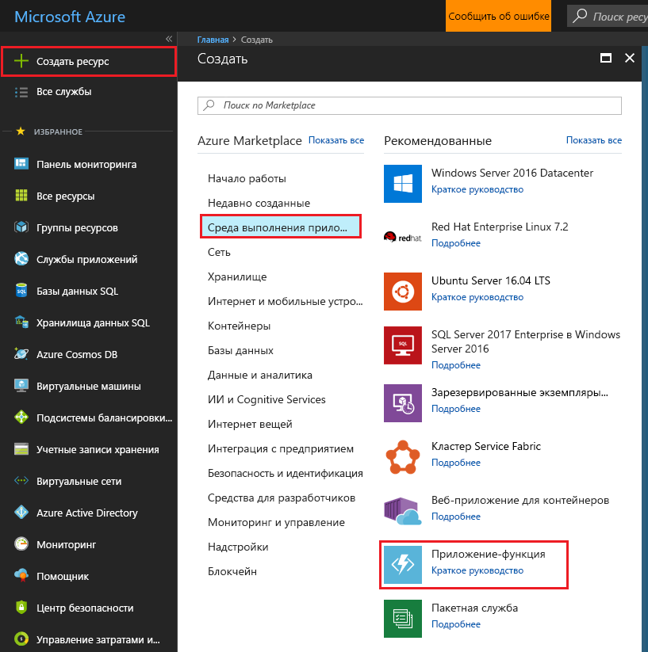
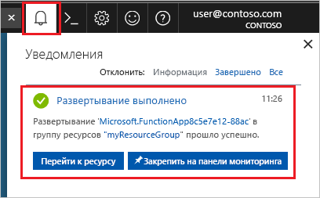

1. Нажмите кнопку **Создать** в верхнем левом углу портала Azure, а затем выберите **Вычисления** > **Приложение-функция**. 

    

2. Используйте настройки приложения-функции, указанные в таблице под рисунком.

    

    | Параметр      | Рекомендуемое значение  | ОПИСАНИЕ                                        |
    | ------------ |  ------- | -------------------------------------------------- |
    | **Имя приложения** | Глобально уникальное имя | Имя, которое идентифицирует ваше новое приложение-функцию. Допустимые символы: `a-z`, `0-9` и `-`.  | 
    | **Подписка** | Ваша подписка | Подписка, в которой создано приложение-функция. | 
    | **[Группа ресурсов](../articles/azure-resource-manager/resource-group-overview.md)** |  myResourceGroup | Имя новой группы ресурсов, в которой создается приложение-функция. | 
    | **ОС** | Windows | Бессерверное размещение в данный момент доступно только при выполнении в Windows. Размещение в среде Linux описывается в разделе [Создание первой функции, выполняемой в Linux, с помощью Azure CLI (предварительная версия)](../articles/azure-functions/functions-create-first-azure-function-azure-cli-linux.md). |
    | **[План размещения](../articles/azure-functions/functions-scale.md)** | План потребления | План размещения, который определяет выделение ресурсов в приложении-функции. В **плане потребления** по умолчанию ресурсы добавляются динамически в соответствии с потребностями функций. При таком [бессерверном](https://azure.microsoft.com/overview/serverless-computing/) размещении вы платите только за время выполнения функций. Когда выполняется план службы приложений необходимо управлять [масштабированием приложения-функции](../articles/azure-functions/functions-scale.md).  |
    | **Местоположение.** | Западная Европа | Выберите ближайший [регион](https://azure.microsoft.com/regions/) или регион рядом с другими службами, к которому получают доступ ваши функции. |
    | **[Учетная запись хранения](../articles/storage/common/storage-quickstart-create-account.md)** |  Глобально уникальное имя |  Имя учетной записи хранения, используемой вашим приложением-функцией. Имя учетной записи хранения должно содержать от 3 до 24 символов и состоять только из цифр и строчных букв. Можно также использовать существующую учетную запись при условии, что она соответствует [требованиям учетной записи хранилища](../articles/azure-functions/functions-scale.md#storage-account-requirements). |

3. Выберите **Создать**, чтобы подготовить и развернуть приложение-функцию.

4. Выберите значок уведомления в правом верхнем углу портала. Вы должны увидеть сообщение **Развертывание выполнено**. 

    

5. Выберите **Перейти к ресурсу** для просмотра нового приложения-функции.

> [!TIP]
> Если при поиске приложений-функций на портале возникают трудности, попробуйте [добавить приложения-функции в избранное на портале Azure](../articles/azure-functions/functions-how-to-use-azure-function-app-settings.md#favorite).   
