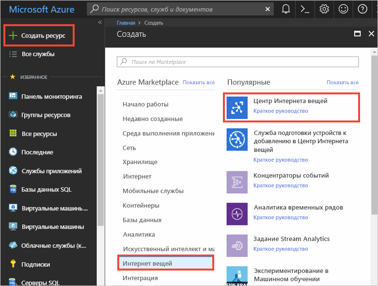
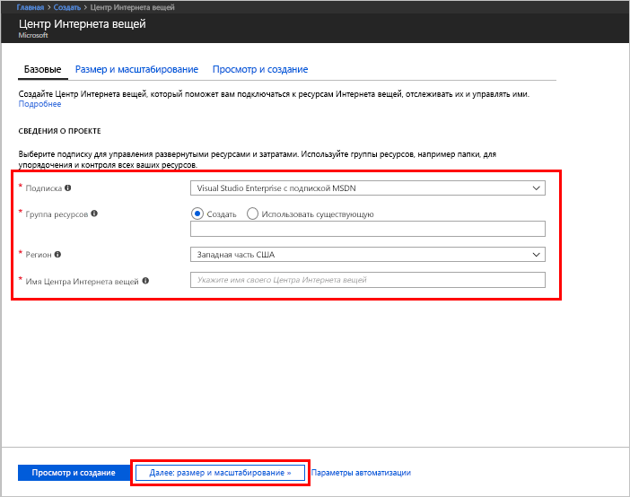
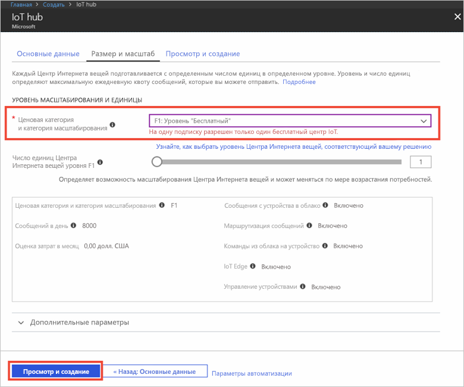

1. Войдите на [портале Azure](https://portal.azure.com/).

2. Выберите **Создать ресурс** > **Интернет вещей** > **Центр Интернета вещей**.
   
    

3. В области **Центр Интернета вещей** введите следующие сведения для создания Центра Интернета вещей:

   * **Подписка**. Выберите подписку, с помощью которой нужно создать этот Центр Интернета вещей.

   * **Группа ресурсов**. Создайте группу ресурсов для размещения Центра Интернета вещей или используйте имеющуюся. Дополнительные сведения см. в статье [Управление ресурсами Azure через портал](../articles/azure-resource-manager/resource-group-portal.md).

   * **Регион**. Выберите ближайшее расположение.

   * **Имя**.Создайте имя Центра Интернета вещей. Если введенное имя доступно, появится зеленая галочка.

   [!INCLUDE [iot-hub-pii-note-naming-hub](iot-hub-pii-note-naming-hub.md)]

   

4. Выберите **Next: Size and scale** (Далее: размер и масштаб), чтобы продолжить создание вашего Центра Интернета вещей. 

5. Выберите **ценовую категорию и уровень масштабирования**. Для работы с этой статьей выберите уровень **F1 — "Бесплатный"**, если он доступен для вашей подписки. Дополнительные сведения о ценовых категориях и категориях масштабирования см. в [этой статье](https://azure.microsoft.com/pricing/details/iot-hub/).

   

6. Выберите **Review + create** (Просмотреть и создать).

7. Проверьте сведения о вашем Центре Интернета вещей, а затем щелкните **Создать**. Создание Центра Интернета вещей может занять несколько минут. Ход создания можно отслеживать на панели **уведомлений**.