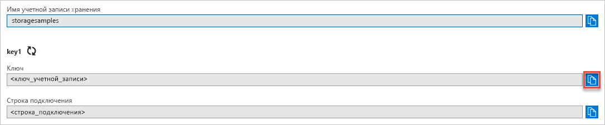

## Копирование учетных данных с портала Azure

Чтобы использовать пример приложения, нужно выполнить аутентификацию доступа к вашей учетной записи хранения. Для аутентификации предоставьте приложению учетные данные учетной записи хранения в виде строки подключения. Просмотр учетных данных учетной записи хранения:

1. Перейдите на [портал Azure](https://portal.azure.com).
2. Перейдите к учетной записи хранения.
3. В разделе **Параметры** учетной записи хранения выберите параметр **Ключи доступа**. Появятся ключи доступа к учетной записи и полная строка подключения для каждого ключа.
4. Имя вашей учетной записи хранения нужно будет предоставить во время аутентификации.   
5. Найдите значение **ключа** в разделе **key1** и нажмите кнопку **Копировать**, чтобы скопировать ключ учетной записи.

    
